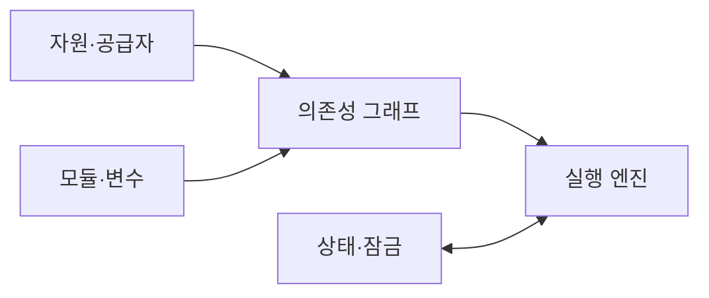
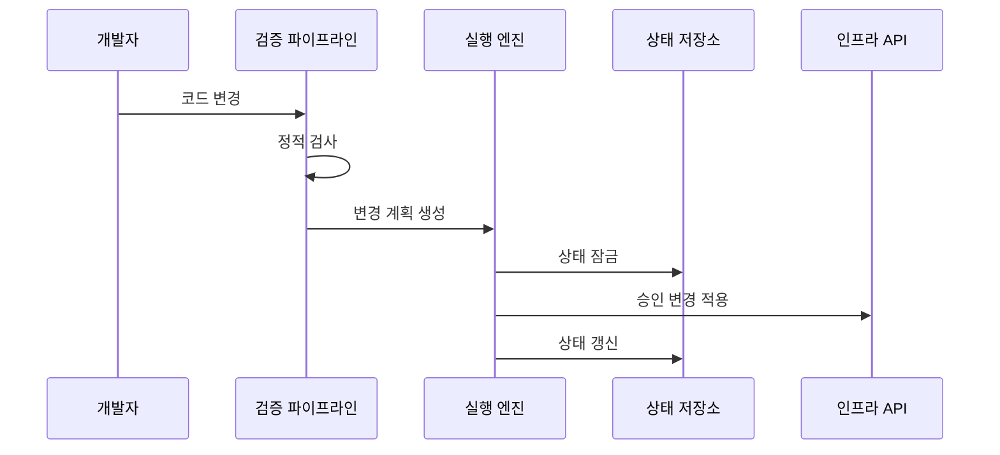

---
sidebar:
  order: 182
  label: "182. IaC 인프라스트럭처 코드 (Infrastructure as Code)"
  badge:
    text: "미출제 · 50%"
    variant: note
title: "IaC 인프라스트럭처 코드 (Infrastructure as Code)"
date: "2026-07-25T00:30:00+09:00"
tags:
  - "notes-software"
weight: 182
extra:
  question_no: "182"
  source_status: "미출제"
  source_history: ""
  priority: 50
  priority_note: "상태·계획·편차 통제가 인프라 자동화 핵심임"
---

## 미리 알고가기

- **코드형 인프라(Infrastructure as Code, IaC)**: IaC는 ‘아이에이시’로 읽고 영문 핵심어의 머리글자를 딴 약어이며, 인프라 구성을 코드로 정의하고 자동 적용
- **선언형(Declarative)**: 목표 상태를 정의하면 엔진이 현재 상태와의 차이를 반영하는 방식임
- **명령형(Imperative)**: 자원 변경 명령과 실행 순서를 직접 기술하는 방식임
- **상태 파일(State File)**: 코드 자원과 실제 자원의 매핑 정보를 저장하는 장부임
- **변경 계획(Plan)**: 적용 전에 생성·수정·삭제 대상을 계산한 결과임
- **구성 편차(Drift)**: 코드 밖의 수동 변경으로 목표·실제 상태가 달라진 현상임
- **공급자·응용 프로그램 인터페이스(Application Programming Interface, API)**: API는 ‘에이피아이’로 읽고 영문 머리글자를 딴 약어이며, 공급자는 클라우드 제어 API와 IaC 자원 규격을 연결
- **모듈·변수**: 모듈은 재사용 코드 묶음이고 변수는 환경별로 바꾸는 입력값임
- **의존성 그래프**: 자원 참조 관계로 생성·변경 순서를 나타낸 구조임
- **원격 상태 잠금**: 공유 상태 파일을 한 실행만 변경하도록 잠그는 기능임
- **정적 검사**: 코드를 실행하지 않고 문법·정책·보안 위반을 찾는 검사임

## Ⅰ. 개요

- 정의/개념: 인프라 목표 상태·변경 절차를 코드로 관리하는 방식
- **배경/필요성**: 수동 구축은 편차·누락을 낳아 코드형 변경 관리가 필요함

### 쉽게 이해하기 (학습용)
- 같은 코드를 적용해 같은 인프라 상태를 재현함

## Ⅱ. 특징

- 코드와 상태를 비교해 변경 대상을 계산한다.
- 의존성 그래프로 적용 순서와 병렬 실행을 정한다.
- 원격 상태 잠금으로 동시 적용 충돌을 방지한다.
- 코드 밖의 수동 변경은 구성 편차로 탐지한다.

### 쉽게 이해하기 (학습용)
- 계획으로 변경을 확인하고 상태 잠금 뒤 적용함

## Ⅲ. 아키텍처 및 구성요소

| 설계 요소 | 설명 |
|:---|:---|
| 자원·공급자 | 자원 규격과 제어 API를 정의함 |
| 모듈·변수 | 재사용 단위와 환경별 입력을 묶음 |
| 의존성 그래프 | 참조 관계로 순서와 병렬성을 계산함 |
| 상태·잠금 | 자원 매핑을 저장하고 동시 적용을 막음 |
| 실행 엔진 | 계획을 만들고 승인 작업을 적용함 |

> 요약: 코드·상태 차이를 그래프로 계산해 적용함

### 쉽게 이해하기 (학습용)

- 코드와 상태 차이를 계산하고 한 실행만 적용함

## Ⅳ. 원리 및 절차 흐름도

| 절차 | 설명 |
|:---|:---|
| 코드 변경 | 자원 정의·버전·입력값을 수정함 |
| 정적 검사 | 문법·정책·보안 규칙을 검증함 |
| 변경 계획 생성 | 목표·현재 상태 차이와 영향을 계산함 |
| 상태 잠금 | 다른 실행의 상태 변경을 차단함 |
| 승인 변경 적용 | 검토된 생성·수정·삭제를 실행함 |
| 상태 갱신 | 적용 결과와 자원 매핑을 저장함 |

> 요약: 계획 검토 후 잠금 상태에서 변경을 적용함

### 쉽게 이해하기 (학습용)

- 계획 승인과 상태 잠금 뒤 실제 자원을 변경함

## Ⅴ. 종류 및 비교

| 판단 기준 | 선언형 | 명령형 |
|:---|:---|:---|
| 핵심 특징 | 목표 상태와 현재 상태 차이 반영 | 변경 명령과 실행 순서 직접 기술 |
| 적용 기준 | 반복되는 클라우드 자원 상태 관리 | 조건·순서가 중요한 운영 절차 |
| 주요 위험 | 상태 파일 손상·구성 편차 | 재실행 부작용·절차 누락 |

> 요약: 상태 수렴은 선언형, 절차 제어는 명령형임

### 쉽게 이해하기 (학습용)

- 목표 상태는 선언형, 실행 순서는 명령형임

## Ⅵ. 실무 사례

1. 개발 환경은 모듈·변수로 동일 구성을 생성함
2. 복구 환경은 저장 코드와 상태로 자원을 재구성함

### 쉽게 이해하기 (학습용)
- 개발 환경은 같은 모듈에 환경별 값만 넣음
- 복구 환경은 코드와 상태로 대체 지역을 재현함

## Ⅶ. 결론

- 계획 승인과 상태 잠금이 가능할 때 IaC를 적용함

### 쉽게 이해하기 (학습용)

- 계획 밖 변경은 중단하고 코드와 실제 상태를 맞춤
