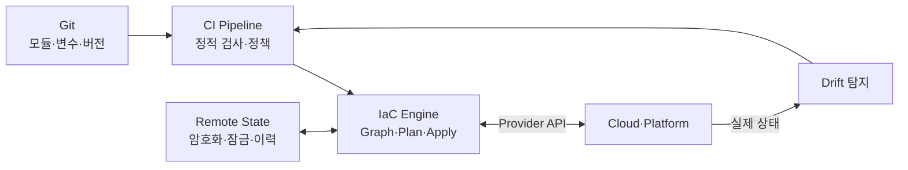
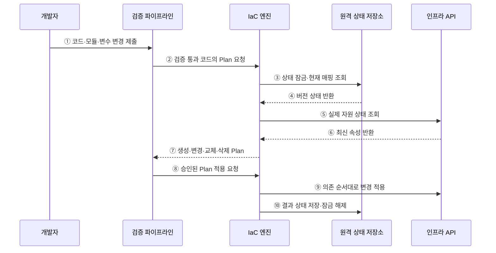

---
sidebar:
  order: 182
  label: "182. IaC 인프라스트럭처 코드 (Infrastructure as Code)"
  badge:
    text: "미출제 · 50%"
    variant: note
title: "IaC 인프라스트럭처 코드 (Infrastructure as Code)"
date: "2026-07-25T00:30:00+09:00"
tags:
  - "notes-software"
weight: 182
extra:
  question_no: "182"
  source_status: "미출제"
  source_history: ""
  priority: 50
  priority_note: "상태·계획·편차 통제가 인프라 자동화 핵심임"
---

## 미리 알고가기

- **코드형 인프라(Infrastructure as Code, IaC·아이에이시)**: 인프라 자원과 정책을 코드로 정의하고 버전 관리·검증·자동 적용하는 방식
- **선언형(Declarative)**: 원하는 최종 상태를 기술하면 엔진이 현재 상태와의 차이를 계산해 수렴시키는 방식
- **명령형(Imperative)**: 자원을 변경할 명령과 실행 순서를 직접 기술하는 방식
- **공급자(Provider)**: IaC의 자원 정의와 클라우드·플랫폼 API를 연결하는 확장 구성
- **상태 파일(State File)**: 코드의 자원 주소와 실제 자원 식별자·속성·의존 관계를 연결하는 장부
- **변경 계획(Plan)**: 코드·상태·실제 자원을 비교해 생성·변경·교체·삭제 대상을 미리 계산한 결과
- **구성 편차(Drift)**: 수동 변경·외부 자동화로 코드의 목표 상태와 실제 인프라가 달라진 현상
- **의존성 그래프(Dependency Graph)**: 자원 참조 관계로 안전한 적용 순서와 병렬 실행 가능성을 나타낸 구조
- **원격 상태 잠금(Remote State Lock)**: 동시에 하나의 실행만 공유 상태를 변경하도록 막는 제어
- **정책형 코드(Policy as Code)**: 보안·비용·규제 규칙을 실행 가능한 코드로 정의해 계획과 배포를 검사하는 방식
- **불변 인프라(Immutable Infrastructure)**: 실행 중인 자원을 직접 수정하기보다 새 이미지·자원으로 교체하는 운영 방식

## Ⅰ. 개요

- IaC는 인프라 구성을 **검토·재현·감사 가능한 코드 변경**으로 관리한다.
- 수동 구축의 누락·환경 편차·변경 이력 부재를 줄이고 반복 환경을 일관되게 만든다.
- 코드만 저장하는 것이 아니라 상태·계획·승인·적용·편차 복구까지 하나의 변경 체계로 운영한다.

### 쉽게 이해하기 (학습용)
- 서버 설치 설명서를 실행 가능한 코드로 만들어 같은 환경을 반복 생성함

## Ⅱ. 특징

- **재현성**: 같은 모듈·버전·입력값으로 동일한 목표 환경을 생성한다.
- **버전 관리**: 코드 검토·변경 이력·승인·복귀를 소프트웨어와 같은 방식으로 수행한다.
- **계획 기반 변경**: 적용 전에 생성·수정·교체·삭제 영향과 의존 순서를 확인한다.
- **상태 수렴**: 선언형 엔진이 목표·기록·실제 상태의 차이를 계산해 반영한다.
- **자동 검증**: 문법·보안·비용·규제 정책을 파이프라인에서 검사한다.
- **편차 탐지**: 코드 밖 변경을 발견해 코드 반영·원상 복구·예외 승인 중 하나로 처리한다.

### 쉽게 이해하기 (학습용)
- 실제로 바꾸기 전에 변경 목록을 보고 승인한 코드만 인프라에 적용함

## Ⅲ. 아키텍처 및 구성요소

**도표안 A — 구조도**

**도표안 B — sequenceDiagram**

| 구성요소 | 역할 |
|:---|:---|
| 코드 저장소 | 자원·모듈·변수·Provider 버전과 변경 이력 관리 |
| 검증 파이프라인 | 형식·정적 보안·비용·정책·Plan 검토 수행 |
| IaC 엔진 | 의존성 그래프·현재 상태·목표 상태로 Plan·Apply 실행 |
| Provider | IaC 자원 작업을 대상 플랫폼 API 호출로 변환 |
| 원격 상태 저장소 | 실제 자원 매핑·상태 버전·암호화·잠금·복구 이력 관리 |
| 편차 탐지 | 실제 자원과 코드의 차이를 주기적으로 발견·분류 |

**동작 원리**

- ① 개발자가 자원 정의·모듈·입력값·Provider 버전 변경을 코드 저장소에 제출한다.
- ② 파이프라인이 형식·보안·정책 검사를 통과한 코드로 Plan 생성을 요청한다.
- ③ IaC 엔진이 동시 변경을 막기 위해 원격 상태를 잠그고 자원 매핑을 읽는다.
- ④ 상태 저장소가 현재 상태의 버전과 자원 식별자를 반환한다.
- ⑤ 엔진이 Provider를 통해 실제 인프라의 최신 속성을 조회한다.
- ⑥ 인프라 API가 수동 변경을 포함한 현재 자원 상태를 반환한다.
- ⑦ 엔진이 목표·기록·실제 상태를 비교해 생성·변경·교체·삭제 Plan을 제시한다.
- ⑧ 검토·정책·권한 승인을 통과한 동일 Plan의 적용을 요청한다.
- ⑨ 엔진이 의존성 그래프 순서와 병렬성에 따라 인프라를 변경하고 결과를 검증한다.
- ⑩ 성공한 자원 매핑을 새 상태 버전으로 저장하고 잠금을 해제하며, 실패 시 부분 상태와 복구 절차를 남긴다.

### 쉽게 이해하기 (학습용)
- 코드와 실제 인프라의 차이를 목록으로 확인한 뒤 한 실행만 승인된 변경을 적용함

## Ⅳ. 종류 및 비교

| 비교 항목 | 선언형 IaC | 명령형 IaC |
|:---|:---|:---|
| 기술 내용 | 원하는 목표 상태 | 변경 명령과 절차 |
| 실행 방식 | 현재와 목표의 차이를 수렴 | 작성한 순서대로 명령 수행 |
| 재실행 | 멱등적 수렴에 유리 | 단계별 멱등성 직접 구현 |
| 상태 관리 | 상태 파일·실제 조회 활용 | 스크립트 변수·실행 결과 중심 |
| 장점 | Plan·Drift·의존성 자동 계산 | 복잡한 조건·세밀한 절차 표현 |
| 한계 | 상태 손상·Provider 동작·교체 영향 | 절차 누락·재실행 부작용·현재 상태 판단 |
| 적용 | 반복 클라우드·플랫폼 자원 | 일회성 마이그레이션·복구 절차 |

| 변경 방식 | 가변 인프라 | 불변 인프라 |
|:---|:---|:---|
| 처리 | 실행 자원을 직접 수정 | 새 자원을 만들고 전환 |
| 장점 | 변경량·비용 절감 | 편차 감소·복귀 단순 |
| 위험 | 누적 편차·재현 곤란 | 교체 비용·데이터 분리 필요 |

### 쉽게 이해하기 (학습용)
- 선언형은 완성 모습을, 명령형은 만드는 순서를 코드로 적음

## Ⅴ. 실무 고려사항 및 대책

| 고려사항 | 위험 | 대책 |
|:---|:---|:---|
| 상태 보안 | 비밀·식별자 노출과 무단 변경 | 암호화·최소 권한·감사·비밀 분리 |
| 동시 적용 | 상태 덮어쓰기와 중복 자원 | 원격 잠금·단일 배포 파이프라인 |
| Plan 불일치 | 검토 뒤 상태가 바뀌어 다른 변경 적용 | 저장된 Plan·짧은 승인 구간·재계획 |
| 삭제·교체 | 데이터 손실·광범위 장애 | 삭제 보호·백업·승인·카나리 교체 |
| 편차 | 수동 긴급 변경이 코드에 남지 않음 | 주기 탐지·코드 반영·자동 원복 정책 |
| Provider 버전 | 업그레이드 후 상태·계획 변화 | 버전 고정·Changelog·시험 환경 검증 |
| 모듈 | 거대 공통 모듈이 변경 영향 확대 | 작은 책임·Semantic Version·계약 시험 |
| 실패 복구 | 부분 적용 후 상태 불명확 | 결과 재조회·상태 복구·Forward Fix·Runbook |
| 비밀 입력 | 코드·Plan·로그에 자격증명 노출 | 비밀 저장소 참조·민감 표시·로그 마스킹 |

### 쉽게 이해하기 (학습용)
- 사례: 개발·검증·운영 환경은 같은 모듈을 쓰고 입력값과 승인 정책만 분리함

## Ⅵ. 결론

- IaC의 핵심은 **인프라 변경을 코드·Plan·상태·승인으로 재현하고 통제**하는 것이다.
- 자동 적용보다 정확한 상태·삭제 보호·Provider 버전·편차 복구가 운영 안전성을 좌우한다.
- 작은 모듈·원격 잠금·정책 검사·검증된 복구 절차를 갖춘 파이프라인으로 운영해야 한다.

### 쉽게 이해하기 (학습용)
- 바뀔 자원을 먼저 확인하고 승인된 코드와 실제 상태를 계속 맞춤
