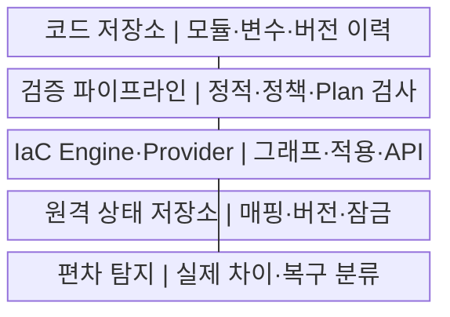
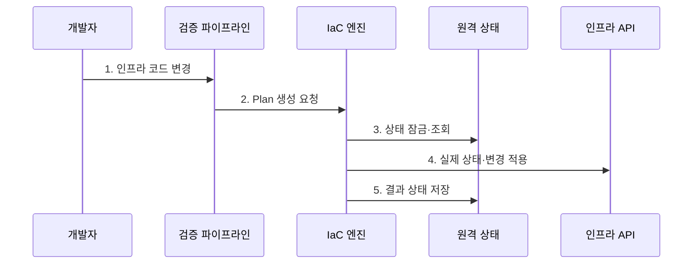

---
sidebar:
  order: 182
  label: "182. IaC 인프라스트럭처 코드 (Infrastructure as Code)"
  badge:
    text: "미출 · 50%"
    variant: note
title: "IaC 인프라스트럭처 코드 (Infrastructure as Code)"
date: "2026-07-29T20:20:00+09:00"
tags:
  - "notes-software"
weight: 182
extra:
  question_no: "182"
  source_status: "미출"
  source_history: ""
  priority: 50
  priority_note: "상태·계획·편차 통제의 자동화 가치"
---

## 미리 알고가기

- **코드형 인프라(Infrastructure as Code, IaC)**: 인프라 자원과 정책을 코드로 정의하고 검증·자동 적용하는 방식
- **선언형·명령형(Declarative·Imperative)**: 최종 상태 또는 변경 명령·순서를 기술하는 방식
- **공급자(Provider)**: IaC 자원 정의와 클라우드·플랫폼 API를 연결하는 확장 구성
- **상태 파일(State File)**: 코드 자원 주소와 실제 자원 식별자·속성·의존 관계를 연결하는 장부
- **변경 계획(Plan)**: 코드·상태·실제 자원을 비교해 생성·변경·교체·삭제 대상을 계산한 결과
- **구성 편차(Drift)**: 수동 변경 등으로 코드의 목표 상태와 실제 인프라가 달라진 현상
- **의존성 그래프(Dependency Graph)**: 자원 참조 관계로 적용 순서와 병렬 실행 가능성을 나타낸 구조
- **원격 상태 잠금(Remote State Lock)**: 하나의 실행만 공유 상태를 변경하도록 막는 제어
- **정책형 코드(Policy as Code)**: 보안·비용·규제 규칙을 실행 코드로 정의해 계획과 배포를 검사하는 방식
- **불변 인프라(Immutable Infrastructure)**: 실행 자원을 직접 수정하지 않고 새 이미지·자원으로 교체하는 방식

## Ⅰ. 개요

- 정의/개념: 인프라의 **코드·Plan·상태·승인 기반 변경 관리**
- 배경/필요성: 수동 구축의 **누락·환경 편차·이력 부재 해소**

### 쉽게 이해하기 (학습용)

- 서버 설치 설명서를 실행 코드로 만들고 실제 변경 전 생성·교체·삭제 목록을 검토해 같은 환경을 반복 재현한다.

## Ⅱ. 특징

- **모듈·변수·버전** 기반 환경 재현
- **Plan·정책 검사·승인** 기반 변경 통제
- **상태·Drift 탐지** 기반 목표 수렴

### 쉽게 이해하기 (학습용)

- 코드만 저장하는 것이 아니라 실제 자원과 연결한 상태 장부를 함께 관리해야 수동 변경과 삭제 영향을 계획에서 찾을 수 있다.

## Ⅲ. 구조 및 구성요소

| 구성요소 | 책임 |
|:---|:---|
| 코드 저장소 | 자원·모듈·**변수·버전 이력** |
| 검증 파이프라인 | 형식·보안·**정책·Plan 검토** |
| IaC Engine·Provider | 그래프·적용·**플랫폼 API 변환** |
| 원격 상태 저장소 | 자원 매핑·**버전·암호화·잠금** |
| 편차 탐지 | 실제 차이·**코드 반영·원복 분류** |

### 쉽게 이해하기 (학습용)

- 저장소가 설계도, 파이프라인이 검사소, 엔진이 시공자, 원격 상태가 실제 건물과 설계도를 연결하는 장부 역할을 한다.

## Ⅳ. 흐름도

**동작 원리**

1. **인프라 코드 변경**: 모듈·입력·Provider 버전 제출
2. **Plan 생성 요청**: 형식·보안·정책 검사 통과
3. **상태 잠금·조회**: 동시 적용 차단·자원 매핑 확인
4. **실제 상태·변경 적용**: 차이 산출·승인 순서 실행
5. **결과 상태 저장**: 새 매핑 기록·잠금 해제

### 쉽게 이해하기 (학습용)

- 검토한 Plan과 같은 변경만 적용하고 실행 동안 상태를 잠가 두 사람이 같은 자원을 동시에 만들거나 덮어쓰지 않게 한다.

## Ⅴ. 종류 및 비교

| IaC 방식 | 선언형 | 명령형 |
|:---|:---|:---|
| 적용 기준 | 반복 환경·**목표 상태 수렴** | 일회 절차·**세밀한 순서 제어** |
| 핵심 특징 | 현재 차이·**Plan·Drift 계산** | 명령·조건·**실행 순서 명시** |
| 한계 | 상태·Provider **동작 의존** | 재실행 부작용·**절차 누락** |

### 쉽게 이해하기 (학습용)

- 선언형은 완성 모습을 적어 엔진이 차이를 맞추고 명령형은 만드는 순서를 직접 적어 각 단계의 재실행 안전성까지 작성자가 책임진다.

## Ⅵ. 실무 고려사항 및 대책

| 고려사항 | 대책 | 효과 |
|:---|:---|:---|
| 상태의 **비밀·식별자 노출** | 암호화·최소 권한·**비밀 분리** | 상태 정보 보호 |
| 동시 적용의 **상태 덮어쓰기** | 원격 잠금·**단일 배포 경로** | 중복 자원 방지 |
| 검토 뒤 **Plan 변경** | 저장 Plan·**짧은 승인 구간** | 승인 대상 일치 |
| 삭제·교체의 **데이터 손실** | 삭제 보호·백업·**별도 승인** | 파괴 변경 차단 |
| 긴급 수동 변경의 **편차 잔존** | 주기 탐지·**코드 반영·원복** | 정본·실제 상태 수렴 |

### 쉽게 이해하기 (학습용)

- 운영에서 긴급 변경했다면 다음 Plan이 되돌릴 수 있으므로 예외를 코드에 반영하거나 실제 자원을 원복하는 결정을 즉시 남겨야 한다.

## Ⅶ. 결론

- **변경 영향·상태·복구성**으로 Plan·적용·Drift 결정

### 쉽게 이해하기 (학습용)

- 저장된 Plan만 승인해 적용하고 원격 상태 잠금·삭제 보호·편차 복구를 갖춰야 IaC가 단순 자동화가 아닌 변경 통제가 된다.
