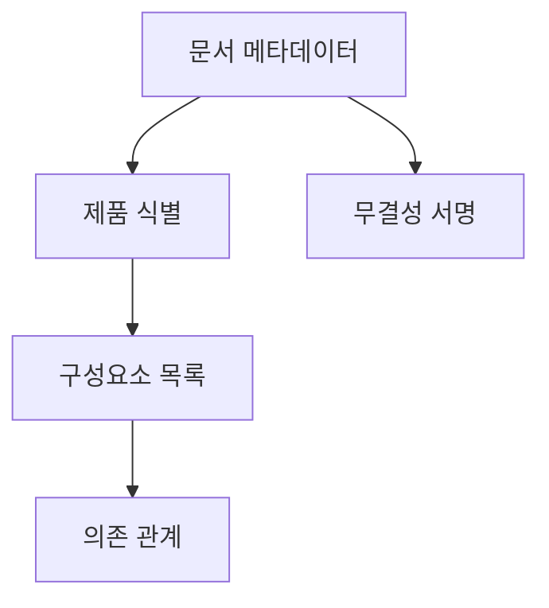
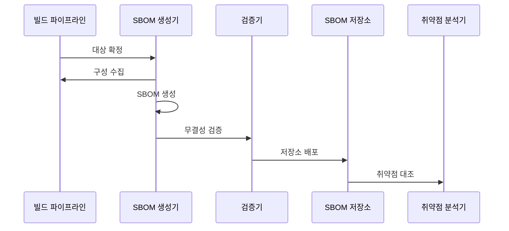

---
sidebar:
  order: 183
  label: "183. SBOM 소프트웨어 자재명세서 (SBOM)"
  badge:
    text: "기출 · 85%"
    variant: note
title: "SBOM 소프트웨어 자재명세서 (SBOM)"
date: "2026-07-25T00:30:00+09:00"
tags:
  - "notes-software"
weight: 183
extra:
  question_no: "183"
  source_status: "기출"
  source_history: "128회, 134회, 135회, 138회"
  priority: 85
  priority_note: "구성요소 식별과 취약점 추적이 반복 출제됨"
---

## 미리 알고가기

- **소프트웨어 자재명세서(Software Bill of Materials, SBOM)**: SBOM은 ‘에스봄’으로 읽고 영문 머리글자를 딴 약어이며, 제품에 포함된 구성요소와 관계를 기록한 명세서임
- **소프트웨어 패키지 데이터 교환(Software Package Data Exchange, SPDX)**: SPDX는 ‘에스피디엑스’로 읽고 영문 명칭의 핵심 글자를 딴 약어이며, SBOM을 표현·교환하는 표준임
- **사이클론디엑스(CycloneDX)**: CycloneDX는 ‘사이클론디엑스’로 읽는 표준명이며, 구성요소·서비스·의존 관계와 취약점 정보를 기계 판독 형식으로 교환함
- **공통 플랫폼 열거(Common Platform Enumeration, CPE)**: CPE는 ‘시피이’로 읽고 영문 머리글자를 딴 약어이며, 운영체제·응용제품을 표준 이름으로 식별함
- **취약점 악용 가능성 교환(Vulnerability Exploitability eXchange, VEX)**: VEX는 ‘벡스’로 읽고 영문 명칭의 핵심 글자를 딴 약어이며, 제품에서 취약점의 실제 영향을 전달함
- **전이 의존성(Transitive Dependency)**: 직접 사용한 부품이 다시 참조하는 간접 부품임
- **빌드 산출물·바이너리**: 빌드 산출물은 배포 결과물이고 바이너리는 실행 가능한 기계 형식 파일임
- **의존 그래프**: 구성요소가 직접·간접으로 참조하는 관계를 연결한 구조임
- **해시·문서 서명**: 해시는 파일 동일성을, 서명은 발행 주체와 위변조 여부를 검증함
- **직렬화**: 메모리의 명세 정보를 SPDX·CycloneDX 같은 저장 형식으로 바꾸는 과정임

## Ⅰ. 개요

- **정의/개념**: 제품 구성요소와 의존 관계를 기록한 명세서
- **배경/필요성**: 전이 부품이 가려져 취약 영향 제품 추적이 필요함

### 쉽게 이해하기 (학습용)

- 문제 부품이 포함된 제품과 버전을 빠르게 찾음

## Ⅱ. 특징

- 제품·구성요소 식별자로 취약점 정보를 연결한다.
- 직접·전이 의존 관계로 공급망 경로를 추적한다.
- 해시·서명으로 산출물 동일성과 발행자를 검증한다.

### 쉽게 이해하기 (학습용)
- 부품 버전과 의존 관계로 취약점 경로를 찾음

## Ⅲ. 아키텍처 및 구성요소

| 설계 요소 | 설명 |
|:---|:---|
| 문서 메타데이터 | 형식·생성 도구·작성 시각을 기록함 |
| 제품 식별 | 제품명·버전·고유 식별자를 연결함 |
| 구성요소 목록 | 부품명·버전·공급자·해시를 기록함 |
| 의존 관계 | 직접·전이 의존 경로를 표현함 |
| 무결성 서명 | 위변조와 발행 주체를 검증함 |

> 요약: 제품·부품·의존 관계를 서명 문서로 연결함

### 쉽게 이해하기 (학습용)

- 부품과 조립 관계를 서명된 표준 문서로 만듦

## Ⅳ. 원리 및 절차 흐름도

| 절차 | 설명 |
|:---|:---|
| 대상 확정 | 제품 버전과 빌드 산출물을 식별함 |
| 구성 수집 | 선언 파일과 실제 의존 그래프를 수집함 |
| SBOM 생성 | SPDX·CycloneDX 형식으로 직렬화함 |
| 무결성 검증 | 산출물 해시와 문서 서명을 대조함 |
| 저장소 배포 | 제품 버전과 SBOM을 함께 보관함 |
| 취약점 대조 | 부품 식별자를 취약점 정보와 연결함 |

> 요약: 빌드 구성과 명세를 대조해 취약점을 추적함

### 쉽게 이해하기 (학습용)

- 실제 빌드 부품과 SBOM을 대조해 누락을 찾음

## Ⅴ. 종류 및 비교

| 판단 기준 | 수동 작성 | 빌드 시 생성 | 사후 분석 |
|:---|:---|:---|:---|
| 핵심 특징 | 담당자가 부품 정보를 직접 입력 | 빌드 의존 그래프에서 자동 생성 | 바이너리·패키지를 역분석해 탐지 |
| 적용 기준 | 소규모 예외 부품 보완 | 자체 개발 제품의 정본 SBOM | 외부 산출물·레거시 검증 |
| 주요 위험 | 누락·버전 오기 | 빌드 밖 부품 누락 | 부품 의미·의존 관계 오탐 |

> 요약: 빌드 생성이 정본이고 나머지는 보완 수단임

### 쉽게 이해하기 (학습용)

- 빌드 목록을 정본으로 삼고 누락만 보완함

## Ⅵ. 실무 사례

1. 공개 취약점은 영향 제품·버전을 역추적함
2. 납품 SBOM은 실제 바이너리와 대조함

### 쉽게 이해하기 (학습용)

- 취약 부품 식별자로 포함 제품과 버전을 찾음
- 납품 바이너리에서 누락·추가 부품을 확인함

## Ⅶ. 결론

- 제품·부품·의존 관계가 일치한 SBOM만 신뢰함

### 쉽게 이해하기 (학습용)

- 버전과 의존 경로까지 확인해 영향 제품을 정함
