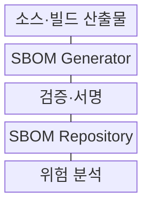
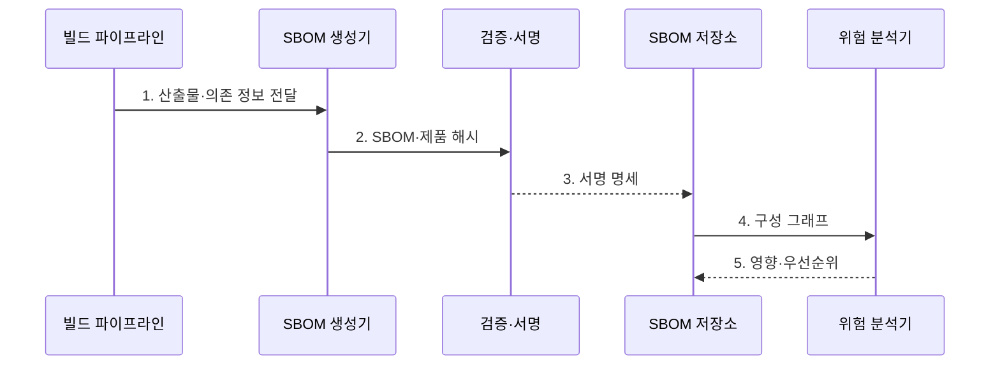

---
sidebar:
  order: 183
  label: "183. SBOM 소프트웨어 자재명세서 (SBOM)"
  badge:
    text: "기출 · 85%"
    variant: note
title: "SBOM 소프트웨어 자재명세서 (SBOM)"
date: "2026-08-02T12:00:00+09:00"
tags:
  - "notes-software"
weight: 183
extra:
  question_no: "183"
  source_status: "기출"
  source_history: "128회, 134회, 135회, 138회"
  priority: 85
  priority_note: "구성요소 식별과 취약점 추적 반복 출제"
---

## Ⅰ. 개요

핵심 용어

- **구성요소·버전·의존 관계**: SBOM은 제품을 이루는 구성요소, 정확한 버전, 직접·전이 의존 관계를 기계 판독 형식으로 기록한다.

- 정의/개념: 제품의 **구성요소·버전·의존 관계**를 기계 판독 형식으로 기록한 명세
- 배경/필요성: 구성 목록 없이는 숨은 부품의 **취약점·라이선스** 영향 추적 불가

### 쉽게 이해하기 (학습용)

- 완제품 안에 어떤 부품과 버전이 어떤 관계로 들어갔는지 적어 문제 부품이 발견됐을 때 영향 제품을 바로 찾는 디지털 부품표다.

## Ⅱ. 특징

핵심 용어

- **SPDX·CycloneDX**: SPDX와 CycloneDX는 소프트웨어 구성요소와 관계, 공급망 정보를 표현하고 교환하는 표준이다.

- **직접·전이 구성요소** 기반 구성 투명성
- **SPDX·CycloneDX** 기반 표준 교환
- **제품 해시·전자서명** 기반 산출물 결속

### 쉽게 이해하기 (학습용)

- 이름만 적은 목록이 아니라 제품 버전·해시와 부품 관계를 연결해야 다른 빌드의 SBOM을 잘못 적용하지 않는다.

## Ⅲ. 구조 및 구성요소

핵심 용어

- **SBOM Generator**: SBOM Generator는 소스·잠금 파일·빌드 산출물에서 부품과 관계, 표준 식별자를 생성한다.

| 구성요소 | 책임 |
|:---|:---|
| 소스·빌드 산출물 | 선언·잠금·**실제 구성 입력** |
| SBOM Generator | 부품·관계·**표준 식별자 생성** |
| 검증·서명 | 제품 해시·**발행자·무결성 검증** |
| SBOM Repository | 제품·배포 **버전별 명세 보관** |
| 위험 분석 | 취약점·라이선스·**VEX 영향 판단** |

### 쉽게 이해하기 (학습용)

- 빌드에서 실제 부품을 뽑아 표준 목록을 만들고 제품 해시와 묶어 서명한 뒤 취약점 목록과 대조한다.

## Ⅳ. 흐름도

핵심 용어

- **4. 구성 그래프**: 구성 그래프는 부품 식별자와 의존 경로를 취약점 정보에 대조해 영향 제품을 찾게 한다.

**동작 원리**

1. **산출물·의존 정보 전달**: 선언·잠금·바이너리 구성 수집
2. **SBOM·제품 해시**: 필수 필드와 산출물 일치 검증
3. **서명 명세**: 제품·버전·배포 단위 연결
4. **구성 그래프**: 식별자·의존 경로·취약점 대조
5. **영향·우선순위**: VEX·배포 자산을 기준으로 대응 순서 결정

### 쉽게 이해하기 (학습용)

- 새 취약점이 공개되면 부품 식별자와 의존 경로를 따라 실제 배포 중인 제품 버전과 호출 가능성을 확인한다.

## Ⅴ. 종류 및 비교

핵심 용어

- **빌드 시 생성**: 빌드 시 생성 방식은 실제로 해석된 의존성과 산출물을 연결해 자체 제품의 공식 SBOM을 만든다.

| SBOM 생성 방식 | 선언 분석 | 빌드 시 생성 | 바이너리 분석 |
|:---|:---|:---|:---|
| 적용 기준 | 개발 초기 **조기 점검** | 자체 제품 **공식 명세** | 외부·레거시 **보완 분석** |
| 핵심 특징 | Manifest·**Lockfile 입력** | 실제 의존·**산출물 연결** | 파일·패키지 **사후 탐지** |
| 한계 | 동적·삽입 부품 **누락** | 도구 밖 삽입 **누락** | 버전·관계 **오탐** |

### 쉽게 이해하기 (학습용)

- 선언 파일은 빠르지만 실제 산출물과 다를 수 있어 빌드 시 생성을 정본으로 삼고 바이너리 분석으로 숨은 부품을 보완한다.

## Ⅵ. 실무 고려사항 및 대책

핵심 용어

- **취약점 오매칭**: 취약점 오매칭은 이름만으로 구성요소를 식별해 다른 생태계나 버전의 취약점을 잘못 연결하는 문제다.

| 문제 | 대책 | 효과 |
|:---|:---|:---|
| 전이·동적 부품의 **목록 누락** | 소스·빌드·**바이너리 교차 검증** | **구성 완전성** 향상 |
| 이름만 사용한 **취약점 오매칭** | **purl·CPE**와 버전·해시 기록 | **식별 정확성** 향상 |
| 다른 빌드의 **SBOM 연결** | 제품 Digest·**출처·서명 결합** | **산출물 결속** 보장 |
| 포함만으로 **영향 단정** | 호출·설정·**VEX 근거 검토** | **대응 우선순위** 정제 |
| 생성 후 **운영 미연계** | 자산·배포·**티켓·패치 연결** | **사고 대응 시간** 단축 |

### 쉽게 이해하기 (학습용)

- 취약 라이브러리가 목록에 있어도 실행 경로와 설정상 사용할 수 없는지 VEX 근거를 확인해야 실제 위험 제품부터 고칠 수 있다.

## Ⅶ. 결론

핵심 용어

- **빌드 시 SBOM**: 자체 제품은 빌드 시 SBOM을 제품 해시와 결속해 서명하고 외부 산출물은 바이너리 분석으로 보완해야 한다.

- 자체 빌드는 **빌드 시 SBOM**을 서명하고 외부 산출물은 바이너리 분석으로 보완

### 쉽게 이해하기 (학습용)

- 빌드마다 제품 해시와 서명된 SBOM을 만들고 배포 자산·취약점·VEX를 연결해야 부품표가 실제 대응 도구가 된다.
