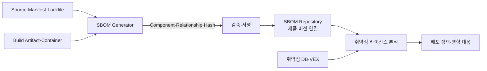
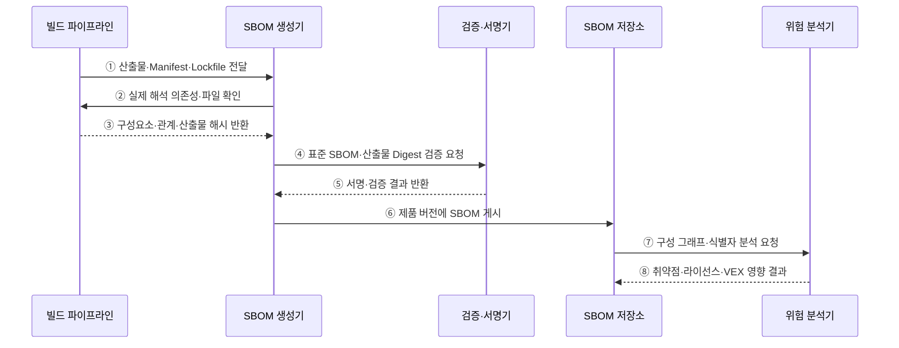

---
sidebar:
  order: 183
  label: "183. SBOM 소프트웨어 자재명세서 (SBOM)"
  badge:
    text: "기출 · 85%"
    variant: note
title: "SBOM 소프트웨어 자재명세서 (SBOM)"
date: "2026-07-27T23:59:59+09:00"
tags:
  - "notes-software"
weight: 183
extra:
  question_no: "183"
  source_status: "기출"
  source_history: "128회, 134회, 135회, 138회"
  priority: 85
  priority_note: "구성요소 식별과 취약점 추적이 반복 출제됨"
---

## 미리 알고가기

- **소프트웨어 자재명세서(Software Bill of Materials, SBOM·에스봄)**: 소프트웨어 제품에 포함된 구성요소·버전·식별자·의존 관계를 기계 판독 형식으로 기록한 명세
- **소프트웨어 패키지 데이터 교환(Software Package Data Exchange, SPDX·에스피디엑스)**: 패키지·파일·라이선스·관계를 표현하고 교환하는 SBOM 표준
- **사이클론디엑스(CycloneDX)**: 구성요소·서비스·의존성·취약점 등 소프트웨어 공급망 정보를 표현하는 표준
- **패키지 URL(Package URL, purl·피유알엘)**: 패키지 생태계·이름·버전·한정자를 일관되게 표현하는 식별자
- **공통 플랫폼 열거(Common Platform Enumeration, CPE·시피이)**: 운영체제·응용·하드웨어 제품을 표준 이름으로 식별하는 체계
- **취약점 악용 가능성 교환(Vulnerability Exploitability eXchange, VEX·벡스)**: 알려진 취약점이 특정 제품에 실제로 영향을 주는지와 판단 근거를 전달하는 상태 문서
- **전이 의존성(Transitive Dependency)**: 제품이 직접 사용한 구성요소가 다시 참조하는 간접 구성요소
- **빌드 출처(Build Provenance)**: 어떤 소스·도구·매개변수·환경으로 산출물을 만들었는지 증명하는 정보
- **해시·전자서명(Hash·Digital Signature)**: 해시는 산출물 동일성을, 서명은 문서 발행자와 위변조 여부를 검증
- **취약점 데이터베이스(Vulnerability Database)**: 공개 취약점 식별자·영향 버전·심각도·참조 정보를 제공하는 저장소

## Ⅰ. 개요

- SBOM은 제품의 **소프트웨어 구성요소와 의존 관계를 추적 가능한 목록**으로 만든다.
- 숨은 전이 의존성의 취약점·라이선스·공급자 영향을 제품과 버전별로 빠르게 찾게 한다.
- 목록 자체가 안전성을 증명하지는 않으며 산출물 일치·최신성·식별 정확성·영향 판단이 함께 필요하다.

### 쉽게 이해하기 (학습용)
- 소프트웨어 안에 어떤 부품과 버전이 들어갔는지 적은 디지털 부품표임

## Ⅱ. 특징

- **구성 투명성**: 직접·전이 구성요소의 이름·버전·공급자·해시를 기록한다.
- **관계 추적**: 제품·패키지·파일 사이의 포함·의존·생성 관계를 그래프로 표현한다.
- **표준 교환**: SPDX·CycloneDX 등 기계 판독 형식으로 공급자와 소비자가 공유한다.
- **위험 연결**: purl·CPE 등 식별자를 취약점·라이선스 정보와 대조한다.
- **무결성 검증**: 제품 해시·문서 서명·빌드 출처로 SBOM과 산출물의 결속을 확인한다.
- **수명주기 관리**: 빌드·배포·운영·폐기 단계에서 제품 버전별 SBOM과 영향 상태를 갱신한다.

### 쉽게 이해하기 (학습용)
- 부품 이름만 적지 않고 버전·관계·제품 해시까지 연결함

## Ⅲ. 아키텍처 및 구성요소

**도표안 A — 구조도**

**도표안 B — sequenceDiagram**

| 구성요소 | 역할 |
|:---|:---|
| 문서 메타데이터 | 형식·문서 ID·생성 도구·작성 시각·작성자 기록 |
| 제품 식별 | 제품명·버전·배포 단위·산출물 Digest 연결 |
| 구성요소 목록 | 패키지명·버전·공급자·purl·CPE·해시·라이선스 기록 |
| 의존 관계 | 직접·전이·포함·생성 관계와 계층 표현 |
| 생성기 | 소스·Lockfile·빌드 환경·바이너리에서 구성 수집·직렬화 |
| 검증·서명 | 필수 필드·산출물 일치·발행자·문서 무결성 검증 |
| 저장소·분석기 | 버전별 SBOM 보관과 취약점·라이선스·VEX 영향 분석 |

**동작 원리**

- ① 빌드 파이프라인이 제품 산출물과 선언·잠금 파일을 SBOM 생성기에 전달한다.
- ② 생성기가 빌드 과정에서 실제로 해석된 의존성과 산출물 파일을 파이프라인에 확인한다.
- ③ 파이프라인이 최종 구성요소·관계·제품 Digest를 반환한다.
- ④ 생성기가 SPDX·CycloneDX 등 표준 SBOM과 산출물 Digest의 검증을 요청한다.
- ⑤ 검증·서명기가 필수 항목과 산출물 결속을 확인하고 발행자 서명을 반환한다.
- ⑥ 생성기가 제품 이름·버전·배포 단위에 연결된 SBOM을 저장소에 게시한다.
- ⑦ 저장소가 구성요소 식별자와 의존 그래프를 위험 분석기에 전달한다.
- ⑧ 분석기가 취약점·라이선스와 VEX 상태를 대조해 실제 영향과 대응 우선순위를 반환한다.

### 쉽게 이해하기 (학습용)
- 실제 빌드 부품을 표준 목록으로 만들고 제품 해시와 묶어 취약점 목록에 대조함

## Ⅳ. 종류 및 비교

| 생성 방식 | 선언 파일 분석 | 빌드 시 생성 | 바이너리 사후 분석 |
|:---|:---|:---|:---|
| 입력 | Manifest·Lockfile | 실제 해석 의존성·빌드 산출물 | 실행 파일·패키지·컨테이너 |
| 장점 | 빠름·개발 초기 사용 | 산출물과 가까운 정본 구성 | 외부·레거시 산출물 분석 |
| 한계 | 미사용·동적·빌드 포함 부품 오차 | 빌드 도구 밖 삽입 부품 누락 | 버전·관계·동적 링크 오탐 |
| 적용 | 개발 중 조기 점검 | 자체 제품의 공식 SBOM | 공급자 검증·보완·사고 조사 |

| 표준 | SPDX | CycloneDX |
|:---|:---|:---|
| 강점 | 패키지·파일·라이선스·관계 표현 | 보안 중심 구성·서비스·취약점 확장 |
| 형식 | JSON·RDF·Tag-Value·YAML 등 | JSON·XML·Protobuf 등 |
| 선택 | 거래처·도구·규제의 상호운용 요구로 결정 | 거래처·도구·규제의 상호운용 요구로 결정 |

### 쉽게 이해하기 (학습용)
- 빌드 목록을 정본으로 삼고 바이너리 분석으로 숨은 부품을 보완함

## Ⅴ. 실무 고려사항 및 대책

| 고려사항 | 위험 | 대책 |
|:---|:---|:---|
| 완전성 | 전이·동적·복사된 라이브러리 누락 | 소스·빌드·바이너리 결과 교차 검증 |
| 정확한 식별 | 이름만으로 잘못된 취약점 매칭 | purl·CPE·버전·해시·공급자 함께 기록 |
| 산출물 결속 | 다른 빌드의 SBOM을 잘못 연결 | 제품 Digest·빌드 ID·출처·서명 결합 |
| 최신성 | 재빌드·패치 뒤 오래된 SBOM 사용 | 빌드마다 생성·배포 단위별 버전 보관 |
| 취약점 해석 | 포함만으로 실제 영향 단정 | 호출 가능성·설정·VEX 근거로 영향 판단 |
| 문서 신뢰 | 위조·변조·발행자 불명 | 전자서명·검증 키·투명한 발행 이력 |
| 정보 노출 | 내부 경로·비공개 패키지·구조 유출 | 배포 대상별 최소 필드·접근 통제 |
| 운영 연계 | 생성만 하고 사고 대응에 사용하지 않음 | 자산·배포·티켓·패치 SLA와 자동 연결 |
| 공급자 품질 | 형식만 맞고 내용이 부정확 | 수용 기준·샘플 검증·오류 피드백 계약 |

### 쉽게 이해하기 (학습용)
- 사례: 새 취약점이 공개되면 부품 식별자와 의존 경로로 영향 제품·버전을 역추적함

## Ⅵ. 결론

- SBOM의 핵심은 **실제 산출물의 구성요소·버전·관계를 제품 버전과 신뢰성 있게 연결**하는 것이다.
- 표준 문서 생성만으로 끝내지 말고 완전성·식별 정확성·서명·최신성을 지속 검증해야 한다.
- 취약점 정보와 VEX·배포 자산을 연계해 실제 영향 제품과 대응 우선순위를 빠르게 결정해야 한다.

### 쉽게 이해하기 (학습용)
- 정확한 부품표를 실제 제품과 묶어 문제 부품이 들어간 버전을 바로 찾음
