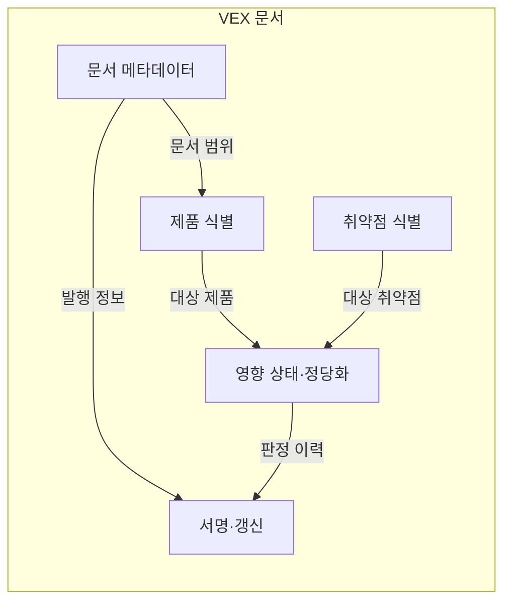
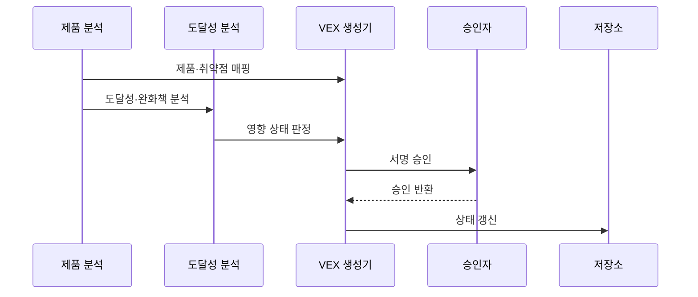

---
sidebar:
  order: 184
  label: "184. 취약점 악용 가능성 교환 (VEX)"
  badge:
    text: "기출 · 70%"
    variant: note
title: "취약점 악용 가능성 교환 (VEX)"
date: "2026-07-27T23:59:59+09:00"
tags:
  - "notes-software"
weight: 184
extra:
  question_no: "184"
  source_status: "기출"
  source_history: "138회"
  priority: 70
  priority_note: "제품별 취약점 영향 판정이 핵심"
---

## 미리 알고가기
- **취약점 악용 가능성 교환(Vulnerability Exploitability eXchange, VEX)**: VEX는 ‘벡스’로 읽고 영문 명칭의 핵심 글자를 딴 약어이며, 특정 제품에서 취약점의 실제 영향 상태와 근거를 전달함
- **소프트웨어 자재명세서(Software Bill of Materials, SBOM)**: SBOM은 ‘에스봄’으로 읽고 영문 머리글자를 딴 약어이며, VEX가 판정할 제품 구성요소와 의존 관계를 제공함
- **영향 상태**: `affected`(어펙티드)는 영향 있음, `not_affected`(낫 어펙티드)는 영향 없음, `fixed`(픽스트)는 조치 완료, `under_investigation`(언더 인베스티게이션)은 조사 중이며 밑줄은 여러 단어를 한 기계 판독 값으로 연결함
- **정당화**: `not_affected` 판정에 코드 미포함, 경로 미도달, 완화책 적용 등의 근거를 연결함
- **도달성 분석**: 취약한 코드가 제품의 실제 실행 경로에서 호출될 수 있는지 확인함
- **공통 취약점 및 노출(Common Vulnerabilities and Exposures, CVE)**: CVE는 ‘시브이이’로 읽고 영문 머리글자를 딴 약어이며, VEX의 취약점 대상을 공통 번호로 식별함
- **완화책**: 패치 전에도 취약점의 악용 경로나 피해를 줄이는 임시 보호 조치임
- **공통 보안 권고 프레임워크(Common Security Advisory Framework, CSAF)**: CSAF는 ‘씨에스에이에프’로 읽고 영문 머리글자를 딴 약어이며, 보안 권고와 제품별 취약점 상태를 기계 판독 형식으로 교환함
- **사이클론디엑스(CycloneDX)·오픈벡스(OpenVEX)**: CycloneDX는 SBOM과 VEX 정보를 표현하는 표준이고 OpenVEX는 VEX 문서를 간결하게 교환하는 공개 형식임
- **문서 서명**: VEX 발행 주체와 배포 뒤 위변조 여부를 검증하는 전자 증명임

## Ⅰ. 개요

- 정의/개념: 제품별 **취약점 영향 상태·근거** 교환
- **배경/필요성**: SBOM의 **실제 악용 가능성 판정 한계** 보완

### 쉽게 이해하기 (학습용)
- SBOM은 포함 여부, VEX는 실제 영향 여부를 밝힘

## Ⅱ. 특징

- 제품 버전·취약점의 **영향 범위 특정**
- 영향 상태와 **정당화 근거 결합**
- 패치·증거 변화에 따른 **상태 갱신**

### 쉽게 이해하기 (학습용)
- 같은 취약점도 실행 경로에 따라 영향이 달라짐

## Ⅲ. 아키텍처 및 구성요소

| 설계 요소 | 설명 |
|:---|:---|
| 문서 메타데이터 | 문서 버전과 발행 시각을 관리함 |
| 제품 식별 | 제품·버전·패키지를 식별함 |
| 취약점 식별 | CVE와 보안 권고를 연결함 |
| 영향 상태·정당화 | 상태와 판단 근거를 기록함 |
| 서명·갱신 | 무결성과 변경 이력을 관리함 |

> 요약: 제품과 취약점을 상태·근거로 연결함

### 쉽게 이해하기 (학습용)
- 영향 상태와 근거를 서명된 문서로 갱신함

## Ⅳ. 원리 및 절차 흐름도

| 절차 | 설명 |
|:---|:---|
| 제품·취약점 매핑 | 대상 제품과 CVE를 연결 |
| 도달성·완화책 분석 | 실행 경로와 완화책을 확인 |
| 영향 상태 판정 | 상태와 정당화를 결정 |
| 서명 승인 | 판정 근거와 문서 내용을 검토 |
| 승인 반환 | 승인자 서명을 생성기에 반환 |
| 상태 갱신 | 패치·증거 변화가 반영된 문서 배포 |

> 요약: 분석 근거로 상태를 판정하고 갱신함

### 쉽게 이해하기 (학습용)
- 도달성과 완화책을 분석해 VEX 상태를 갱신함

## Ⅴ. 종류 및 비교

| 취약점 정보 문서 | VEX | SBOM | 보안 권고 |
|:---|:---|:---|:---|
| 적용 기준 | 실제 대응 우선순위 판정 | 공급망 구성 파악 | 일반 취약점 대응 안내 |
| 핵심 특징 | 제품별 영향 상태·근거 | 구성요소·의존 관계 | 취약점·대응 정보 공지 |
| 한계 | 오판·오래된 상태 | 누락된 구성요소 | 제품별 영향 불명확 |

> 요약: 구성 파악은 SBOM, 영향 판정은 VEX임

### 쉽게 이해하기 (학습용)
- SBOM은 포함 부품, VEX는 실제 영향을 알려줌

## Ⅵ. 실무 사례

1. 미도달 근거로 **영향 없음 상태 발행**

### 쉽게 이해하기 (학습용)
- 미도달 취약 코드는 근거와 함께 영향 없음으로 판정함

## Ⅶ. 결론

- **최신 도달성·완화 근거**로 영향 상태 확정

### 쉽게 이해하기 (학습용)
- 근거가 바뀌면 영향 상태도 즉시 다시 판정함
