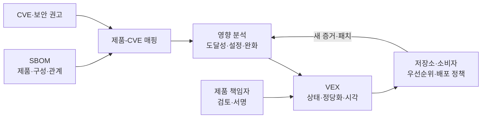
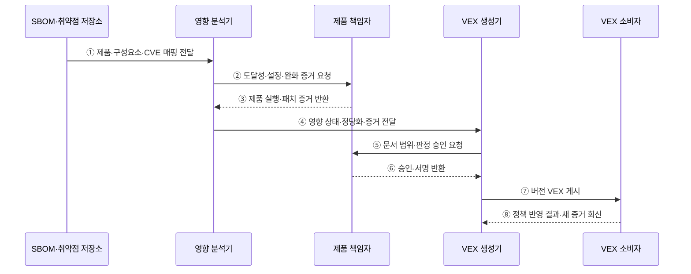

---
sidebar:
  order: 184
  label: "184. 취약점 악용 가능성 교환 (VEX)"
  badge:
    text: "기출 · 70%"
    variant: note
title: "취약점 악용 가능성 교환 (VEX)"
date: "2026-07-27T23:59:59+09:00"
tags:
  - "notes-software"
weight: 184
extra:
  question_no: "184"
  source_status: "기출"
  source_history: "138회"
  priority: 70
  priority_note: "제품별 취약점 영향 판정이 핵심"
---

## 미리 알고가기

- **취약점 악용 가능성 교환(Vulnerability Exploitability eXchange, VEX·벡스)**: 특정 제품·버전에서 알려진 취약점의 영향 상태와 판단 근거를 기계 판독 형식으로 전달하는 문서
- **소프트웨어 자재명세서(Software Bill of Materials, SBOM·에스봄)**: 제품에 포함된 구성요소·버전·식별자·의존 관계를 기록한 명세
- **공통 취약점 및 노출(Common Vulnerabilities and Exposures, CVE·시브이이)**: 공개 취약점을 공통 번호로 식별하는 체계
- **영향 있음(Affected)**: 해당 제품이 취약점의 영향을 받아 패치·완화·사용 중단 등 대응이 필요한 상태
- **영향 없음(Not Affected)**: 구성요소가 있어도 코드 미포함·미도달·실행 조건 불충족·완화 통제 등으로 제품이 영향을 받지 않는 상태
- **조치 완료(Fixed)**: 취약점을 제거·패치한 제품 버전이나 배포 상태
- **조사 중(Under Investigation)**: 영향 판단에 필요한 증거가 아직 충분하지 않은 상태
- **도달성 분석(Reachability Analysis)**: 취약한 함수·코드 경로가 제품 실행에서 실제 호출될 수 있는지 분석하는 활동
- **정당화(Justification)**: 영향 없음 등 상태 판단을 뒷받침하는 표준 사유와 상세 증거
- **공통 보안 권고 프레임워크(Common Security Advisory Framework, CSAF·씨에스에이에프)**: 제품별 취약점 상태와 대응 정보를 표현하는 기계 판독 보안 권고 표준
- **OpenVEX·CycloneDX**: OpenVEX는 간결한 VEX 교환 형식이고 CycloneDX는 SBOM과 취약점·영향 정보를 함께 표현할 수 있는 표준

## Ⅰ. 개요

- VEX는 SBOM에서 발견한 취약점 후보를 **제품별 실제 영향 상태와 근거**로 구체화한다.
- 구성요소가 포함됐다는 사실만으로 모든 제품을 패치 대상으로 보는 오탐과 대응 낭비를 줄인다.
- 영향 없음 선언은 면제가 아니라 검증 가능한 증거와 지속적인 재평가가 필요한 위험 판단이다.

### 쉽게 이해하기 (학습용)
- SBOM은 문제 부품의 포함 여부를, VEX는 그 부품이 실제로 위험한지를 알려 줌

## Ⅱ. 특징

- **대상 특정**: 제품·버전·패키지와 CVE의 정확한 조합에 상태를 부여한다.
- **상태 표준화**: 영향 있음·영향 없음·조치 완료·조사 중으로 대응 단계를 전달한다.
- **근거 결합**: 도달성·설정·컴파일 옵션·완화 통제·패치 정보를 정당화에 연결한다.
- **기계 판독**: 자산·취약점·배포 정책 도구가 자동으로 우선순위를 조정할 수 있다.
- **시간 변화**: 새 공격 기법·설정·제품 버전·패치에 따라 문서 버전과 상태를 갱신한다.
- **발행자 책임**: 서명·발행 시각·문서 이력으로 판단 주체와 무결성을 증명한다.

### 쉽게 이해하기 (학습용)
- 같은 취약 부품도 제품의 사용 경로와 설정에 따라 영향 상태가 달라짐

## Ⅲ. 아키텍처 및 구성요소

**도표안 A — 구조도**

**도표안 B — sequenceDiagram**

| 구성요소 | 역할 |
|:---|:---|
| 문서 메타데이터 | 문서 ID·버전·작성·발행 시각·발행자 기록 |
| 제품 식별 | 제품·버전·패키지·산출물 Digest를 정확히 지정 |
| 취약점 식별 | CVE·보안 권고·취약 구성요소 연결 |
| 영향 상태 | Affected·Not Affected·Fixed·Under Investigation 표현 |
| 정당화·증거 | 코드 포함·도달성·실행 조건·완화·패치 근거 기록 |
| 승인·서명 | 제품 책임자의 판정 승인과 문서 무결성 증명 |
| 저장소·소비자 | 최신 VEX 보관·취약점 우선순위·배포 정책 반영 |

**동작 원리**

- ① SBOM과 취약점 정보에서 제품·구성요소·CVE 조합을 영향 분석 대상으로 전달한다.
- ② 분석기가 제품 책임자에게 코드 도달성·실행 설정·완화 통제·패치 증거를 요청한다.
- ③ 제품 책임자가 실제 빌드·배포·실행 경로와 조치 정보를 반환한다.
- ④ 분석기가 증거 수준에 따라 영향 상태·정당화·상세 근거를 VEX 생성기에 전달한다.
- ⑤ 생성기가 제품·버전·CVE 범위와 판정 내용을 책임자에게 승인 요청한다.
- ⑥ 책임자가 근거를 검토해 승인하고 문서 서명을 반환한다.
- ⑦ 생성기가 새 버전 VEX를 저장소·고객·취약점 관리 도구에 게시한다.
- ⑧ 소비자는 상태를 정책에 반영하고 새 공격 정보·상충 증거·패치 결과를 발행자에게 회신한다.

### 쉽게 이해하기 (학습용)
- 제품에서 취약 코드가 실제 실행되는지 증거로 확인해 서명된 영향 상태를 배포함

## Ⅳ. 종류 및 비교

| 비교 항목 | SBOM | VEX | 보안 권고 |
|:---|:---|:---|:---|
| 핵심 질문 | 무엇이 포함됐는가 | 이 제품이 실제 영향을 받는가 | 취약점과 대응 방법은 무엇인가 |
| 대상 | 제품 구성요소·관계 | 제품·버전·CVE 조합 | 취약점·영향 제품·패치 정보 |
| 핵심 정보 | 이름·버전·식별자·해시 | 상태·정당화·증거·시각 | 설명·심각도·완화·수정 버전 |
| 활용 | 공급망 파악·후보 탐색 | 대응 우선순위·오탐 제거 | 공지·패치·완화 안내 |
| 한계 | 포함 여부만으로 영향 판단 불가 | 오판·오래된 증거·범위 오류 | 소비자 제품의 실제 배포 상태 불명확 |

| VEX 상태 | 의미 | 요구 조치 |
|:---|:---|:---|
| Affected | 제품이 영향을 받음 | 패치·완화·노출 제한·우선순위 지정 |
| Not Affected | 검증 근거로 영향 없음 | 정당화 보존·조건 변화 감시 |
| Fixed | 지정 버전·배포에서 조치 완료 | 배포 여부·잔여 구버전 확인 |
| Under Investigation | 판단 증거 부족 | 보수적 통제·조사 기한·책임자 지정 |

### 쉽게 이해하기 (학습용)
- SBOM으로 후보를 찾고 VEX로 실제 영향과 대응 상태를 좁힘

## Ⅴ. 실무 고려사항 및 대책

| 고려사항 | 위험 | 대책 |
|:---|:---|:---|
| 제품 범위 | 다른 버전·빌드에 상태를 잘못 적용 | 제품 ID·버전·Digest·플랫폼 명시 |
| 도달성 | 정적 분석만으로 동적 호출·설정 누락 | 정적·동적·구성·운영 증거 교차 검증 |
| Not Affected | 편의를 위한 근거 없는 위험 제외 | 표준 정당화·상세 증거·승인자 필수 |
| Fixed | 패치 존재를 배포 완료로 오인 | 수정 버전과 실제 자산 배포 상태 분리 |
| 최신성 | 새 공격 경로에도 이전 상태 유지 | 만료·재검토 시점·취약점 정보 변화 감시 |
| 신뢰성 | 위조 문서·알 수 없는 발행자 | 서명·신뢰 키·발행자 권한 검증 |
| 상충 상태 | 공급자와 내부 분석 결과 불일치 | 증거 비교·보수적 상태·이의 절차 |
| 자동화 | VEX만 믿고 중요한 취약점 자동 종료 | 심각도·노출·자산 중요도와 함께 정책화 |

### 쉽게 이해하기 (학습용)
- 사례: 취약 함수가 제품에 포함되지 않았음을 빌드·도달성 증거로 확인한 뒤 영향 없음으로 발행함

## Ⅵ. 결론

- VEX의 핵심은 **제품·버전·취약점별 실제 영향 상태를 검증 가능한 근거와 함께 전달**하는 것이다.
- 영향 없음과 조치 완료는 정확한 범위·증거·승인·배포 상태가 없으면 신뢰할 수 없다.
- 새 증거·공격 기법·설정·패치에 따라 상태를 재평가하고 SBOM·자산·취약점 대응과 연결해야 한다.

### 쉽게 이해하기 (학습용)
- 문제 부품이 실제 위험한지 증명하고 근거가 바뀌면 영향 상태도 갱신함
