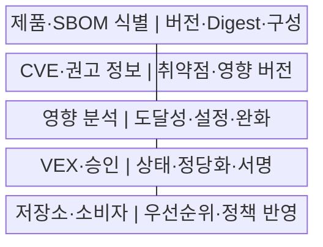
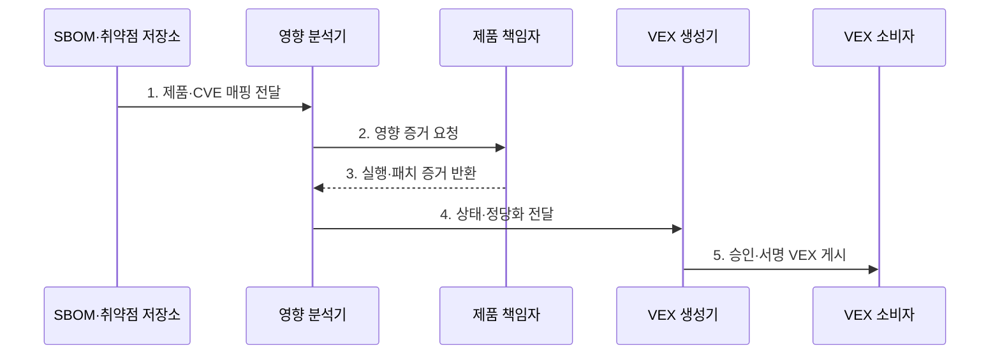

---
sidebar:
  order: 184
  label: "184. 취약점 악용 가능성 교환 (VEX)"
  badge:
    text: "기출 · 70%"
    variant: note
title: "취약점 악용 가능성 교환 (VEX)"
date: "2026-07-29T20:40:00+09:00"
tags:
  - "notes-software"
weight: 184
extra:
  question_no: "184"
  source_status: "기출"
  source_history: "138회"
  priority: 70
  priority_note: "제품별 취약점 영향 판정 출제"
---

## 미리 알고가기

- **취약점 악용 가능성 교환(Vulnerability Exploitability eXchange, VEX)**: 제품·버전별 취약점 영향 상태와 근거를 기계 판독 형식으로 전달하는 문서
- **소프트웨어 자재명세서(Software Bill of Materials, SBOM)**: 제품의 구성요소·버전·식별자·의존 관계 명세
- **공통 취약점 및 노출(Common Vulnerabilities and Exposures, CVE)**: 공개 취약점을 공통 번호로 식별하는 체계
- **영향 있음(Affected)**: 제품이 취약점 영향을 받아 패치·완화가 필요한 상태
- **영향 없음(Not Affected)**: 코드 미포함·미도달·실행 조건 불충족 등으로 영향이 없는 상태
- **조치 완료(Fixed)**: 취약점을 제거·패치한 제품 버전이나 배포 상태
- **조사 중(Under Investigation)**: 영향 판단 증거가 충분하지 않은 상태
- **도달성 분석(Reachability Analysis)**: 취약한 함수·코드 경로가 실제 호출될 수 있는지 분석하는 활동
- **정당화(Justification)**: 상태 판단을 뒷받침하는 표준 사유와 상세 증거
- **CSAF·OpenVEX·CycloneDX**: 제품별 취약점 상태를 기계 판독 형식으로 교환하는 표준·형식

## Ⅰ. 개요

- 정의/개념: 제품별 취약점의 **영향 상태·판단 근거 교환 문서**
- 배경/필요성: 포함 사실만으로 생기는 **오탐·대응 낭비 감소**

### 쉽게 이해하기 (학습용)

- SBOM이 문제 부품의 포함 여부를 알려 준다면 VEX는 그 부품의 취약 코드가 이 제품에서 실제 실행되는지 증거와 함께 알려 준다.

## Ⅱ. 특징

- **제품·버전·CVE 조합** 기반 대상 특정
- **Affected·Not Affected·Fixed** 상태 표준화
- **도달성·설정·완화·서명** 기반 판단 신뢰

### 쉽게 이해하기 (학습용)

- 같은 취약 부품이 들어 있어도 빌드 옵션과 실행 경로가 다르면 제품별 영향 상태가 달라지므로 범위와 근거를 함께 기록한다.

## Ⅲ. 구조 및 구성요소

| 구성요소 | 책임 |
|:---|:---|
| 제품·SBOM 식별 | 제품·버전·**Digest·구성 연결** |
| CVE·권고 정보 | 취약점·**영향 버전·대응 제공** |
| 영향 분석 | 도달성·설정·**완화 증거 검토** |
| VEX·승인 | 상태·정당화·**책임자 서명** |
| 저장소·소비자 | 최신 문서·**우선순위·정책 반영** |

### 쉽게 이해하기 (학습용)

- 제품 부품표와 취약점 목록을 맞춘 뒤 실행 가능성을 분석하고 책임자가 서명한 영향 상태를 운영 도구에 전달한다.

## Ⅳ. 흐름도

**동작 원리**

1. **제품·CVE 매핑 전달**: SBOM 식별자 기반 후보 생성
2. **영향 증거 요청**: 도달성·설정·완화·패치 조사
3. **실행·패치 증거 반환**: 실제 빌드·배포 조건 확인
4. **상태·정당화 전달**: 영향 상태·범위·근거 확정
5. **승인·서명 VEX 게시**: 정책 반영·새 증거 재평가

### 쉽게 이해하기 (학습용)

- 취약 함수가 빌드에 없다는 증거를 책임자가 검토해 Not Affected로 발행하면 소비자는 그 제품만 패치 대기열에서 분리할 수 있다.

## Ⅴ. 종류 및 비교

| 공급망 문서 | SBOM | VEX | 보안 권고 |
|:---|:---|:---|:---|
| 적용 기준 | 제품 **구성 파악** | 제품별 **실제 영향 판단** | 취약점 **대응 정보 제공** |
| 핵심 특징 | 부품·버전·**의존 관계** | 상태·정당화·**판단 증거** | 심각도·완화·**수정 버전** |
| 한계 | 포함만으로 **영향 판단 불가** | 오판·범위·**증거 노후화** | 실제 배포 상태 **확인 불가** |

### 쉽게 이해하기 (학습용)

- SBOM으로 후보 제품을 찾고 VEX로 실제 영향을 좁히며 보안 권고에서 패치와 완화 방법을 확인한다.

## Ⅵ. 실무 고려사항 및 대책

| 고려사항 | 대책 | 효과 |
|:---|:---|:---|
| 다른 빌드에 **상태 오적용** | 제품 ID·버전·**Digest 명시** | 판정 범위 정확화 |
| 정적 분석의 **동적 경로 누락** | 정적·동적·**설정 증거 교차 검증** | 도달성 오판 감소 |
| 근거 없는 **Not Affected** | 표준 정당화·**상세 증거·승인** | 위험 제외 신뢰 확보 |
| 패치 존재의 **배포 완료 오인** | 수정 버전·**실제 자산 상태 분리** | 미패치 자산 식별 |
| 새 공격 뒤 **오래된 판정 유지** | 만료·재검토·**정보 변화 감시** | 영향 상태 최신화 |

### 쉽게 이해하기 (학습용)

- Fixed 문서가 있어도 운영 자산이 수정 버전으로 배포됐는지 별도로 확인해야 실제 취약 제품이 남지 않는다.

## Ⅶ. 결론

- **제품 범위·도달성·배포 상태**로 VEX 판정·우선순위 결정

### 쉽게 이해하기 (학습용)

- 영향 없음과 조치 완료는 제품 Digest·검증 증거·책임자 서명·배포 확인이 있을 때만 정책에 반영하고 새 정보가 나오면 재평가해야 한다.
