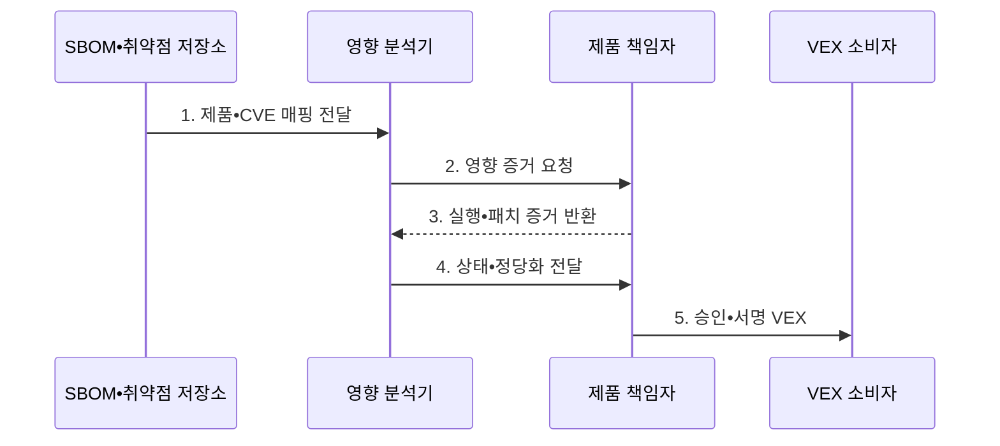

---
sidebar:
  order: 184
  label: "184. 취약점 악용 가능성 교환 (VEX)"
  badge:
    text: "기출 • 70%"
    variant: note
title: "취약점 악용 가능성 교환 (VEX)"
date: "2026-08-05T01:15:56+09:00"
tags:
  - "notes-software"
weight: 184
extra:
  question_no: "184"
  source_status: "기출"
  source_history: "138회"
  priority: 70
  priority_note: "제품별 취약점 영향 판정 출제"
---

## Ⅰ. 개요

<details>
<summary>핵심 용어</summary>

- **취약점 악용 가능성 교환(Vulnerability Exploitability eXchange, VEX)**: 제품•버전별 취약점의 실제 영향 상태와 판단 근거를 기계 판독 형식으로 전달하는 공급망 문서이다.

</details>

- 정의/개념: **VEX** 는 알려진 취약점이 특정 제품에 실제 영향을 주는지에 대한 상태와 판단 근거를 공급망 참여자 사이에 교환하는 기계 판독 문서
- 배경/필요성: 구성요소 포함 여부만으로는 **실제 영향 제품** 식별 불가

#### 한줄 요약

- SBOM이 문제 부품의 포함 여부를 알려 준다면 VEX는 그 부품의 취약 코드가 이 제품에서 실제 실행되는지 증거와 함께 알려 준다.

## Ⅱ. 특징

<details>
<summary>핵심 용어</summary>

- **Affected**: 패치나 완화가 필요한 영향 상태이다.
- **Not Affected**: 도달성 근거로 영향이 없다고 판단한 상태이다.
- **공통 취약점 및 노출(Common Vulnerabilities and Exposures, CVE)**: 공개 취약점을 고유 번호로 식별하는 표준 체계이다.
- **공통 보안 권고 프레임워크(Common Security Advisory Framework, CSAF)**: 보안 권고를 기계 판독 형식으로 교환하는 표준이다.
- **오픈VEX(OpenVEX)**: VEX 상태와 판단 근거를 교환하는 공개 형식이다.
- **사이클론DX(CycloneDX)**: 구성요소와 취약점 정보를 표현하는 공급망 명세 형식이다.
- **소프트웨어 자재 명세서(Software Bill of Materials, SBOM)**: 제품 구성요소와 의존 관계를 기록하는 명세서이다.

</details>

- **제품•버전•CVE 조합** 기반 대상 특정
- **Affected•Not Affected** 영향 상태 표준화
- **Fixed•Under Investigation** 조치•조사 상태 표준화
- **도달성•설정 증거** 기반 영향 판단 신뢰
- **CSAF•OpenVEX** 기반 기계 판독 교환
- **CycloneDX•SBOM** 기반 구성•영향 연계

#### 한줄 요약

- 같은 취약 부품이 들어 있어도 빌드 옵션과 실행 경로가 다르면 제품별 영향 상태가 달라지므로 범위와 근거를 함께 기록한다.

## Ⅲ. 구조 및 구성요소

<details>
<summary>핵심 용어</summary>

- **영향 분석**: 영향 분석은 취약 코드의 도달성, 설정, 완화, 패치 증거를 검토해 제품별 상태를 판단한다.
- **제품•SBOM 식별**: 제품•버전•다이제스트와 구성요소 목록을 연결하는 구성요소이다.
- **CVE•권고 정보**: 취약점의 영향 버전•심각도•완화•수정 정보를 제공하는 구성요소이다.
- **VEX 문서**: 영향 상태•정당화•상세 근거를 기록하는 구성요소이다.
- **승인**: 책임자가 VEX 판단 근거를 검토하고 서명하는 구성요소이다.

</details>

```text
[제품•SBOM 식별]---+
                    |
[CVE•권고 정보]---[영향 분석]---[VEX•승인]---[저장소•소비자]
```

선의 의미: 제품•SBOM 식별과 CVE•권고 정보는 영향 분석의 대상 및 판단 자료 관계이고, 영향 분석은 VEX•승인 및 저장소•소비자와 상태 근거의 검토•활용 관계이다.

| 구성요소 | 책임 |
|:---|:---|
| 제품•SBOM 식별 | 제품•버전•**Digest•구성 연결** |
| CVE•권고 정보 | 취약점•**영향 버전•대응 제공** |
| 영향 분석 | 도달성•설정•**완화 증거 검토** |
| VEX•승인 | 상태•정당화•**책임자 서명** |
| 저장소•소비자 | 최신 문서•**우선순위•정책 반영** |

#### 한줄 요약

- 제품 부품표와 취약점 목록을 맞춘 뒤 실행 가능성을 분석하고 책임자가 서명한 영향 상태를 운영 도구에 전달한다.

## Ⅳ. 흐름도

<details>
<summary>핵심 용어</summary>

- **4. 상태•정당화 전달**: 분석 결과의 영향 상태, 적용 범위, 표준 정당화와 상세 근거를 VEX 생성기에 전달한다.
- **1. 제품•CVE 매핑 전달**: SBOM 식별자로 영향 후보 제품을 만드는 단계이다.
- **2. 영향 증거 요청**: 취약 코드의 도달성•설정•완화•패치 상태를 조사하도록 요청하는 단계이다.
- **3. 실행•패치 증거 반환**: 실제 빌드•배포 조건과 취약 코드 실행 가능성을 확인한 자료를 제공하는 단계이다.
- **5. 승인•서명 VEX**: 책임자가 검토한 문서를 소비자에게 발행하고 정책에 반영하는 단계이다.

</details>



**동작 원리**

1. **제품•CVE 매핑 전달**: SBOM 식별자 기반 후보 생성
2. **영향 증거 요청**: 도달성•설정•완화•패치 조사
3. **실행•패치 증거 반환**: 실제 빌드•배포 조건 확인
4. **상태•정당화 전달**: 영향 상태•범위•근거 확정
5. **승인•서명 VEX**: 소비 정책 반영•새 증거 발생 시 재평가

#### 한줄 요약

- 취약 함수가 빌드에 없다는 증거를 책임자가 검토해 Not Affected로 발행하면 소비자는 그 제품만 패치 대기열에서 분리할 수 있다.

## Ⅴ. 종류 및 비교

<details>
<summary>핵심 용어</summary>

- **SBOM 역할**: 제품의 부품•버전•의존 관계로 취약점 후보 식별
- **VEX 역할**: 취약점 후보 중 실제 제품 영향을 상태와 증거로 판정

</details>

| 공급망 문서 | SBOM | VEX | 보안 권고 |
|:---|:---|:---|:---|
| 적용 기준 | 제품 **구성 파악** | 제품별 **실제 영향 판단** | 취약점 **대응 정보 제공** |
| 핵심 특징 | 부품•버전•**의존 관계** | 상태•정당화•**판단 증거** | 심각도•완화•**수정 버전** |
| 한계 | 포함만으로 **영향 판단 불가** | 오판•범위•**증거 노후화** | 실제 배포 상태 **확인 불가** |

#### 한줄 요약

- SBOM으로 후보 제품을 찾고 VEX로 실제 영향을 좁히며 보안 권고에서 패치와 완화 방법을 확인한다.

## Ⅵ. 실무 고려사항 및 대책

<details>
<summary>핵심 용어</summary>

- **영향 없음 판정**: 제품 식별자•도달성 증거•책임자 검토 확보
- **제품 다이제스트(Product Digest)**: VEX 판정을 정확한 제품 빌드에 결속하는 내용 기반 해시값이다.
- **도달성 증거(Reachability Evidence)**: 취약 코드가 실제 실행 경로에서 호출 가능한지를 정적•동적•설정 분석으로 입증한 자료이다.

</details>

| 문제 | 대책 | 효과 |
|:---|:---|:---|
| 다른 빌드에 **상태 오적용** | 제품 식별자•버전•**Digest 명시** | **판정 범위** 정확화 |
| 정적 분석의 **동적 경로 누락** | 정적•동적•**설정 증거 교차 검증** | **도달성 오판** 감소 |
| 근거 없는 **Not Affected** | 표준 정당화•**상세 증거•승인** | **위험 제외** 신뢰 향상 |
| 패치 존재의 **배포 완료 오인** | 수정 버전•**실제 자산 상태 분리** | **미패치 자산** 식별 |
| 새 공격 뒤 **오래된 판정 유지** | 만료•재검토•**정보 변화 감시** | **영향 상태** 최신화 |

#### 한줄 요약

- Fixed 문서가 있어도 운영 자산이 수정 버전으로 배포됐는지 별도로 확인해야 실제 취약 제품이 남지 않는다.

## Ⅶ. 결론

<details>
<summary>핵심 용어</summary>

- **반영 기준**: 제품 Digest 일치와 **도달성 증거** 유효성 확인 후 VEX 반영

</details>

- 제품 Digest와 도달성 증거가 일치할 때만 **Not Affected** 반영, 미배포 자산은 패치 우선

#### 한줄 요약

- 영향 없음과 조치 완료는 제품 Digest•검증 증거•책임자 서명•배포 확인이 있을 때만 정책에 반영하고 새 정보가 나오면 재평가해야 한다.
