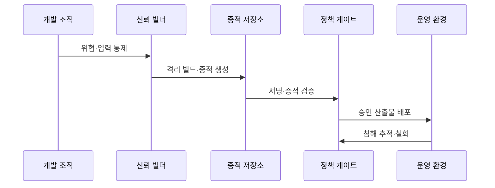

---
sidebar:
  order: 185
  label: "185. 소프트웨어 공급망 보안"
  badge:
    text: "기출 · 85%"
    variant: note
title: "소프트웨어 공급망 보안"
date: "2026-07-25T00:30:00+09:00"
tags:
  - "notes-software"
weight: 185
extra:
  question_no: "185"
  source_status: "기출"
  source_history: "128회, 134회, 135회"
  priority: 85
  priority_note: "개발·빌드·배포 신뢰사슬 반복 출제"
---

## 미리 알고가기

- **공급망 공격**: 소스·의존성·빌드·배포 경로를 침해해 악성 코드를 제품에 유입하는 공격임
- **소프트웨어 자재명세서(Software Bill of Materials, SBOM)**: SBOM은 ‘에스봄’으로 읽고 영문 머리글자를 딴 약어이며, 제품의 구성요소와 의존 관계로 취약 부품의 영향 범위를 추적함
- **취약점 악용 가능성 교환(Vulnerability Exploitability eXchange, VEX)**: VEX는 ‘벡스’로 읽고 영문 명칭의 핵심 글자를 딴 약어이며, 특정 제품에서 취약점의 실제 영향 상태와 근거를 전달함
- **출처 증명(Provenance)**: 산출물의 소스·입력·생성 과정과 빌더 신원을 입증하는 증적임
- **소프트웨어 산출물 공급망 수준(Supply-chain Levels for Software Artifacts, SLSA)**: SLSA는 ‘살사’로 읽고 영문 머리글자를 딴 약어이며, 소스·빌드 플랫폼·출처 증명의 보증 수준으로 산출물 변조 위험을 줄임
- **제로 트러스트**: 주체를 기본 신뢰하지 않고 접근마다 신원과 권한을 검증하는 원칙임
- **지속적 통합·지속적 전달(Continuous Integration/Continuous Delivery, CI/CD) 파이프라인**: CI/CD는 ‘씨아이·씨디’로 읽고 두 영문 머리글자 사이를 슬래시로 구분한 표기이며, 통합·검사·빌드·배포와 증적 검증을 자동화함
- **격리·재현 빌드**: 격리 빌드는 외부 영향을 막고 재현 빌드는 같은 입력에서 같은 결과를 만듦
- **정책 게이트**: 서명·출처·SBOM이 배포 조건을 충족하는지 검사하는 승인 지점임
- **서명 철회·롤백**: 철회는 신뢰를 취소하고 롤백은 이전 정상 버전으로 되돌리는 조치임
- **산출물**: 소스와 의존성을 빌드해 만든 실행 파일·패키지·이미지임

## Ⅰ. 개요

- **정의/개념**: 개발·빌드·배포의 위변조·악성 코드 유입 통제
- **배경/필요성**: 의존성 침해가 제품에 전파돼 공급 경로 검증이 필요함

### 쉽게 이해하기 (학습용)
- 코드부터 배포까지 주체와 산출물을 계속 검증함

## Ⅱ. 특징

- 개발자·소스·의존성·빌드·배포를 연계 통제한다.
- 서명·SBOM·출처 증명으로 무결성 검증한다.
- 최소 권한·격리로 침해 범위와 변경 권한 제한한다.
- 영향 제품 식별 후 서명 철회·롤백한다.

### 쉽게 이해하기 (학습용)
- 단계별 증적으로 침해 지점과 영향 제품을 찾음

## Ⅲ. 아키텍처 및 구성요소

| 설계 요소 | 설명 |
|:---|:---|
| 신원·권한 | 주체를 식별하고 최소 권한을 적용함 |
| 소스·의존성 | 변경을 승인하고 버전·출처를 고정함 |
| 격리 빌드 | 재현 가능한 신뢰 환경을 제공함 |
| 증적·서명 | SBOM·출처·무결성을 증명함 |
| 정책 게이트 | 증적 검증 후 배포를 승인함 |
| 배포·대응 | 추적·철회·격리·롤백을 수행함 |

> 요약: 신뢰 입력과 증적을 배포 정책으로 연결함

### 쉽게 이해하기 (학습용)
- 증적과 서명이 유효한 산출물만 배포함

## Ⅳ. 원리 및 절차 흐름도

| 절차 | 설명 |
|:---|:---|
| 위협·입력 통제 | 자산·경로를 식별하고 버전을 고정함 |
| 격리 빌드·증적 생성 | 통제 환경에서 빌드하고 증명함 |
| 서명·증적 검증 | 출처·SBOM·정책 적합성을 확인함 |
| 승인 산출물 배포 | 검증을 통과한 산출물만 허용함 |
| 침해 추적·철회 | 영향을 식별하고 격리·롤백함 |

> 요약: 입력을 통제하고 증명·검증한 뒤 배포함

### 쉽게 이해하기 (학습용)
- 승인 입력으로 빌드하고 침해 시 산출물을 철회함

## Ⅴ. 종류 및 비교

| 판단 기준 | 예방 통제 | 탐지 통제 | 대응·복구 통제 |
|:---|:---|:---|:---|
| 핵심 특징 | 유입·변조 기회 제한 | 위변조·취약점 발견 | 침해 확산 차단·복구 |
| 적용 기준 | 소스·의존성·빌드 보호 | 저장·배포 전 검증 | 침해 확인·영향 추적 |
| 주요 위험 | 우회 경로·권한 과다 | 증적 누락·오탐 | 철회 지연·복구 실패 |

> 요약: 예방·탐지·복구 통제를 연결함

### 쉽게 이해하기 (학습용)
- 악성 유입을 차단하고 변조를 찾은 뒤 정상 버전으로 복구함

## Ⅵ. 실무 사례

1. CI/CD는 출처 증명과 서명을 자동 검증함
2. 취약점 대응은 SBOM·VEX로 우선순위 결정

### 쉽게 이해하기 (학습용)
- CI/CD는 빌더 신원과 서명이 다르면 배포를 차단함
- SBOM·VEX로 포함 여부와 실제 영향을 나눠 대응함

## Ⅶ. 결론

- 출처·서명 검증에 실패한 산출물은 배포하지 않음

### 쉽게 이해하기 (학습용)
- 출처나 서명이 맞지 않는 산출물은 운영 환경에 들이지 않음
