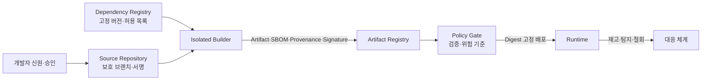
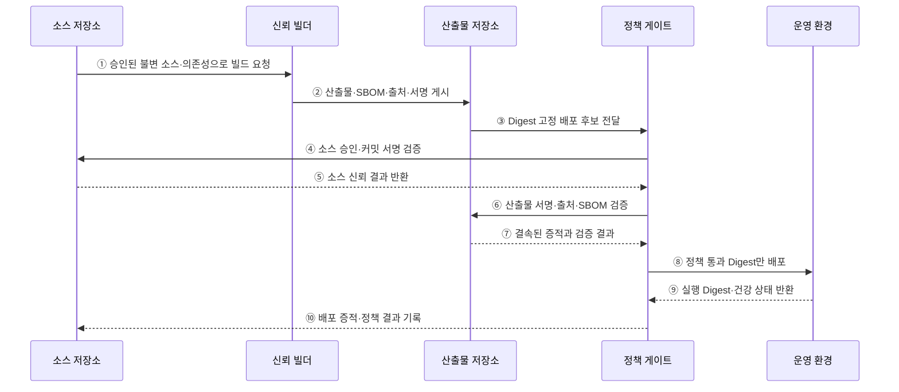

---
sidebar:
  order: 185
  label: "185. 소프트웨어 공급망 보안"
  badge:
    text: "기출 · 85%"
    variant: note
title: "소프트웨어 공급망 보안"
date: "2026-07-27T23:59:59+09:00"
tags:
  - "notes-software"
weight: 185
extra:
  question_no: "185"
  source_status: "기출"
  source_history: "128회, 134회, 135회"
  priority: 85
  priority_note: "개발·빌드·배포 신뢰사슬 반복 출제"
---

## 미리 알고가기

- **소프트웨어 공급망(Software Supply Chain)**: 개발자·소스·의존성·도구·빌드·저장소·배포를 거쳐 소프트웨어가 사용자에게 전달되는 전체 경로
- **공급망 공격(Supply-chain Attack)**: 신뢰받는 개발·빌드·배포 경로를 침해해 악성 코드나 변조 산출물을 제품에 유입하는 공격
- **소프트웨어 자재명세서(Software Bill of Materials, SBOM·에스봄)**: 제품의 구성요소·버전·식별자·의존 관계를 기록한 명세
- **출처 증명(Provenance)**: 산출물의 소스·의존성·빌더·매개변수·생성 과정을 연결하는 검증 가능한 증적
- **소프트웨어 산출물 공급망 수준(Supply-chain Levels for Software Artifacts, SLSA·살사)**: 소스·빌드·출처 증명의 위변조 저항성을 높이는 보안 프레임워크
- **격리 빌드(Isolated Build)**: 다른 작업·사용자·외부 네트워크의 영향을 제한한 전용 환경에서 수행하는 빌드
- **재현 빌드(Reproducible Build)**: 같은 소스·의존성·도구·환경에서 동일한 산출물을 만들 수 있는 빌드
- **정책 게이트(Policy Gate)**: 서명·출처·SBOM·취약점·승인 조건을 검증해 배포 허용 여부를 결정하는 지점
- **서명 철회(Signature Revocation)**: 키 침해·오발행 시 해당 서명이나 키의 신뢰를 중단하는 조치
- **의존성 혼동(Dependency Confusion)**: 내부 패키지와 같은 이름의 외부 패키지를 더 높은 버전 등으로 등록해 빌드가 공격자 패키지를 받게 하는 공격
- **타이포스쿼팅(Typosquatting)**: 유명 패키지와 비슷한 이름의 악성 패키지를 배포해 설치를 유도하는 공격

## Ⅰ. 개요

- 소프트웨어 공급망 보안은 개발부터 운영까지 **코드·도구·산출물의 신원·무결성·출처를 연속 검증**한다.
- 신뢰받는 패키지·빌더·저장소·업데이트 경로가 침해되어 악성 코드가 제품과 고객으로 확산되는 것을 막는다.
- 개별 보안 도구보다 단계 사이의 증거 연결과 검증 실패 시 배포 차단이 핵심이다.

### 쉽게 이해하기 (학습용)
- 코드가 만들어져 배포될 때까지 사람·재료·공장·제품표를 계속 확인함

## Ⅱ. 특징

- **신뢰 경계 연계**: 개발자·소스·의존성·빌더·저장소·배포 주체를 각각 인증하고 연결한다.
- **입력 고정**: 소스 커밋·Lockfile·도구·기본 이미지·빌드 매개변수를 불변 식별자로 고정한다.
- **격리 생성**: 임시·최소 권한 빌더가 승인된 입력만 사용해 산출물을 생성한다.
- **증적 결속**: 산출물 Digest에 SBOM·출처·시험 결과·서명을 연결한다.
- **소비 시 검증**: 저장·배포·실행 시 정책 게이트가 서명과 증적을 다시 확인한다.
- **신속한 대응**: 침해 키·산출물·의존성의 영향 제품을 추적해 철회·격리·롤백한다.

### 쉽게 이해하기 (학습용)
- 승인된 재료로 격리 빌드하고 서명·부품표·제조 기록이 맞는 제품만 배포함

## Ⅲ. 아키텍처 및 구성요소

**도표안 A — 구조도**

**도표안 B — sequenceDiagram**

| 구성요소 | 역할 |
|:---|:---|
| 개발자 신원·소스 통제 | 강한 인증·최소 권한·검토·보호 브랜치·서명 적용 |
| 의존성 통제 | 내부 Registry·Lockfile·해시·허용 목록·악성 패키지 검사 |
| 신뢰 빌더 | 임시 격리 환경·고정 도구·최소 권한으로 빌드 |
| 증적·서명 | 산출물 Digest에 SBOM·출처·시험·빌더 신원 결속 |
| 산출물 저장소 | 불변 Artifact·증적·서명·보존·접근 이력 관리 |
| 정책 게이트 | 출처·서명·취약점·승인·환경 정책 검증 |
| 운영·대응 | 실행 Digest 확인·행위 감시·철회·격리·롤백 |

**동작 원리**

- ① 소스 저장소가 검토·승인된 불변 커밋과 고정 의존성으로 신뢰 빌더를 호출한다.
- ② 빌더가 격리 환경에서 산출물을 만들고 SBOM·출처 증명·서명을 같은 Digest에 연결해 게시한다.
- ③ 저장소가 태그가 아닌 불변 Digest의 배포 후보를 정책 게이트에 전달한다.
- ④ 정책 게이트가 소스 저장소에 커밋 서명·브랜치 보호·승인 이력을 검증한다.
- ⑤ 소스 저장소가 변경 주체와 검토 정책의 신뢰 결과를 반환한다.
- ⑥ 정책 게이트가 산출물 저장소의 서명·빌더 신원·입력·SBOM·취약점 기준을 검증한다.
- ⑦ 저장소가 동일 Digest에 결속된 증적과 검증 결과를 반환한다.
- ⑧ 정책을 모두 통과한 Digest만 운영 환경에 배포한다.
- ⑨ 운영 환경이 실제 실행 Digest와 건강 상태를 반환해 승인 산출물과 일치하는지 확인한다.
- ⑩ 배포·거부 결과와 증적을 소스 변경 이력에 연결해 추적성을 완성한다.

### 쉽게 이해하기 (학습용)
- 승인 소스로 만든 제품의 서명·부품표·제조 기록이 모두 맞아야 운영에 들어감

## Ⅳ. 종류 및 비교

| 통제 단계 | 예방 | 탐지 | 대응·복구 |
|:---|:---|:---|:---|
| 개발·소스 | 강한 인증·최소 권한·검토 | 이상 커밋·권한 변경 감사 | 계정 잠금·커밋 복귀·키 철회 |
| 의존성 | 내부 Registry·버전·해시 고정 | 악성·취약 패키지·이름 유사 탐지 | 버전 차단·교체·영향 제품 추적 |
| 빌드 | 격리·임시 빌더·네트워크 제한 | 출처·재현성·빌드 행위 검증 | 빌더 폐기·재빌드·자격증명 회전 |
| 저장·배포 | 불변 Digest·서명·정책 게이트 | 서명·SBOM·취약점·실행 Digest 대조 | 배포 차단·Artifact 철회·롤백 |
| 운영 | 최소 권한·읽기 전용 이미지 | 행위·파일·네트워크 이상 감시 | 격리·키 회전·정상 이미지 재배포 |

| 공격 경로 | 대표 위험 | 핵심 통제 |
|:---|:---|:---|
| 소스 침해 | 계정 탈취·악성 커밋 | MFA·서명·검토·보호 브랜치 |
| 의존성 침해 | 혼동·타이포스쿼팅·탈취 | 내부 우선순위·Lockfile·해시·평판 |
| 빌드 침해 | 빌더가 산출물 변조 | 격리·임시 빌더·검증 가능한 출처 |
| 배포 침해 | 태그 교체·서명 우회 | Digest 고정·입학 정책·실행 검증 |

### 쉽게 이해하기 (학습용)
- 들어오기 전 막고, 만들어진 뒤 검증하며, 침해 시 제품을 찾아 철회함

## Ⅴ. 실무 고려사항 및 대책

| 고려사항 | 위험 | 대책 |
|:---|:---|:---|
| 개발자 계정 | 계정 탈취가 정상 변경으로 위장 | 피싱 저항 MFA·짧은 권한·검토 분리 |
| 의존성 출처 | 공개 저장소의 악성 동명 패키지 선택 | 내부 Namespace·Registry 우선·해시 고정 |
| 빌드 비밀 | 악성 빌드가 서명 키·배포 토큰 탈취 | 작업별 단기 자격증명·비밀 비주입·격리 |
| 서명 키 | 장기 키 침해로 악성 Artifact 신뢰 | 키리스·HSM·회전·투명 로그·철회 |
| 출처 증명 | 빌더가 자기 주장 문서를 생성 | 신뢰 빌더가 자동 생성·서명하고 외부 수정 차단 |
| SBOM 품질 | 누락 부품으로 영향 추적 실패 | 소스·빌드·바이너리 교차 분석 |
| 정책 예외 | 긴급 우회가 상시 백도어로 남음 | 기한·승인자·범위·사후 검토가 있는 예외 |
| 사고 대응 | 침해 산출물의 배포 위치 파악 지연 | Digest 기반 자산 재고·철회·롤백 훈련 |
| 도구 자체 | 보안 도구·Action·Plugin이 새 공급망 위험 | 버전·Digest 고정·권한 최소화·자체 검증 |

### 쉽게 이해하기 (학습용)
- 사례: CI/CD는 빌더 신원과 출처 서명이 다른 이미지의 배포를 자동 차단함

## Ⅵ. 결론

- 소프트웨어 공급망 보안의 핵심은 **승인된 입력에서 생성된 산출물임을 증명하고 소비 지점에서 검증**하는 것이다.
- SBOM·서명·출처 증명은 같은 Artifact Digest에 결속되어야 하며 문서 존재만으로 신뢰해서는 안 된다.
- 계정·의존성·빌더·저장소·배포 경로를 최소 권한으로 격리하고 철회·추적·재빌드 능력을 정기 검증해야 한다.

### 쉽게 이해하기 (학습용)
- 출처와 제조 기록이 검증된 제품만 배포하고 문제 제품은 Digest로 찾아 즉시 철회함
