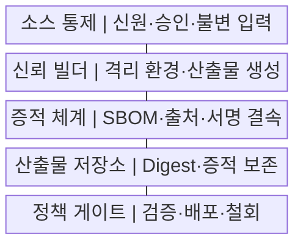
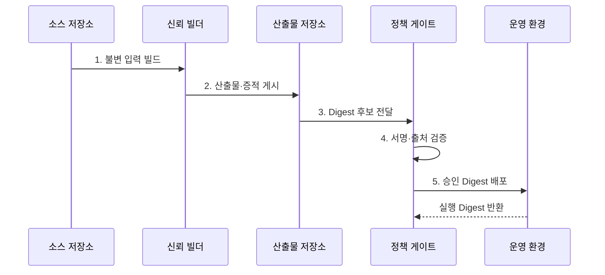

---
sidebar:
  order: 185
  label: "185. 소프트웨어 공급망 보안"
  badge:
    text: "기출 · 85%"
    variant: note
title: "소프트웨어 공급망 보안"
date: "2026-07-29T16:45:00+09:00"
tags:
  - "notes-software"
weight: 185
extra:
  question_no: "185"
  source_status: "기출"
  source_history: "128회, 134회, 135회"
  priority: 85
  priority_note: "개발·빌드·배포 신뢰사슬 반복 출제"
---

## 미리 알고가기

- **소프트웨어 공급망(Software Supply Chain)**: 개발자·소스·의존성·도구·빌드·저장소·배포를 거쳐 소프트웨어가 사용자에게 전달되는 전체 경로
- **공급망 공격(Supply-chain Attack)**: 신뢰받는 개발·빌드·배포 경로를 침해해 악성 코드나 변조 산출물을 제품에 유입하는 공격
- **소프트웨어 자재명세서(Software Bill of Materials, SBOM·에스봄)**: 제품의 구성요소·버전·식별자·의존 관계를 기록한 명세
- **출처 증명(Provenance)**: 산출물의 소스·의존성·빌더·매개변수·생성 과정을 연결하는 검증 가능한 증적
- **소프트웨어 산출물 공급망 수준(Supply-chain Levels for Software Artifacts, SLSA·살사)**: 소스·빌드·출처 증명의 위변조 저항성을 높이는 보안 프레임워크
- **격리 빌드(Isolated Build)**: 다른 작업·사용자·외부 네트워크의 영향을 제한한 전용 환경에서 수행하는 빌드
- **재현 빌드(Reproducible Build)**: 같은 소스·의존성·도구·환경에서 동일한 산출물을 만들 수 있는 빌드
- **정책 게이트(Policy Gate)**: 서명·출처·SBOM·취약점·승인 조건을 검증해 배포 허용 여부를 결정하는 지점
- **서명 철회(Signature Revocation)**: 키 침해·오발행 시 해당 서명이나 키의 신뢰를 중단하는 조치
- **의존성 혼동(Dependency Confusion)**: 내부 패키지와 같은 이름의 외부 패키지를 더 높은 버전 등으로 등록해 빌드가 공격자 패키지를 받게 하는 공격
- **타이포스쿼팅(Typosquatting)**: 유명 패키지와 비슷한 이름의 악성 패키지를 배포해 설치를 유도하는 공격

## Ⅰ. 개요

- 정의/개념: 개발부터 운영까지 **신원·무결성·출처 검증**
- 배경/필요성: 신뢰 경로 침해의 **악성 산출물 확산 차단**

### 쉽게 이해하기 (학습용)

- 식재료와 조리자와 포장 이력이 모두 맞는 상품만 매장에 놓듯 코드부터 배포까지 증거가 이어져야 한다.

## Ⅱ. 특징

- **불변 입력·격리 빌드** 기반 산출물 생성
- **SBOM·출처·서명**의 Digest 결속
- **소비 지점 정책 검증**과 철회·재빌드

### 쉽게 이해하기 (학습용)

- 승인된 재료로 격리 생산하고 제품 지문에 부품표와 제조 기록을 묶어야 바꿔치기를 찾을 수 있다.

## Ⅲ. 구조 및 구성요소

| 구성요소 | 책임 |
|:---|:---|
| 소스 통제 | 신원·승인·**불변 입력 보장** |
| 신뢰 빌더 | 최소 권한·**격리 산출물 생성** |
| 증적 체계 | SBOM·출처·**서명 결속** |
| 산출물 저장소 | Digest·증적의 **불변 보존** |
| 정책 게이트 | 소비 시 **검증·배포·철회** |

### 쉽게 이해하기 (학습용)

- 소스 통제가 재료를 승인하고 빌더가 제품을 만들면 증적 체계와 저장소가 이력을 봉인하고 게이트가 출고를 결정한다.

## Ⅳ. 흐름도

**동작 원리**

1. **불변 입력 빌드**: 승인 소스·고정 의존성 사용
2. **산출물·증적 게시**: SBOM·출처·서명 결속
3. **Digest 후보 전달**: 태그 대신 불변 지문 지정
4. **서명·출처 검증**: 빌더·입력·취약점 확인
5. **승인 Digest 배포**: 통과 산출물만 운영 반영

### 쉽게 이해하기 (학습용)

- 정책 게이트는 제품 이름이 아니라 지문을 기준으로 부품표와 제조 서명을 대조한 뒤 같은 지문만 운영에 보낸다.

## Ⅴ. 종류 및 비교

| 공급망 통제 방식 | 예방 | 탐지 | 대응·복구 |
|:---|:---|:---|:---|
| 적용 기준 | 변경 전 **신뢰 경계 통제** | 생성 후 **증적 일치 확인** | 침해 후 **영향 범위 제거** |
| 핵심 특징 | 신원·버전·**해시 고정** | 서명·SBOM·**실행 지문 대조** | 철회·격리·**정상 재빌드** |
| 한계 | 승인 계정의 **내부자 위험** | 누락 증적의 **오판 가능성** | 재고 부재의 **추적 지연** |

### 쉽게 이해하기 (학습용)

- 예방은 나쁜 재료의 반입을 막고 탐지는 완제품의 봉인을 확인하며 대응은 같은 지문의 제품을 찾아 회수한다.

## Ⅵ. 실무 고려사항 및 대책

| 고려사항 | 대책 | 효과 |
|:---|:---|:---|
| 동명 패키지의 **의존성 혼동** | 내부 Registry·**해시 고정** | 악성 의존성 **유입 차단** |
| 빌드의 **비밀 탈취** | 단기 자격증명·**격리 빌드** | 서명 키·토큰 **노출 축소** |
| 자기 발행 **출처 증명** | 신뢰 빌더의 **자동 생성·서명** | 제조 이력 **위변조 방지** |
| 누락된 **SBOM 부품** | 소스·빌드·**바이너리 교차 분석** | 영향 제품 **추적 정확성** |
| 긴급 예외의 **상시 우회** | 기한·승인·**사후 검토 명시** | 정책 우회 **고착 방지** |

### 쉽게 이해하기 (학습용)

- 빌드 작업마다 짧게 쓰는 자격증명을 발급하고 소스·바이너리 부품표를 대조하면 공격자가 훔칠 열쇠와 숨길 부품이 줄어든다.

## Ⅶ. 결론

- **입력 신뢰·증적 결속·철회 능력**으로 공급망 통제 결정

### 쉽게 이해하기 (학습용)

- 승인 입력에서 만든 사실을 같은 Digest의 증적으로 입증하고 소비 지점에서 다시 검사하며 문제 지문을 즉시 철회해야 한다.
