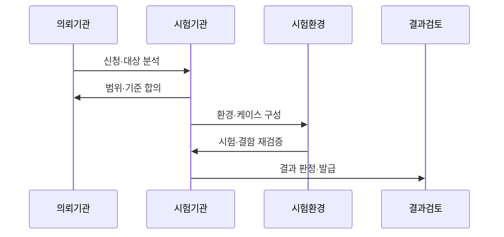

---
sidebar:
  order: 186
  label: "186. TTA 소프트웨어 품질 시험"
  badge:
    text: "기출 · 70%"
    variant: note
title: "TTA 소프트웨어 품질 시험"
date: "2026-07-25T00:30:00+09:00"
tags:
  - "notes-software"
weight: 186
extra:
  question_no: "186"
  source_status: "기출"
  source_history: "126회, 134회"
  priority: 70
  priority_note: "품질 기준·시험 절차 반복 출제"
---

## 미리 알고가기

- **한국정보통신기술협회(Telecommunications Technology Association, TTA)**: TTA는 ‘티티에이’로 읽고 영문 머리글자를 딴 약어이며, 정보통신 기술의 표준화와 소프트웨어 시험·인증을 수행함
- **소프트웨어 품질 시험**: 합의한 요구사항과 품질 기준에 따라 기능·성능·신뢰성 등을 제3자가 측정함
- **시험성적(Tested)**: 의뢰자와 협의한 항목을 시험해 측정 결과가 담긴 공인 시험성적서를 발급하는 서비스임
- **인증(Certified)**: 정해진 표준이나 인증 기준에 적합한지 판정해 인증을 부여하는 서비스임
- **벤치마크 테스트(Benchmark Test, BMT)**: BMT는 ‘비엠티’로 읽고 영문 머리글자를 딴 약어이며, 동일 환경·데이터·부하에서 여러 제품의 기능·성능을 비교함
- **품질 특성**: 기능 적합성·성능 효율성·신뢰성처럼 품질을 나누어 평가하는 관점임
- **시험 케이스**: 입력·실행 절차·예상 결과와 통과 조건을 명시한 시험 단위임
- **시험 증적**: 시험 결과를 재현·검토할 수 있는 로그·측정값·화면 기록임
- **처리량·응답 시간**: 처리량은 단위 시간 작업 수이고 응답 시간은 결과까지 걸린 시간임

## Ⅰ. 개요

- **정의/개념**: 독립 기관이 품질을 기준·증적으로 검증
- **배경/필요성**: 공급자 주장만으로 부족해 독립 품질 판정이 필요함

### 쉽게 이해하기 (학습용)
- 제3자가 같은 조건으로 측정해 객관적 결과를 냄

## Ⅱ. 특징

- **기준 합의**: 대상·범위·품질 특성·통과 조건을 정한다.
- **환경 통제**: 장비·데이터·부하·버전을 고정한다.
- **증적 중심**: 결과·결함·재현 절차를 기록한다.
- **재시험 지원**: 수정 결과를 같은 기준으로 확인한다.

### 쉽게 이해하기 (학습용)
- 조건과 증적을 함께 보관해야 결과를 재현함

## Ⅲ. 아키텍처 및 구성요소

| 설계 요소 | 설명 |
|:---|:---|
| 시험 기준 | 품질 특성과 통과 조건을 확정함 |
| 시험 계획 | 범위·일정·담당을 정의함 |
| 시험 환경 | 장비·데이터·부하를 통제함 |
| 시험 케이스 | 입력·절차·예상 결과를 명세함 |
| 결함·증적 | 결과·로그·재현 절차를 기록함 |
| 결과 판정 | 기준 충족을 검토하고 성적서를 발급함 |

> 요약: 기준과 환경을 증적·판정으로 연결함

### 쉽게 이해하기 (학습용)
- 통제 환경에서 시험하고 증적으로 결과를 판정함

## Ⅳ. 원리 및 절차 흐름도

| 절차 | 설명 |
|:---|:---|
| 신청·대상 분석 | 제품·목적·제약을 확인함 |
| 범위·기준 합의 | 항목·조건·통과 기준을 확정함 |
| 환경·케이스 구성 | 장비·데이터·절차를 준비함 |
| 시험·결함 재검증 | 측정·결함 확인·재시험을 수행함 |
| 결과 판정·발급 | 증적을 검토하고 성적서를 발행함 |

> 요약: 대상 분석 후 시험하고 증적으로 판정함

### 쉽게 이해하기 (학습용)
- 기준을 합의하고 같은 환경에서 시험·재시험함

## Ⅴ. 종류 및 비교

| 판단 기준 | TTA Tested | TTA Certified | BMT |
|:---|:---|:---|:---|
| 핵심 특징 | 협의 항목 측정·성적서 | 규격 적합 판정·인증 | 동일 조건 제품 비교 |
| 적용 기준 | 개별 품질 결과 필요 | 표준 적합성 입증 필요 | 제품 선정 근거 필요 |
| 주요 위험 | 범위 밖 품질 미확인 | 인증 범위 과대 해석 | 불공정한 비교 환경 |

> 요약: 측정·인증·비교 목적을 구분함

### 쉽게 이해하기 (학습용)
- 측정은 Tested, 적합 인증은 Certified임

## Ⅵ. 실무 사례

1. 공공 검수는 계약 항목을 시험성적서로 확인함
2. 솔루션 선정은 같은 환경에서 BMT를 수행함

### 쉽게 이해하기 (학습용)
- 공공 검수는 계약 조건의 통과 여부를 확인함
- BMT는 장비·데이터·부하를 같게 통제함

## Ⅶ. 결론

- 기준·환경·증적이 재현될 때만 결과를 채택함

### 쉽게 이해하기 (학습용)
- 측정값과 대상 버전·조건을 함께 보관함
