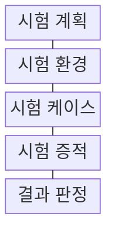
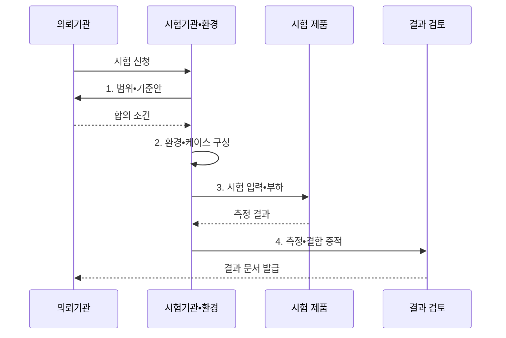

---
sidebar:
  order: 186
  label: "186. TTA 소프트웨어 품질 시험"
  badge: { text: "기출 • 70%", variant: note }
title: "TTA 소프트웨어 품질 시험"
date: "2026-08-04T14:26:00+09:00"
tags: ["notes-software"]
weight: 186
extra:
  question_no: "186"
  source_status: "기출"
  source_history: "126회, 134회"
  priority: 70
  priority_note: "품질 기준•시험 절차 반복 출제"
---

## Ⅰ. 개요

핵심 용어

- **한국정보통신기술협회(Telecommunications Technology Association, TTA) 제3자 시험**: 독립 기관이 합의한 환경•방법•기준으로 소프트웨어 품질을 측정•판정하는 절차이다.

- 정의/개념: **TTA 소프트웨어 품질 시험** 은 독립된 제3자가 합의한 시험 기준과 환경에서 소프트웨어 품질 특성을 측정•판정하는 평가 절차
- 배경/필요성: 자체 시험은 공급자별 조건 차이로 **객관 비교** 불가

#### 한줄 요약
- 제3자가 같은 시험장과 문제와 채점표로 제품을 검사해야 공급자마다 다른 자체 결과를 공정하게 비교할 수 있다.

## Ⅱ. 특징

핵심 용어

- **원시 증적**: 시험 조건에서 얻은 측정값과 로그의 원본 기록이다.
- **독립 판정**: 공급자와 분리된 기관이 합의된 기준으로 결과를 판정하는 방식이다.
- **시험 범위**: 시험 제품•버전과 평가할 품질 항목을 확정한 경계이다.
- **통과 기준**: 품질 항목별 합격선을 사전에 수치화한 판정 조건이다.
- **시험 조건 고정**: 반복 시험의 환경•데이터•부하를 동일하게 유지하는 통제이다.

- **제품•버전•범위•통과 기준** 사전 합의
- **환경•데이터•부하 고정** 과 반복 측정
- **원시 증적•독립 판정** 기반 결과 발급

#### 한줄 요약
- 제품 버전과 시험 조건을 먼저 봉인하고 반복 측정한 원본 기록을 기준표와 대조해야 결과를 다시 확인할 수 있다.

## Ⅲ. 구조 및 구성요소

핵심 용어

- **시험 증적**: 시험 증적은 측정값, 로그, 결함 기록과 환경 설정을 보존해 결과를 재현하고 검토하게 한다.
- **시험 계획**: 제품•범위•방법•통과 기준과 책임을 합의한 구성요소이다.
- **시험 환경**: 장비•네트워크•데이터•부하 조건을 통제하는 구성요소이다.
- **시험 케이스**: 입력•실행 절차•기대 결과를 재현 가능하게 명세한 구성요소이다.
- **결과 판정**: 증적을 기준에 대조해 통과 여부•재시험 범위와 공식 문서를 확정하는 구성요소이다.

| 구성요소 | 책임 |
|:---|:---|
| 시험 계획 | 제품•범위•**통과 기준 합의** |
| 시험 환경 | 장비•데이터•**부하 조건 통제** |
| 시험 케이스 | 입력•절차•**기대 결과 명세** |
| 시험 증적 | 측정값•로그•**결함 원본 보존** |
| 결과 판정 | 기준 대조•**재시험•문서 발급** |

#### 한줄 요약

- 계획은 채점 범위를 정하고 환경과 케이스는 같은 문제를 내며 증적과 판정은 풀이 기록을 공식 결과로 만든다.

## Ⅳ. 흐름도

핵심 용어

- **4. 측정•결함 증적**: 시험 환경에서 수집한 측정값과 결함 원본을 통과 기준에 대조해 공식 결과를 판정한다.
- **1. 범위•기준안**: 제품 버전•시험 환경•방법•합격선을 의뢰기관에 제안하는 단계이다.
- **2. 환경•케이스 구성**: 합의한 장비•데이터•부하와 시험 절차를 고정하는 단계이다.
- **3. 시험 입력•부하**: 제품에 기능 입력과 단계•급증•지속 부하를 적용해 결과를 측정하는 단계이다.

**동작 원리**

1. **범위•기준안**: 제품 버전•환경•방법•합격선 제안
2. **환경•케이스 구성**: 합의한 장비•데이터•부하 고정
3. **시험 입력•부하**: 기능 결과•오류•자원 지표 측정
4. **측정•결함 증적**: 원본 기록을 통과 기준과 대조

#### 한줄 요약
- 같은 장비와 데이터로 여러 번 실행한 측정 원본을 합격선에 대조해야 수정 뒤 재시험 범위도 분명해진다.

## Ⅴ. 종류 및 비교

핵심 용어

- **벤치마크 시험(Benchmark Test, BMT)**: 같은 환경•데이터•부하에서 여러 후보 제품의 기능과 성능을 상대 비교하는 시험이다.
- **시험성적(Test Report)**: 특정 품질 항목의 측정값과 시험 조건을 공식 문서로 증빙하는 방식이다.
- **인증(Certification)**: 제품이 정해진 규격과 평가 기준에 적합함을 판정해 자격을 부여하는 방식이다.

| 품질 시험 방식 | 시험성적 | 인증 | BMT |
|:---|:---|:---|:---|
| 적용 기준 | 특정 항목 **수치 증빙** | 규격의 **적합성 증명** | 후보 제품 **상대 비교** |
| 핵심 특징 | 항목별 **측정 결과** | 합격 여부•**인증서** | 공통 시나리오 **비교 결과** |
| 한계 | 미시험 품질 **보장 불가** | 제품•버전의 **범위 제한** | 시나리오•환경 **편향 가능성** |

#### 한줄 요약
- 납품 수치가 필요하면 시험성적을, 자격 표시가 필요하면 인증을, 여러 후보의 순위를 정하면 BMT를 사용한다.

## Ⅵ. 실무 고려사항 및 대책

핵심 용어

- **측정 불확도 산정**: 측정 불확도 산정은 반복 측정값에 영향을 주는 합리적 오차 범위를 수치화해 결과의 신뢰도를 나타낸다.
- **빌드 식별자•해시**: 시험 제품과 납품•운영 제품이 같은 산출물인지 확인하는 불변 식별 정보이다.
- **단위•백분위•오류 허용치**: 측정 결과의 의미와 합격선을 모호하지 않게 수치화하는 판정 기준이다.

| 문제 | 대책 | 효과 |
|:---|:---|:---|
| 시험 뒤 **제품 교체** | 버전•빌드 식별자•**해시 기록** | 시험 대상 **동일성 확보** |
| 운영과 **환경 차이** | 규모•망•데이터•**장애 조건 반영** | 운영 결과 **재현성 향상** |
| 특정 제품의 **데이터 편향** | 공통 데이터•**초기화 조건 명시** | 후보 비교 **공정성 확보** |
| 평균 부하의 **최대치 누락** | 단계•급증•**지속 부하 시험** | 최대 부하 **한계 확인** |
| 반복 측정의 **오차 범위 누락** | 반복 횟수•**측정 불확도 산정** | 측정 결과 **신뢰도 확보** |
| 모호한 **통과 기준** | 단위•백분위•**오류 허용치 수치화** | 판정 분쟁 **예방** |

#### 한줄 요약
- 후보 제품의 캐시를 같은 상태로 초기화하고 동일 부하를 반복해야 처리량 차이가 제품 성능에서 비롯됐다고 판단할 수 있다.

## Ⅶ. 결론

핵심 용어

- **시험성적**: 특정 품질 항목의 수치 증빙이 필요하면 시험성적을, 규격 적합은 인증을, 제품 선정은 BMT를 사용한다.

- 수치 증빙은 **시험성적**, 규격 적합은 인증, 제품 선정은 BMT 선택

#### 한줄 요약
- 증명할 대상이 수치인지 자격인지 제품 비교인지 먼저 정하고 고정 조건의 원본 기록으로 해당 범위만 판정해야 한다.
