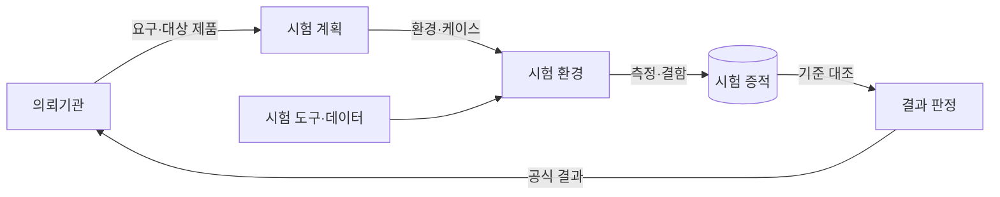
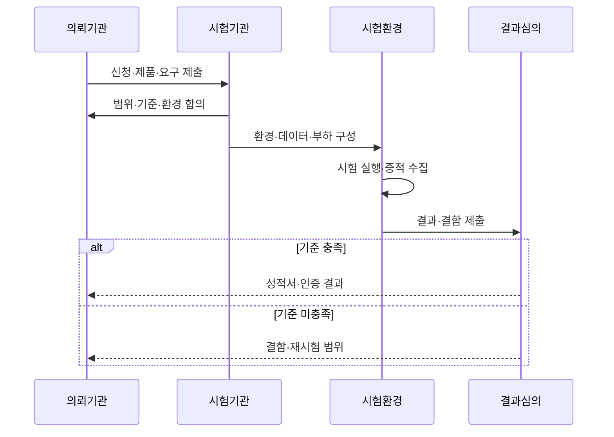

---
sidebar:
  order: 186
  label: "186. TTA 소프트웨어 품질 시험"
  badge: { text: "기출 · 70%", variant: note }
title: "TTA 소프트웨어 품질 시험"
date: "2026-07-27T23:59:59+09:00"
tags: ["notes-software"]
weight: 186
extra:
  question_no: "186"
  source_status: "기출"
  source_history: "126회, 134회"
  priority: 70
  priority_note: "품질 기준·시험 절차 반복 출제"
---

## 미리 알고가기

- **한국정보통신기술협회(Telecommunications Technology Association, TTA)**: ‘티티에이’로 읽고 영문 머리글자를 딴 약어이며, 정보통신 표준화와 소프트웨어 시험·인증을 수행함
- **소프트웨어 품질 시험(Software Quality Test)**: 합의한 요구·품질 기준으로 기능·성능·신뢰성 등을 독립적으로 측정하는 활동
- **시험성적서(Test Report)**: 합의한 시험 항목·환경·측정 결과를 기록한 공식 문서
- **인증(Certification)**: 제품이 정해진 표준·인증 기준을 충족하는지 판정해 자격을 부여하는 절차
- **벤치마크 테스트(Benchmark Test, BMT)**: ‘비엠티’로 읽고 영문 머리글자를 딴 약어이며, 동일 환경·데이터·부하에서 후보 제품의 기능·성능을 비교함
- **시험 케이스(Test Case)**: 입력·사전 조건·절차·기대 결과·통과 조건을 명시한 시험 단위
- **시험 증적(Test Evidence)**: 결과를 재현·검토할 수 있는 로그·측정값·화면 기록
- **처리량·응답시간(Throughput·Response Time)**: 단위 시간당 처리 건수와 요청부터 결과까지 걸린 시간

## Ⅰ. 개요

- **정의/개념**: 독립 시험기관이 **품질 기준 충족을 측정·판정**
- **기존 한계**: 공급자 자체 시험의 **객관성·비교 가능성 부족**

### 쉽게 이해하기 (학습용)

- 판매자가 아닌 제3자가 같은 조건과 정답표로 제품을 시험해 공식 결과를 내는 절차다.

## Ⅱ. 특징

- 시험 전 **대상·환경·통과 기준 합의**
- 통제 환경의 **기능·성능 반복 측정**
- 로그·결함 중심의 **재현 가능한 증적**

### 쉽게 이해하기 (학습용)

- 무엇을 어떤 장비와 부하로 시험할지 먼저 고정하고 결과와 재현 방법을 함께 기록한다.

## Ⅲ. 아키텍처 및 구성요소

| 구성요소 | 책임 |
|:---|:---|
| 의뢰기관 | **시험 목적·대상·요구** 제공 |
| 시험 계획 | 범위·환경·**통과 기준 확정** |
| 시험 환경 | 장비·데이터·**부하 조건 통제** |
| 시험 케이스 | 입력·절차·**기대 결과 명세** |
| 시험 증적 | 측정값·결함의 **재현 근거 보존** |
| 결과 판정 | 기준 충족과 **성적서·인증 결정** |

> 요약: 합의한 기준과 통제 환경을 시험 증적에 연결

### 쉽게 이해하기 (학습용)

- 의뢰 목적에 맞춘 시험지를 만들고 같은 시험장에서 실행한 기록으로 합격 여부를 판단한다.

## Ⅳ. 원리 및 절차 흐름

| 절차 | 설명 |
|:---|:---|
| 신청·대상 분석 | 제품·버전·**시험 목적 확인** |
| 기준 합의 | 품질 특성·**통과 조건 확정** |
| 환경 구성 | 장비·데이터·**부하 고정** |
| 시험 실행 | 케이스별 **측정·결함 수집** |
| 결과 심의 | 증적과 **기준 충족 대조** |
| 결과 발급 | 성적서·인증 또는 **재시험 범위 제시** |

> 요약: 합의 기준으로 실행·심의해 공식 결과를 발급

### 쉽게 이해하기 (학습용)

- 시험 조건을 먼저 서명하고 실행 기록을 채점해 통과 결과나 다시 시험할 항목을 알린다.

## Ⅴ. 종류 및 비교

| 품질 검증 | 시험성적 | 인증 | BMT |
|:---|:---|:---|:---|
| 적용 기준 | 특정 항목의 **측정 결과 확보** | 표준 기준의 **적합성 증명** | 후보 제품의 **비교 선정** |
| 핵심 특징 | 합의 항목의 **수치·결과 보고** | 정해진 기준의 **통과 여부 판정** | 동일 조건의 **상대 기능·성능 비교** |
| 한계 | 시험 범위 밖 **품질 보장 불가** | 인증 시점·**버전 범위 제한** | 시나리오 편향·**운영 환경 차이** |

> 요약: 측정 보고·기준 적합·제품 비교 목적에 따라 선택

### 쉽게 이해하기 (학습용)

- 수치가 필요하면 성적시험, 자격이 필요하면 인증, 여러 제품을 고르려면 BMT를 쓴다.

## Ⅵ. 실무 사례

1. 공공 제품 도입은 **BMT 동일 부하**로 처리량 비교
2. 결함 수정판은 **동일 케이스 재시험**으로 개선 확인

### 쉽게 이해하기 (학습용)

- 후보 제품은 같은 데이터와 부하로 비교하고 수정 제품은 처음 실패한 조건 그대로 다시 검사한다.

## Ⅶ. 결론

- 제품 비교는 **BMT**, 기준 적합은 **인증**, 측정 근거는 **성적서**

### 쉽게 이해하기 (학습용)

- 시험 목적을 먼저 정해야 비교 결과, 인증 자격, 측정 문서 중 필요한 산출물을 고를 수 있다.
