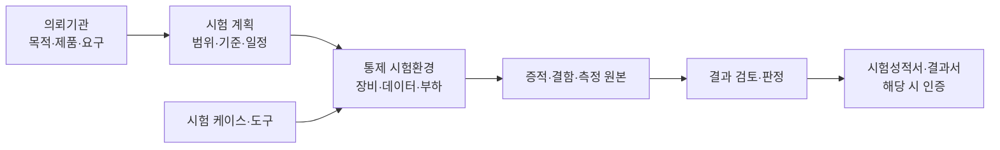
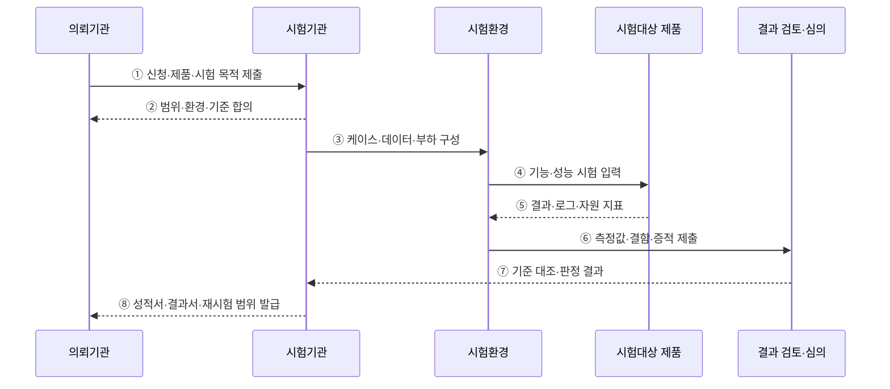

---
sidebar:
  order: 186
  label: "186. TTA 소프트웨어 품질 시험"
  badge: { text: "기출 · 70%", variant: note }
title: "TTA 소프트웨어 품질 시험"
date: "2026-07-27T23:59:59+09:00"
tags: ["notes-software"]
weight: 186
extra:
  question_no: "186"
  source_status: "기출"
  source_history: "126회, 134회"
  priority: 70
  priority_note: "품질 기준·시험 절차 반복 출제"
---

## 미리 알고가기

- **한국정보통신기술협회(Telecommunications Technology Association, TTA·티티에이)**: 정보통신 표준화와 제품·소프트웨어 시험·인증 서비스를 수행하는 기관
- **소프트웨어 품질 시험(Software Quality Test)**: 합의하거나 규정한 요구·품질 기준으로 기능·성능·신뢰성 등을 객관적으로 측정하는 활동
- **시험성적서(Test Report)**: 시험 대상·버전·항목·환경·방법·측정 결과를 기록한 공식 문서
- **인증(Certification)**: 제품이 정해진 표준·인증 기준을 충족하는지 시험·심의해 인증서와 자격을 부여하는 절차
- **벤치마크 테스트(Benchmark Test, BMT·비엠티)**: 같은 환경·데이터·부하에서 후보 제품의 기능·성능을 비교하는 시험
- **시험 케이스(Test Case)**: 사전 조건·입력·절차·기대 결과·통과 조건을 명시한 시험 단위
- **시험 증적(Test Evidence)**: 결과를 재현·검토할 수 있는 로그·측정값·화면·장비 설정 기록
- **측정 불확도(Measurement Uncertainty)**: 측정값에 합리적으로 영향을 줄 수 있는 오차 범위를 수치로 표현한 값
- **재시험(Retest)**: 결함 수정이나 제품 변경 뒤 합의한 범위의 항목을 같은 기준으로 다시 확인하는 시험

## Ⅰ. 개요

- TTA 소프트웨어 품질 시험은 제품을 **합의한 시험 항목·환경·통과 기준으로 측정하고 공식 결과를 제공**한다.
- 공급자 자체 시험의 객관성 부족과 제품 간 비교 조건의 차이를 줄인다.
- 시험성적·인증·BMT는 산출 목적과 판정 방식이 다르므로 의뢰 목적에 맞게 구분한다.

### 쉽게 이해하기 (학습용)
- 제3자가 같은 시험장·문제·채점 기준으로 제품을 검사해 공식 결과를 냄

## Ⅱ. 특징

- **범위 합의**: 시험 대상 제품·버전·기능·환경·제외 항목·통과 기준을 시작 전에 확정한다.
- **환경 통제**: 하드웨어·운영체제·네트워크·데이터·부하·도구 버전을 고정한다.
- **객관 측정**: 기능 결과와 처리량·응답시간·자원 사용량을 정의된 방법으로 반복 측정한다.
- **증적 보존**: 시험 로그·결함·측정 원본·설정으로 판정의 재현성과 추적성을 확보한다.
- **독립 판정**: 수행 결과를 기준과 대조하고 필요한 심의·검토를 거쳐 공식 문서를 발급한다.
- **변경 통제**: 제품 수정·환경 변경 시 영향 범위를 분석해 재시험 대상을 정한다.

### 쉽게 이해하기 (학습용)
- 무엇을 어떻게 잴지 먼저 고정하고 같은 조건의 기록으로 합격 여부를 판단함

## Ⅲ. 아키텍처 및 구성요소

**도표안 A — 구조도**

**도표안 B — sequenceDiagram**

| 구성요소 | 역할 |
|:---|:---|
| 의뢰기관 | 시험 목적·제품·버전·요구·운영 조건 제공 |
| 시험 계획 | 범위·품질 특성·환경·방법·통과 기준·일정 확정 |
| 시험 케이스 | 사전 조건·입력·절차·기대 결과·판정 기준 명세 |
| 시험환경 | 장비·소프트웨어·네트워크·데이터·부하 조건 통제 |
| 시험 도구 | 부하 생성·모니터링·기록·분석 자동화 |
| 시험 증적 | 원시 측정값·로그·화면·결함·환경 설정 보존 |
| 결과 검토·심의 | 기준 충족·예외·불확도·재시험 범위 판정 |
| 결과 문서 | 시험성적서·시험결과서와 해당 인증 산출물 발급 |

**동작 원리**

- ① 의뢰기관이 시험 대상 제품·정확한 버전·목적·요구사항을 제출한다.
- ② 시험기관과 의뢰기관이 시험 범위·환경·데이터·측정 방법·통과 기준을 확정한다.
- ③ 시험기관이 합의한 장비·도구·데이터·부하와 시험 케이스를 환경에 구성한다.
- ④ 시험환경이 제품에 기능 입력과 단계별 성능 부하를 가한다.
- ⑤ 제품의 처리 결과·오류·로그·CPU·메모리 등 측정 지표를 수집한다.
- ⑥ 시험환경이 원시 측정값·반복 결과·결함 재현 절차와 증적을 검토 단계에 제출한다.
- ⑦ 검토·심의가 결과를 합의 기준과 대조해 충족·미충족·재시험 범위를 판정한다.
- ⑧ 시험기관이 시험 범위가 명시된 성적서·결과서를 발급하고, 결함 수정 시 재시험 조건을 제시한다.

### 쉽게 이해하기 (학습용)
- 시험 조건을 고정해 실행하고 원본 기록을 기준표와 대조해 공식 결과를 만듦

## Ⅳ. 종류 및 비교

| 비교 항목 | 시험성적 | 인증 | BMT |
|:---|:---|:---|:---|
| 목적 | 특정 항목의 객관적 측정 | 정해진 기준의 적합성 증명 | 후보 제품의 상대 비교 |
| 기준 | 의뢰·규격에 합의한 항목 | 인증 규격·절차·통과 기준 | 발주 요구와 동일 시나리오 |
| 결과 | 항목별 수치·통과·관찰 결과 | 적합 여부와 인증서·마크 | 기능·성능 비교 결과 |
| 활용 | 납품·검증·연구·품질 증빙 | 시장 자격·조달·신뢰 표시 | 제품 선정·도입 의사결정 |
| 한계 | 시험하지 않은 품질은 보장 불가 | 인증 제품·버전·시점 범위에 한정 | 시나리오 편향·실운영 환경 차이 |

| 시험 특성 | 대표 측정 |
|:---|:---|
| 기능성 | 요구 기능 성공·오류 처리·정확성 |
| 성능 효율성 | 처리량·응답시간·동시 사용자·자원 사용량 |
| 신뢰성 | 장시간 안정성·복구·장애 허용 |
| 사용성·호환성 | 사용자 과업·상호운용·환경 적합 |
| 보안성 | 식별·인증·권한·보호·감사 기능 |

### 쉽게 이해하기 (학습용)
- 수치 증빙은 성적시험, 자격 판정은 인증, 후보 선택은 BMT를 사용함

## Ⅴ. 실무 고려사항 및 대책

| 고려사항 | 위험 | 대책 |
|:---|:---|:---|
| 제품 식별 | 시험 뒤 다른 빌드·설정으로 교체 | 버전·빌드 ID·해시·설정 기록 |
| 환경 대표성 | 시험실 결과가 운영에서 재현되지 않음 | 운영 규모·망·데이터·장애 조건 반영 |
| 데이터 공정성 | 특정 제품에 유리한 데이터·캐시 | 공통 데이터·초기화·Warm-up 조건 명시 |
| 부하 모델 | 평균 부하만으로 Peak 장애 누락 | 단계·Spike·지속·동시성 시나리오 |
| 측정 신뢰성 | 단일 실행·도구 오버헤드로 왜곡 | 반복 측정·원시값·불확도·도구 보정 |
| 통과 기준 | 모호한 표현으로 판정 분쟁 | 단위·백분위·기간·오류 허용치 수치화 |
| 결함 수정 | 수정이 다른 기능에 회귀 결함 유발 | 결함 재시험과 영향 범위 회귀시험 |
| 결과 해석 | 성적서가 제품 전체 품질 보증으로 오인 | 시험 범위·환경·버전·제외 조건 명시 |

### 쉽게 이해하기 (학습용)
- 사례: 공공 제품 BMT는 같은 데이터·장비·부하·초기 상태로 처리량과 응답시간을 비교함

## Ⅵ. 결론

- TTA 소프트웨어 품질 시험의 핵심은 **합의한 기준을 통제 환경에서 재현 가능하게 측정하고 공식 증적으로 판정**하는 것이다.
- 결과는 시험한 제품·버전·환경·항목 범위 안에서만 해석해야 한다.
- 목적에 따라 시험성적·인증·BMT를 구분하고 운영 대표성·측정 신뢰성·결함 재시험을 확보해야 한다.

### 쉽게 이해하기 (학습용)
- 무엇을 증명할지 먼저 정하고 같은 조건의 기록으로 수치·자격·비교 결과를 구분해 받음
