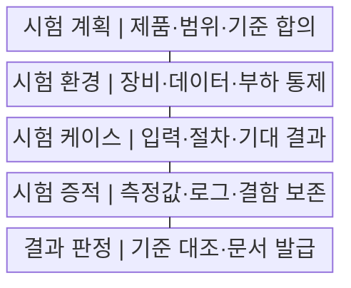
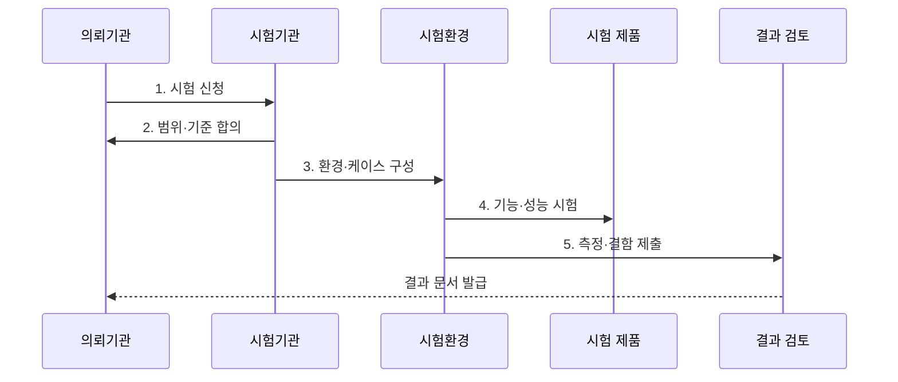

---
sidebar:
  order: 186
  label: "186. TTA 소프트웨어 품질 시험"
  badge: { text: "기출 · 70%", variant: note }
title: "TTA 소프트웨어 품질 시험"
date: "2026-07-29T16:50:00+09:00"
tags: ["notes-software"]
weight: 186
extra:
  question_no: "186"
  source_status: "기출"
  source_history: "126회, 134회"
  priority: 70
  priority_note: "품질 기준·시험 절차 반복 출제"
---

## 미리 알고가기

- **한국정보통신기술협회(Telecommunications Technology Association, TTA·티티에이)**: 정보통신 표준화와 제품·소프트웨어 시험·인증 서비스를 수행하는 기관
- **소프트웨어 품질 시험(Software Quality Test)**: 합의하거나 규정한 요구·품질 기준으로 기능·성능·신뢰성 등을 객관적으로 측정하는 활동
- **시험성적서(Test Report)**: 시험 대상·버전·항목·환경·방법·측정 결과를 기록한 공식 문서
- **인증(Certification)**: 제품이 정해진 표준·인증 기준을 충족하는지 시험·심의해 인증서와 자격을 부여하는 절차
- **벤치마크 테스트(Benchmark Test, BMT·비엠티)**: 같은 환경·데이터·부하에서 후보 제품의 기능·성능을 비교하는 시험
- **시험 케이스(Test Case)**: 사전 조건·입력·절차·기대 결과·통과 조건을 명시한 시험 단위
- **시험 증적(Test Evidence)**: 결과를 재현·검토할 수 있는 로그·측정값·화면·장비 설정 기록
- **측정 불확도(Measurement Uncertainty)**: 측정값에 합리적으로 영향을 줄 수 있는 오차 범위를 수치로 표현한 값
- **재시험(Retest)**: 결함 수정이나 제품 변경 뒤 합의한 범위의 항목을 같은 기준으로 다시 확인하는 시험

## Ⅰ. 개요

- 정의/개념: 합의한 기준의 **독립 품질 측정·공식 판정**
- 배경/필요성: 자체 시험의 **객관성·비교 가능성 보완**

### 쉽게 이해하기 (학습용)
- 제3자가 같은 시험장과 문제와 채점표로 제품을 검사해야 공급자마다 다른 자체 결과를 공정하게 비교할 수 있다.

## Ⅱ. 특징

- **제품·버전·범위·통과 기준** 사전 합의
- **환경·데이터·부하 고정**과 반복 측정
- **원시 증적·독립 판정** 기반 결과 발급

### 쉽게 이해하기 (학습용)
- 제품 버전과 시험 조건을 먼저 봉인하고 반복 측정한 원본 기록을 기준표와 대조해야 결과를 다시 확인할 수 있다.

## Ⅲ. 구조 및 구성요소

| 구성요소 | 책임 |
|:---|:---|
| 시험 계획 | 제품·범위·**통과 기준 합의** |
| 시험 환경 | 장비·데이터·**부하 조건 통제** |
| 시험 케이스 | 입력·절차·**기대 결과 명세** |
| 시험 증적 | 측정값·로그·**결함 원본 보존** |
| 결과 판정 | 기준 대조·**재시험·문서 발급** |

### 쉽게 이해하기 (학습용)

- 계획은 채점 범위를 정하고 환경과 케이스는 같은 문제를 내며 증적과 판정은 풀이 기록을 공식 결과로 만든다.

## Ⅳ. 흐름도

**동작 원리**

1. **시험 신청**: 제품·버전·목적 제출
2. **범위·기준 합의**: 환경·방법·합격선 확정
3. **환경·케이스 구성**: 장비·데이터·부하 고정
4. **기능·성능 시험**: 결과·오류·자원 지표 수집
5. **측정·결함 제출**: 원본 증적 기반 판정

### 쉽게 이해하기 (학습용)
- 같은 장비와 데이터로 여러 번 실행한 측정 원본을 합격선에 대조해야 수정 뒤 재시험 범위도 분명해진다.

## Ⅴ. 종류 및 비교

| 품질 시험 방식 | 시험성적 | 인증 | BMT |
|:---|:---|:---|:---|
| 적용 기준 | 특정 항목 **수치 증빙** | 규격의 **적합성 증명** | 후보 제품 **상대 비교** |
| 핵심 특징 | 항목별 **측정 결과** | 합격 여부·**인증서** | 공통 시나리오 **비교 결과** |
| 한계 | 미시험 품질 **보장 불가** | 제품·버전의 **범위 제한** | 시나리오·환경 **편향 가능성** |

### 쉽게 이해하기 (학습용)
- 납품 수치가 필요하면 시험성적을, 자격 표시가 필요하면 인증을, 여러 후보의 순위를 정하면 BMT를 사용한다.

## Ⅵ. 실무 고려사항 및 대책

| 고려사항 | 대책 | 효과 |
|:---|:---|:---|
| 시험 뒤 **제품 교체** | 버전·빌드 ID·**해시 기록** | 시험 대상 **동일성 확보** |
| 운영과 **환경 차이** | 규모·망·데이터·**장애 조건 반영** | 운영 결과 **재현성 향상** |
| 특정 제품의 **데이터 편향** | 공통 데이터·**초기화 조건 명시** | 후보 비교 **공정성 확보** |
| 평균 부하의 **Peak 누락** | 단계·Spike·**지속 부하 시험** | 최대 부하 **한계 확인** |
| 모호한 **통과 기준** | 단위·백분위·**오류 허용치 수치화** | 판정 분쟁 **예방** |

### 쉽게 이해하기 (학습용)
- 후보 제품의 캐시를 같은 상태로 초기화하고 동일 부하를 반복해야 처리량 차이가 제품 성능에서 비롯됐다고 판단할 수 있다.

## Ⅶ. 결론

- **시험 목적·환경 대표성·증적성**으로 시험 방식 결정

### 쉽게 이해하기 (학습용)
- 증명할 대상이 수치인지 자격인지 제품 비교인지 먼저 정하고 고정 조건의 원본 기록으로 해당 범위만 판정해야 한다.
