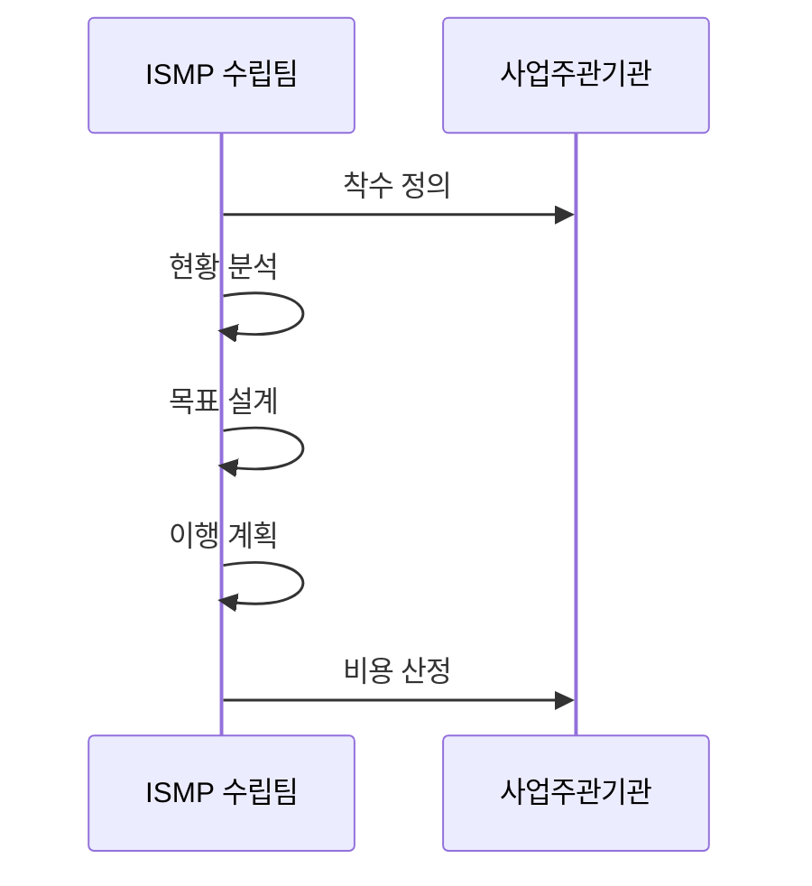

---
sidebar:
  order: 187
  label: "187. ISMP 정보화 마스터플랜 (ISMP)"
  badge:
    text: "기출 · 70%"
    variant: note
title: "ISMP 정보화 마스터플랜 (ISMP)"
date: "2026-07-25T00:30:00+09:00"
tags:
  - "notes-software"
weight: 187
extra:
  question_no: "187"
  source_status: "기출"
  source_history: "125회, 128회, 132회, 135회"
  priority: 70
  priority_note: "현황·목표·이행계획 비교가 반복 출제됨"
---

## 미리 알고가기

- **정보시스템 마스터플랜(Information System Master Plan, ISMP)**: ISMP는 ‘아이에스엠피’로 읽고 영문 머리글자를 딴 약어이며, 특정 정보화 사업의 요구·규모·예산·발주 계획을 구체화함
- **정보전략계획(Information Strategy Planning, ISP)**: ISP는 ‘아이에스피’로 읽고 영문 머리글자를 딴 약어이며, 조직의 정보화 비전·투자 과제·우선순위를 정해 ISMP 대상 사업을 선정함
- **한국지능정보사회진흥원(National Information Society Agency, NIA)**: NIA는 ‘엔아이에이’로 읽고 영문 머리글자를 딴 약어이며, 공공 지능정보화 정책·사업과 ISMP 방법론 적용을 지원함
- **기능점수**: 사용자 관점의 기능량을 세어 소프트웨어 개발 규모를 산정하는 단위임
- **총사업비**: 개발·장비·운영·전환 등 사업 수행에 필요한 전체 비용임
- **거버넌스**: 사업의 의사결정 권한·책임·검토 절차를 정한 관리 체계임
- **목표 모델·로드맵**: 목표 모델은 미래 구조이고 로드맵은 단계별 이행 순서임
- **요구 추적률**: 원 요구사항이 목표 기능·발주 항목에 연결된 비율임

## Ⅰ. 개요

- **정의/개념**: 요구사항을 분석해 사업 실행 계획을 수립
- **배경/필요성**: 발주 범위·예산이 불명확해 사전 구체화가 필요함

### 쉽게 이해하기 (학습용)
- 구축 전에 기능 범위와 발주 비용을 구체화함

## Ⅱ. 특징

- 사업 비전과 추진 목표·범위를 연결한다.
- 현행 문제를 분석하고 목표 구조를 설계한다.
- 요구사항을 발주 가능한 수준으로 구체화한다.
- 개발 규모와 조달 예산·일정을 산정한다.

### 쉽게 이해하기 (학습용)
- 비전을 설계하고 사업 규모와 예산을 정함

## Ⅲ. 아키텍처 및 구성요소

| 설계 요소 | 설명 |
|:---|:---|
| 거버넌스 | 사업 방향과 의사결정 체계를 정함 |
| 요구 분석 | 현행 한계와 구축 요구를 분석함 |
| 목표 모델 | 미래 기능·데이터 구조를 설계함 |
| 발주 계획 | 단계별 로드맵과 운영 방안을 정함 |
| 규모·비용 | 기능점수로 조달 비용을 산정함 |

> 요약: 현황을 분석해 발주 범위와 규모를 도출함

### 쉽게 이해하기 (학습용)
- 개선 요구를 바탕으로 목표 구조를 설정함

## Ⅳ. 원리 및 절차 흐름도

| 절차 | 설명 |
|:---|:---|
| 착수 정의 | 추진 조직·목표·범위를 합의 |
| 현황 분석 | 시스템 기능·업무 요구를 분석 |
| 목표 설계 | 미래 기능·데이터 구조를 설계 |
| 이행 계획 | 전환 순서와 발주 로드맵 수립 |
| 비용 산정 | 기능 규모로 총사업비 근거 도출 |

> 요약: 목표와 규모·비용 근거를 연결해 발주함

### 쉽게 이해하기 (학습용)
- 현장을 분석해 규모와 총사업비를 계산함

## Ⅴ. 종류 및 비교

| 판단 기준 | ISMP | ISP | 구축설계 |
|:---|:---|:---|:---|
| 핵심 특징 | 개별 사업을 구체화 | 전사 투자 방향을 결정 | 구현 상세를 설계 |
| 적용 기준 | 예산 요구·발주 전 | 투자 과제 선정 전 | 개발 착수 후 |
| 주요 위험 | 요구·비용 산정 오류 | 실행 근거 부족 | 상위 요구 누락 |

> 요약: ISP는 과제를 선정하고 ISMP는 발주함

### 쉽게 이해하기 (학습용)
- ISP는 투자 방향, ISMP는 개별 발주 계획임

## Ⅵ. 실무 사례

1. 공공 시스템 구축은 요구를 목표 기능·발주 항목에 추적
2. 클라우드 전환은 기능 규모로 총사업비·일정을 산정

### 쉽게 이해하기 (학습용)
- 사용자 요구마다 구현할 기능과 발주 항목을 연결해 누락을 찾음
- 옮길 기능의 양을 세어 필요한 예산과 기간을 계산함

## Ⅶ. 결론

- 요구가 기능·비용에 연결된 뒤 발주 범위를 확정함

### 쉽게 이해하기 (학습용)
- 기능이 빠지거나 비용 근거가 없으면 발주하지 않음
