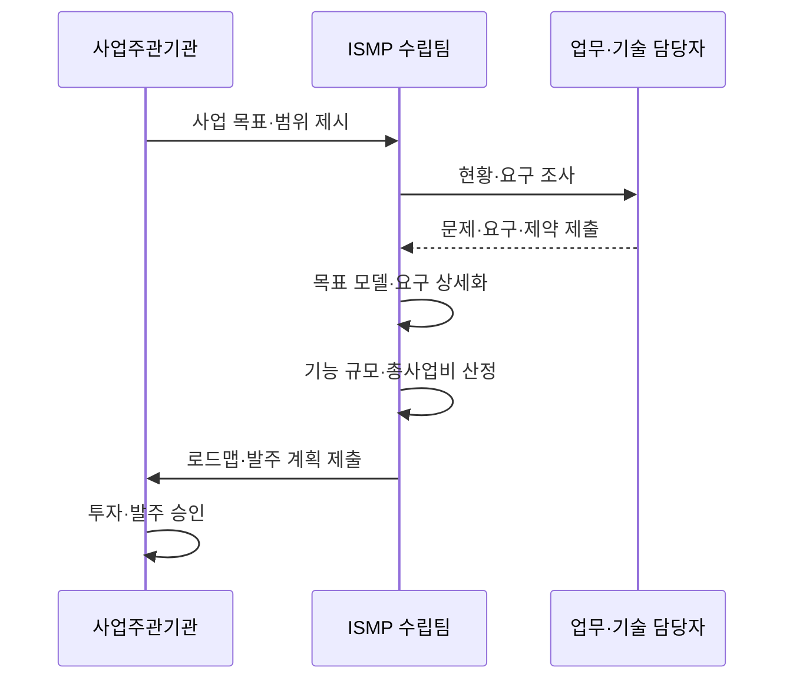

---
sidebar:
  order: 187
  label: "187. ISMP 정보화 마스터플랜 (ISMP)"
  badge: { text: "기출 · 70%", variant: note }
title: "ISMP 정보화 마스터플랜 (ISMP)"
date: "2026-07-27T23:59:59+09:00"
tags: ["notes-software"]
weight: 187
extra:
  question_no: "187"
  source_status: "기출"
  source_history: "125회, 128회, 132회, 135회"
  priority: 70
  priority_note: "현황·목표·이행계획 비교가 반복 출제됨"
---

## 미리 알고가기

- **정보시스템 마스터플랜(Information System Master Plan, ISMP)**: ‘아이에스엠피’로 읽고 영문 머리글자를 딴 약어이며, 특정 정보화 사업의 요구·규모·예산·발주 계획을 구체화함
- **정보전략계획(Information Strategy Planning, ISP)**: ‘아이에스피’로 읽고 영문 머리글자를 딴 약어이며, 조직의 정보화 비전·투자 과제·중장기 우선순위를 정함
- **기능점수(Function Point, FP)**: ‘에프피’로 읽고 영문 머리글자를 딴 약어이며, 사용자 관점의 기능량으로 소프트웨어 개발 규모를 산정함
- **총사업비(Total Project Cost)**: 개발·장비·전환·운영 등 사업 수행에 필요한 전체 비용
- **목표 모델(Target Model)**: 요구사항을 반영한 미래 업무·기능·데이터·기술 구조
- **이행 로드맵(Implementation Roadmap)**: 선후 관계와 우선순위에 따른 단계별 구축 순서
- **제안요청서(Request for Proposal, RFP)**: ‘알에프피’로 읽고 영문 머리글자를 딴 약어이며, 공급자에게 사업 범위·요구·제안 조건을 알리는 조달 문서

## Ⅰ. 개요

- 정의/개념: 특정 정보화 사업의 **발주 범위·규모·예산 구체화**
- 기존 한계: 전략 과제만으로는 **구축 요구·사업비·발주 기준 불명확**

### 쉽게 이해하기 (학습용)

- 무엇을 정보화할지 정한 뒤 실제 발주에 필요한 기능, 규모, 비용, 일정까지 설계하는 작업이다.

## Ⅱ. 특징

- 현행 업무·시스템의 **구축 요구 상세화**
- 목표 모델의 **기능·데이터·기술 설계**
- 기능 규모 기반의 **예산·발주 계획 산정**

### 쉽게 이해하기 (학습용)

- 큰 투자 방향을 실제 구축사가 견적하고 제안할 수 있는 수준의 요구와 사업 계획으로 바꾼다.

## Ⅲ. 아키텍처 및 구성요소

| 구성요소 | 책임 |
|:---|:---|
| 사업 목표·범위 | **구축 대상·성과 기준** 확정 |
| 현황·요구 분석 | 문제·사용자의 **상세 요구 도출** |
| 목표 모델 | 업무·기능·데이터의 **미래 구조 설계** |
| 규모·총사업비 | 기능점수·자원의 **비용 산정** |
| 이행 로드맵 | 단계·선후 관계의 **구축 순서 결정** |
| 발주 계획 | 분할·계약·**RFP 작성 기준** 마련 |

> 요약: 상세 요구와 목표 모델을 규모·예산·발주 계획에 연결

### 쉽게 이해하기 (학습용)

- 문제와 원하는 기능을 설계도로 바꾸고 그 설계도로 공사비와 발주 순서를 계산한다.

## Ⅳ. 원리 및 절차 흐름

| 절차 | 설명 |
|:---|:---|
| 목표·범위 설정 | 구축 대상과 **성과 목표 확정** |
| 현황·요구 조사 | 업무 문제·**기술 제약 식별** |
| 목표 모델 설계 | 요구 기반 **미래 구조 정의** |
| 요구 상세화 | 기능·성능·**전환 조건 명세** |
| 규모·비용 산정 | 기능량과 자원의 **총사업비 계산** |
| 발주 계획 | 일정·분할·**조달 문서 구성** |

> 요약: 목표 모델과 상세 요구를 정량 규모·발주 계획으로 변환

### 쉽게 이해하기 (학습용)

- 현장 요구를 설계하고 기능량과 비용을 계산해 실제 계약에 쓸 계획을 만든다.

## Ⅴ. 종류 및 비교

| 정보화 기획 | ISP | ISMP |
|:---|:---|:---|
| 적용 기준 | 전사 방향·**중장기 투자 선정** | 특정 사업·**발주 구체화** |
| 핵심 특징 | 비전·과제·**우선순위 로드맵** | 요구·규모·**예산·발주 계획** |
| 한계 | 개별 사업의 **상세 요구 부족** | 상위 전략 변경·**범위 재산정** |

> 요약: ISP는 투자 방향, ISMP는 개별 사업의 실행·발주 계획

### 쉽게 이해하기 (학습용)

- ISP가 어떤 사업부터 할지 정하면 ISMP는 선택된 사업을 어떻게 발주하고 구축할지 상세화한다.

## Ⅵ. 실무 사례

1. 차세대 세정 사업은 **업무 요구·기능점수**로 사업비 산정
2. 데이터 전환은 **검증·복구 요구**를 RFP 항목으로 명세

### 쉽게 이해하기 (학습용)

- 업무 기능 수로 개발 규모를 계산하고 자료 이전의 합격 조건과 복구 절차를 계약 요구에 넣는다.

## Ⅶ. 결론

- 전사 투자 선정은 **ISP**, 개별 사업 발주 구체화는 **ISMP**

### 쉽게 이해하기 (학습용)

- 전략 단계와 발주 단계를 혼동하지 말고 상세 요구·규모·예산이 필요한 시점에 ISMP를 수행한다.
