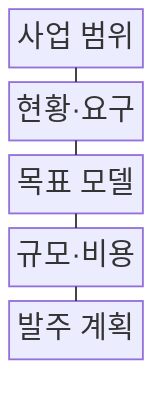
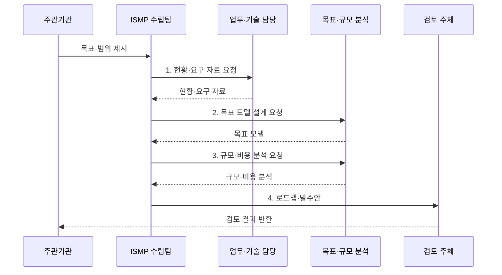

---
sidebar:
  order: 187
  label: "187. ISMP 정보화 마스터플랜 (ISMP)"
  badge: { text: "기출 · 70%", variant: note }
title: "ISMP 정보화 마스터플랜 (ISMP)"
date: "2026-08-02T12:00:00+09:00"
tags: ["notes-software"]
weight: 187
extra:
  question_no: "187"
  source_status: "기출"
  source_history: "125회, 128회, 132회, 135회"
  priority: 70
  priority_note: "현황·목표·이행계획 비교가 반복 출제됨"
---

## Ⅰ. 개요

핵심 용어

- **실행 계획**: ISMP는 선택된 정보화 사업의 요구, 구조, 규모, 비용, 발주 조건을 구체화하는 실행 계획이다.

- 정의/개념: 특정 정보화 사업의 요구·구조·규모·비용·발주를 구체화하는 **실행 계획**
- 배경/필요성: ISP 전략 과제만으로는 **계약·구축 기준** 산출 불가

### 쉽게 이해하기 (학습용)
- 전략에서 선택한 사업을 공사 설계도와 견적서처럼 요구·구조·규모·비용·발주 조건으로 구체화한다.

## Ⅱ. 특징

핵심 용어

- **목표 모델·상세 요구·규모**: ISMP는 미래 업무·응용·데이터·기술의 목표 모델을 상세 요구와 소프트웨어 규모에 추적 연결한다.

- **특정 사업·성과 범위** 중심 계획
- **목표 모델·상세 요구·규모**의 추적 연결
- **BPR·FP** 기반 업무 재설계·규모 산정
- **총사업비·RFP** 실행 기준 산출

### 쉽게 이해하기 (학습용)
- 현장의 불편을 요구사항으로 바꾸고 목표 구조와 규모를 계산한 뒤 비용과 계약 조건까지 연결한다.

## Ⅲ. 구조 및 구성요소

핵심 용어

- **규모·비용**: 규모·비용 구성은 기능, 자원, 전환 범위를 계산해 사업 수명주기의 총사업비를 산정한다.

| 구성요소 | 책임 |
|:---|:---|
| 사업 범위 | 대상·성과·**제약 조건 확정** |
| 현황·요구 | 문제·기능·**비기능 요구 분석** |
| 목표 모델 | 업무·응용·**데이터·기술 설계** |
| 규모·비용 | 기능·자원·**총사업비 산정** |
| 발주 계획 | 로드맵·RFP·**인수 기준 마련** |

### 쉽게 이해하기 (학습용)

- 사업 범위가 경계를 정하고 현황과 요구가 문제를 밝히면 목표 모델과 비용 산정이 발주 계획의 근거가 된다.

## Ⅳ. 흐름도

핵심 용어

- **3. 규모·비용 분석 요청**: 목표 모델과 상세 요구를 바탕으로 기능·전환 규모와 구축·운영을 포함한 총사업비를 분석한다.

**동작 원리**

1. **현황·요구 자료 요청**: 업무·데이터·운영 문제의 근거 수집
2. **목표 모델 설계 요청**: 미래 구조와 상세 요구 연결
3. **규모·비용 분석 요청**: 기능·전환 규모와 총사업비 산정
4. **로드맵·발주안**: 일정·RFP·인수 기준 제시

### 쉽게 이해하기 (학습용)
- 인터뷰에서 나온 요구를 목표 구조에 배치하고 기능과 전환 규모를 계산해야 예산서와 RFP가 같은 범위를 가리킨다.

## Ⅴ. 종류 및 비교

핵심 용어

- **ISMP**: ISMP는 개별 정보화 사업의 요구, 모델, 규모, 비용과 RFP를 구체화해 실행과 발주를 준비한다.

| 정보화 계획 | ISP | ISMP |
|:---|:---|:---|
| 적용 기준 | 전사·기관의 **중장기 투자 방향** | 개별 사업의 **실행·발주 준비** |
| 핵심 특징 | 비전·과제·**우선순위 로드맵** | 요구·모델·**규모·비용·RFP** |
| 한계 | 개별 사업의 **상세 요구 부족** | 상위 전략 변경의 **재산정 필요** |

### 쉽게 이해하기 (학습용)
- ISP가 지을 건물을 고르는 도시 계획이라면 ISMP는 선택된 건물의 설계도와 견적서와 발주 조건이다.

## Ⅵ. 실무 고려사항 및 대책

핵심 용어

- **요구 추적 단절**: 요구 추적 단절은 목표와 상세 요구, 설계, 비용 항목 사이의 연결이 끊겨 구축 범위가 누락되는 문제다.

| 문제 | 대책 | 효과 |
|:---|:---|:---|
| 모호한 **사업 범위** | 대상·제외·**변경 절차 명시** | 요구·비용의 **팽창 억제** |
| 인터뷰 중심 **현황 왜곡** | 로그·업무량·**품질 자료 검증** | 문제 근거 **객관성 확보** |
| 목표와 **요구 추적 단절** | 고유 식별자·**양방향 추적표** | 설계·비용 **누락 방지** |
| 구축비만의 **비용 산정** | 전환·운영·**폐기 비용 포함** | 총사업비 **현실성 향상** |
| 모호한 **인수 조건** | 기능·성능·**전환 합격선 수치화** | 검수 분쟁 **예방** |

### 쉽게 이해하기 (학습용)
- 차세대 업무는 기능점수뿐 아니라 전환할 데이터량과 대사 기준과 중단 시간을 비용과 RFP에 함께 반영해야 한다.

## Ⅶ. 결론

핵심 용어

- **RFP·인수 기준**: 요구 추적과 총사업비 근거가 완결되면 같은 범위를 가리키는 RFP와 객관적 인수 기준을 확정한다.

- 요구 추적과 총사업비 근거가 완결되면 **RFP·인수 기준** 확정, 누락 시 범위 재산정

### 쉽게 이해하기 (학습용)
- 전략 과제를 목표 모델과 상세 요구와 정량 비용으로 연결해 계약자와 검수자가 같은 완성 기준을 보게 해야 한다.
