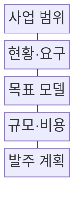
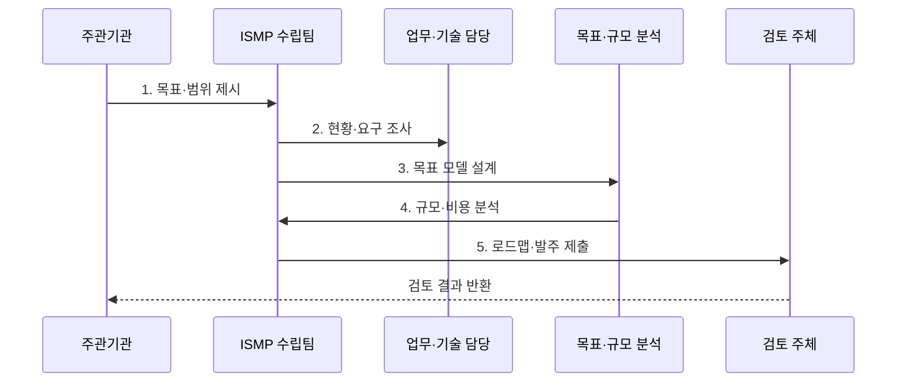

---
sidebar:
  order: 187
  label: "187. ISMP 정보화 마스터플랜 (ISMP)"
  badge: { text: "기출 · 70%", variant: note }
title: "ISMP 정보화 마스터플랜 (ISMP)"
date: "2026-07-30T18:00:00+09:00"
tags: ["notes-software"]
weight: 187
extra:
  question_no: "187"
  source_status: "기출"
  source_history: "125회, 128회, 132회, 135회"
  priority: 70
  priority_note: "현황·목표·이행계획 비교가 반복 출제됨"
---

## 미리 알고가기

- **정보시스템 마스터플랜(Information System Master Plan, ISMP·아이에스엠피)**: 특정 정보시스템 구축사업의 목표·요구·구조·규모·비용·이행·발주 계획을 구체화하는 계획
- **정보전략계획(Information Strategy Planning, ISP·아이에스피)**: 조직의 경영전략과 연계해 정보화 비전·추진 과제·중장기 투자 우선순위를 정하는 계획
- **업무재설계(Business Process Reengineering, BPR·비피알)**: 성과 향상을 위해 현재 업무 절차·역할·규칙을 근본적으로 다시 설계하는 활동
- **목표 모델(Target Model)**: 미래 업무·응용·데이터·기술·보안 구조와 서비스 운영 방식을 나타낸 설계
- **기능점수(Function Point, FP·에프피)**: 사용자에게 제공하는 데이터 기능과 트랜잭션 기능을 기준으로 소프트웨어 규모를 산정하는 방법
- **총사업비(Total Project Cost)**: 구축·장비·소프트웨어·전환·부대비·운영·유지관리 등 사업 수명주기의 전체 비용
- **이행 로드맵(Implementation Roadmap)**: 과제의 우선순위·의존 관계·자원·위험에 따른 단계별 구축 순서
- **제안요청서(Request for Proposal, RFP·알에프피)**: 공급자에게 사업 목적·범위·요구·제안 조건·평가 기준을 알리는 발주 문서
- **인수 기준(Acceptance Criteria)**: 구축 결과가 요구를 충족했다고 발주자가 승인할 수 있는 객관적 조건

## Ⅰ. 개요

- 정의/개념: 특정 정보화 사업의 **실행·예산·발주 상세화**
- 배경/필요성: 전략 과제와 **계약·구축 기준의 간극 해소**

### 쉽게 이해하기 (학습용)
- 전략에서 선택한 사업을 공사 설계도와 견적서처럼 요구·구조·규모·비용·발주 조건으로 구체화한다.

## Ⅱ. 특징

- **특정 사업·성과 범위** 중심 계획
- **목표 모델·상세 요구·규모**의 추적 연결
- **총사업비·로드맵·RFP** 실행 기준 산출

### 쉽게 이해하기 (학습용)
- 현장의 불편을 요구사항으로 바꾸고 목표 구조와 규모를 계산한 뒤 비용과 계약 조건까지 연결한다.

## Ⅲ. 구조 및 구성요소

| 구성요소 | 책임 |
|:---|:---|
| 사업 범위 | 대상·성과·**제약 조건 확정** |
| 현황·요구 | 문제·기능·**비기능 요구 분석** |
| 목표 모델 | 업무·응용·**데이터·기술 설계** |
| 규모·비용 | 기능·자원·**총사업비 산정** |
| 발주 계획 | 로드맵·RFP·**인수 기준 마련** |

### 쉽게 이해하기 (학습용)

- 사업 범위가 경계를 정하고 현황과 요구가 문제를 밝히면 목표 모델과 비용 산정이 발주 계획의 근거가 된다.

## Ⅳ. 흐름도

**동작 원리**

1. **목표·범위 제시**: 성과·법·예산 제약 확정
2. **현황·요구 조사**: 업무·데이터·운영 문제 확인
3. **목표 모델 설계**: 미래 구조·상세 요구 연결
4. **규모·비용 분석**: 기능·전환·총사업비 산정
5. **로드맵·발주 제출**: 일정·RFP·인수 기준 제시

### 쉽게 이해하기 (학습용)
- 인터뷰에서 나온 요구를 목표 구조에 배치하고 기능과 전환 규모를 계산해야 예산서와 RFP가 같은 범위를 가리킨다.

## Ⅴ. 종류 및 비교

| 정보화 계획 | ISP | ISMP |
|:---|:---|:---|
| 적용 기준 | 전사·기관의 **중장기 투자 방향** | 개별 사업의 **실행·발주 준비** |
| 핵심 특징 | 비전·과제·**우선순위 로드맵** | 요구·모델·**규모·비용·RFP** |
| 한계 | 개별 사업의 **상세 요구 부족** | 상위 전략 변경의 **재산정 필요** |

### 쉽게 이해하기 (학습용)
- ISP가 지을 건물을 고르는 도시 계획이라면 ISMP는 선택된 건물의 설계도와 견적서와 발주 조건이다.

## Ⅵ. 실무 고려사항 및 대책

| 고려사항 | 대책 | 효과 |
|:---|:---|:---|
| 모호한 **사업 범위** | 대상·제외·**변경 절차 명시** | 요구·비용의 **팽창 억제** |
| 인터뷰 중심 **현황 왜곡** | 로그·업무량·**품질 자료 검증** | 문제 근거 **객관성 확보** |
| 목표와 **요구 추적 단절** | 고유 ID·**양방향 추적표** | 설계·비용 **누락 방지** |
| 구축비만의 **비용 산정** | 전환·운영·**폐기 비용 포함** | 총사업비 **현실성 향상** |
| 모호한 **인수 조건** | 기능·성능·**전환 합격선 수치화** | 검수 분쟁 **예방** |

### 쉽게 이해하기 (학습용)
- 차세대 업무는 기능점수뿐 아니라 전환할 데이터량과 대사 기준과 중단 시간을 비용과 RFP에 함께 반영해야 한다.

## Ⅶ. 결론

- **사업 범위·요구 추적·비용 근거**로 발주 수준 결정

### 쉽게 이해하기 (학습용)
- 전략 과제를 목표 모델과 상세 요구와 정량 비용으로 연결해 계약자와 검수자가 같은 완성 기준을 보게 해야 한다.
