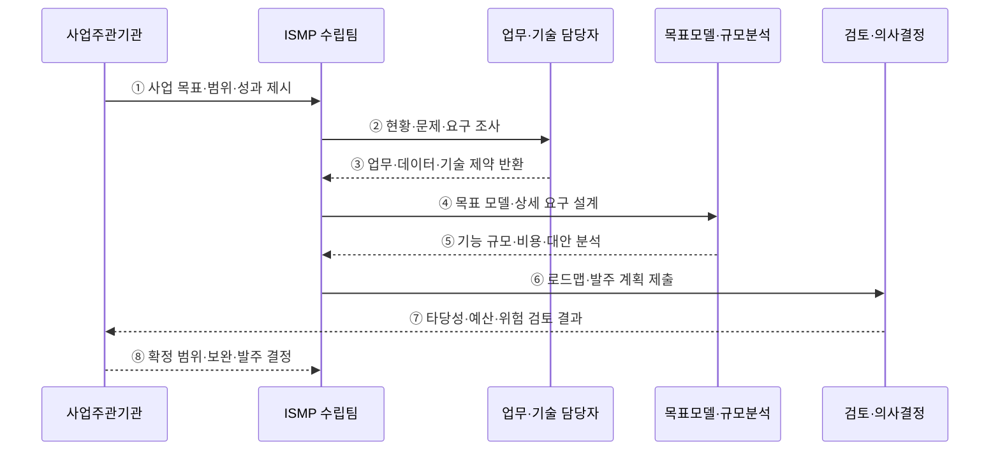

---
sidebar:
  order: 187
  label: "187. ISMP 정보화 마스터플랜 (ISMP)"
  badge: { text: "기출 · 70%", variant: note }
title: "ISMP 정보화 마스터플랜 (ISMP)"
date: "2026-07-27T23:59:59+09:00"
tags: ["notes-software"]
weight: 187
extra:
  question_no: "187"
  source_status: "기출"
  source_history: "125회, 128회, 132회, 135회"
  priority: 70
  priority_note: "현황·목표·이행계획 비교가 반복 출제됨"
---

## 미리 알고가기

- **정보시스템 마스터플랜(Information System Master Plan, ISMP·아이에스엠피)**: 특정 정보시스템 구축사업의 목표·요구·구조·규모·비용·이행·발주 계획을 구체화하는 계획
- **정보전략계획(Information Strategy Planning, ISP·아이에스피)**: 조직의 경영전략과 연계해 정보화 비전·추진 과제·중장기 투자 우선순위를 정하는 계획
- **업무재설계(Business Process Reengineering, BPR·비피알)**: 성과 향상을 위해 현재 업무 절차·역할·규칙을 근본적으로 다시 설계하는 활동
- **목표 모델(Target Model)**: 미래 업무·응용·데이터·기술·보안 구조와 서비스 운영 방식을 나타낸 설계
- **기능점수(Function Point, FP·에프피)**: 사용자에게 제공하는 데이터 기능과 트랜잭션 기능을 기준으로 소프트웨어 규모를 산정하는 방법
- **총사업비(Total Project Cost)**: 구축·장비·소프트웨어·전환·부대비·운영·유지관리 등 사업 수명주기의 전체 비용
- **이행 로드맵(Implementation Roadmap)**: 과제의 우선순위·의존 관계·자원·위험에 따른 단계별 구축 순서
- **제안요청서(Request for Proposal, RFP·알에프피)**: 공급자에게 사업 목적·범위·요구·제안 조건·평가 기준을 알리는 발주 문서
- **인수 기준(Acceptance Criteria)**: 구축 결과가 요구를 충족했다고 발주자가 승인할 수 있는 객관적 조건

## Ⅰ. 개요

- ISMP는 선택된 정보화 사업을 **실행·예산·발주 가능한 수준으로 상세화**한다.
- 전략 과제만으로 불명확한 구축 범위·요구·목표 구조·규모·총사업비·일정을 구체화한다.
- 공공 정보화사업에서는 관련 지침과 최신 공통가이드에 따라 수립·검토 범위를 확인해야 한다.

### 쉽게 이해하기 (학습용)
- 해야 할 정보화 사업을 실제 견적·발주·구축이 가능한 설계와 계획으로 바꿈

## Ⅱ. 특징

- **사업 중심**: 조직 전체 전략보다 특정 구축사업의 목표·범위·성과를 다룬다.
- **현황 근거**: 업무·시스템·데이터·인프라·보안·운영의 문제와 제약을 분석한다.
- **요구 상세화**: 기능·성능·보안·전환·운영·인수 요구를 추적 가능한 형태로 만든다.
- **목표 구조 설계**: 미래 업무·응용·데이터·기술 구조와 연계·전환 방식을 정의한다.
- **정량 규모 산정**: 기능점수·장비 용량·전환량·인력·일정으로 사업비 근거를 만든다.
- **발주 연결**: 단계별 로드맵·분할발주·성과지표·RFP 작성 기준까지 연결한다.

### 쉽게 이해하기 (학습용)
- 현장 문제를 기능·구조·규모·비용·계약 조건으로 차례로 바꿈

## Ⅲ. 아키텍처 및 구성요소

**도표안 A — 구조도**

**도표안 B — sequenceDiagram**

| 구성요소 | 역할 |
|:---|:---|
| 사업 목표·범위 | 구축 대상·이해관계자·성과지표·제약 확정 |
| 현황 분석 | 업무·응용·데이터·기술·보안·운영 문제 진단 |
| 요구사항 | 기능·성능·보안·연계·전환·운영·인수 조건 명세 |
| 목표 모델 | 미래 업무·응용·데이터·기술 구조와 원칙 설계 |
| 규모·비용 | 기능점수·자원·데이터·인력·기간·총사업비 산정 |
| 이행 로드맵 | 과제 우선순위·의존성·단계·일정·위험 결정 |
| 발주 계획 | 분할·계약·평가·RFP·검수·인수 기준 마련 |

**동작 원리**

- ① 사업주관기관이 해결할 문제·구축 범위·성과 목표·법적·예산 제약을 제시한다.
- ② ISMP 수립팀이 이해관계자를 식별하고 현재 업무·시스템·데이터·운영을 조사한다.
- ③ 업무·기술 담당자가 문제·요구·연계·데이터 품질·전환 제약을 근거와 함께 반환한다.
- ④ 수립팀이 현황과 요구를 미래 업무·응용·데이터·기술 모델과 상세 요구로 변환한다.
- ⑤ 분석 계층이 대안별 기능 규모·인프라 용량·전환량·총사업비·편익을 산정한다.
- ⑥ 수립팀이 우선순위·의존성·단계·위험을 반영한 로드맵과 발주 계획을 제출한다.
- ⑦ 검토 주체가 전략 정합성·중복·타당성·비용·실행 가능성·위험을 검토한다.
- ⑧ 사업주관기관이 보완 내용을 반영해 범위·예산·일정·발주 방식을 확정한다.

### 쉽게 이해하기 (학습용)
- 현장 요구를 목표 설계로 바꾸고 규모와 비용을 계산해 발주 가능한 계획으로 확정함

## Ⅳ. 종류 및 비교

| 비교 항목 | ISP | ISMP |
|:---|:---|:---|
| 목적 | 조직 정보화 방향과 투자 과제 선정 | 특정 구축사업의 실행·발주 구체화 |
| 범위 | 전사·기관·중장기 | 개별 사업·구축 범위 |
| 시작 질문 | 어떤 정보화가 필요한가 | 선택된 사업을 무엇으로 어떻게 구축할까 |
| 핵심 산출물 | 비전·목표·과제·우선순위·로드맵 | 상세 요구·목표 모델·규모·비용·발주 계획 |
| 비용 수준 | 과제별 개략 투자 | 근거가 있는 총사업비·연차별 비용 |
| 활용 | 예산 방향·투자 포트폴리오 | RFP·계약·구축·검수 기준 |
| 한계 | 개별 사업의 상세 요구 부족 | 상위 전략·사업 범위 변경 시 재산정 |

| 연계 단계 | 핵심 질문 |
|:---|:---|
| ISP | 어떤 과제에 왜 투자할 것인가 |
| ISMP | 선택된 사업을 어떤 구조·규모·비용으로 발주할 것인가 |
| 구축 | 확정 요구를 어떻게 설계·개발·전환할 것인가 |

### 쉽게 이해하기 (학습용)
- ISP가 할 사업을 고르면 ISMP가 그 사업의 설계·견적·발주 조건을 만듦

## Ⅴ. 실무 고려사항 및 대책

| 고려사항 | 위험 | 대책 |
|:---|:---|:---|
| 범위 | 목표가 모호해 요구와 비용이 계속 증가 | 대상·제외·성과·가정·변경 절차 명시 |
| 현황 근거 | 인터뷰 의견만으로 문제 과장·누락 | 로그·업무량·장애·비용·데이터 품질로 검증 |
| 요구 추적 | 목표·요구·설계·비용 연결 단절 | 추적표와 고유 ID로 양방향 연결 |
| 대안 분석 | 특정 제품·기술을 결론으로 전제 | 최소 2개 대안과 비용·위험·종속성 비교 |
| 기능 규모 | 조기 요구의 불확실성으로 FP 왜곡 | 가정·범위·산정 근거·오차 범위 기록 |
| 총사업비 | 구축비만 포함해 운영 부담 누락 | 전환·교육·운영·유지관리·폐기 비용 포함 |
| 데이터 전환 | 품질·정합성·중단 시간 과소평가 | Profiling·정제·대사·Cutover·Rollback 설계 |
| 발주 중립성 | 특정 공급자 종속 요구 | 성능·기능 중심 요구와 개방 표준·출구 조건 |
| 인수 기준 | “정상 동작” 같은 모호한 검수 | 측정 가능한 기능·성능·보안·전환 합격 기준 |

### 쉽게 이해하기 (학습용)
- 사례: 차세대 세정 사업은 기능점수뿐 아니라 데이터 전환량·대사 기준·중단 허용시간까지 비용과 RFP에 반영함

## Ⅵ. 결론

- ISMP의 핵심은 **특정 정보화 사업을 목표 모델·상세 요구·규모·비용·로드맵·발주 기준으로 구체화**하는 것이다.
- ISP의 전략 방향과 구축사업의 계약·검수 사이를 정량 근거로 연결해야 한다.
- 범위·요구 추적·대안·데이터 전환·총사업비·인수 기준을 명확히 해야 실행 가능한 계획이 된다.

### 쉽게 이해하기 (학습용)
- 전략에서 고른 사업을 실제로 견적하고 계약하고 검수할 수 있는 수준까지 설계함
