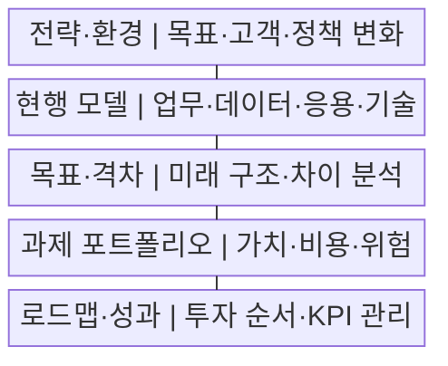
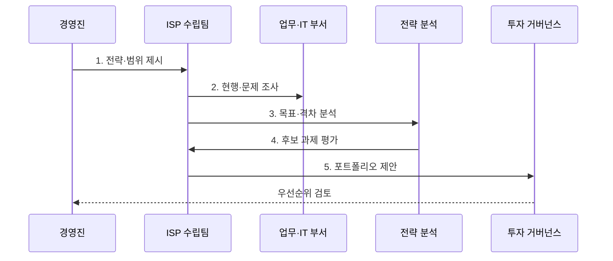

---
sidebar:
  order: 188
  label: "188. ISP 정보화 전략 계획 (ISP Information Strategy Planning)"
  badge: { text: "기출 · 70%", variant: note }
title: "ISP 정보화 전략 계획 (ISP Information Strategy Planning)"
date: "2026-07-29T17:00:00+09:00"
tags: ["notes-software"]
weight: 188
extra:
  question_no: "188"
  source_status: "기출"
  source_history: "120회"
  priority: 70
  priority_note: "현황 분석과 목표 전략 수립이 반복 활용됨"
---

## 미리 알고가기

- **정보전략계획(Information Strategy Planning, ISP·아이에스피)**: 경영전략과 연계한 정보화 비전·목표·투자 과제·중장기 로드맵을 수립하는 계획
- **정보시스템 마스터플랜(Information System Master Plan, ISMP·아이에스엠피)**: 선정된 개별 정보화사업의 목표 모델·상세 요구·규모·예산·발주 계획을 구체화하는 계획
- **전사 아키텍처(Enterprise Architecture, EA·이에이)**: 업무·데이터·응용·기술 구조와 원칙·표준을 지속 관리하는 체계
- **현행 모델(Current Model)**: 현재 업무·조직·데이터·응용·기술·운영 구조와 문제를 표현한 모델
- **목표 모델(Target Model)**: 경영전략 달성에 필요한 미래 업무·데이터·응용·기술 구조
- **격차 분석(Gap Analysis)**: 현행과 목표의 차이·원인·영향·해소 방안을 식별하는 활동
- **과제 포트폴리오(Initiative Portfolio)**: 가치·비용·위험·의존성으로 함께 평가하고 투자하는 정보화 과제 집합
- **이행 로드맵(Implementation Roadmap)**: 우선순위·선후 관계·자원·위험을 반영한 단계별 실행 순서
- **핵심성과지표(Key Performance Indicator, KPI·케이피아이)**: 정보화 과제의 전략 기여와 목표 달성을 측정하는 지표

## Ⅰ. 개요

- 정의/개념: 경영전략의 **정보화 과제·투자 로드맵 전환**
- 배경/필요성: 부서별 투자로 인한 **중복·단절·우선순위 부재**

### 쉽게 이해하기 (학습용)
- 조직의 목적지를 정보화 목표로 바꾸고 현재 위치와의 차이를 사업 목록과 투자 순서로 그린 지도다.

## Ⅱ. 특징

- **경영전략·정보화 목표**의 추적 정렬
- **현행·목표 격차** 기반 과제 도출
- **가치·비용·위험·의존성** 기반 투자 순위

### 쉽게 이해하기 (학습용)
- 현재 업무와 시스템을 목표 모습에 겹쳐 보고 빈 공간을 과제로 바꾸면 무엇부터 투자할지 근거가 생긴다.

## Ⅲ. 구조 및 구성요소

| 구성요소 | 책임 |
|:---|:---|
| 전략·환경 | 경영 목표·**정책 변화 반영** |
| 현행 모델 | 업무·데이터·**자산 문제 진단** |
| 목표·격차 | 미래 구조·**해소 후보 도출** |
| 과제 포트폴리오 | 가치·비용·**위험·의존성 평가** |
| 로드맵·성과 | 투자 순서·**KPI 재검토** |

### 쉽게 이해하기 (학습용)

- 전략은 목적지를, 현행 모델은 출발지를 보여 주고 격차와 포트폴리오는 그 사이의 노선과 투자 순서를 정한다.

## Ⅳ. 흐름도

**동작 원리**

1. **전략·범위 제시**: 목표·기간·성과 기대 확정
2. **현행·문제 조사**: 업무·자산·비용 근거 수집
3. **목표·격차 분석**: 미래 구조와 차이 도출
4. **후보 과제 평가**: 가치·비용·위험·선행성 비교
5. **포트폴리오 제안**: 연차별 투자·KPI 연결

### 쉽게 이해하기 (학습용)
- 목표와 현재의 차이를 사업 후보로 바꾼 뒤 가치와 선행 관계를 함께 보면 기반 사업보다 서비스 사업을 먼저 하는 오류를 막을 수 있다.

## Ⅴ. 종류 및 비교

| 정보화 관리 | ISP | ISMP | EA |
|:---|:---|:---|:---|
| 적용 기준 | 전사의 **투자 방향 선정** | 개별 사업의 **발주 구체화** | 전사 구조의 **상시 통제** |
| 핵심 특징 | 비전·과제·**중장기 로드맵** | 요구·규모·**비용·RFP** | 구조·원칙·**표준 관리** |
| 한계 | 상세 요구·**비용 근거 부족** | 전략 변경의 **재산정 필요** | 지속 관리의 **운영 부담** |

### 쉽게 이해하기 (학습용)
- ISP는 투자 지도, ISMP는 선택 사업의 설계와 견적, EA는 모든 사업이 따라야 할 전사 건축 기준이다.

## Ⅵ. 실무 고려사항 및 대책

| 고려사항 | 대책 | 효과 |
|:---|:---|:---|
| 기술 목록의 **전략 대체** | 목표·KPI·과제 **추적표 구성** | 투자 목적 **정렬 확보** |
| 인터뷰의 **현황 왜곡** | 업무량·비용·**품질 자료 분석** | 문제 진단 **객관성 확보** |
| 부서별 **과제 중복** | 공통 데이터·**플랫폼 과제 통합** | 중복 투자 **방지** |
| 단기 효과의 **순위 편향** | 가치·위험·**선행 관계 평가** | 실행 순서 **타당성 향상** |
| 계획 이후 **성과 방치** | 책임자·재원·**분기 검토 지정** | 로드맵 **실행력 확보** |

### 쉽게 이해하기 (학습용)
- 온라인과 매장 데이터가 끊긴 기업은 새 서비스보다 공통 고객과 재고 기반을 먼저 배치해야 뒤 과제가 같은 자료를 재사용한다.

## Ⅶ. 결론

- **전략 기여·격차·선행 관계**로 투자 포트폴리오 결정

### 쉽게 이해하기 (학습용)
- 최신 기술의 이름보다 조직 목표에 기여하는 정도와 기반 과제의 순서를 보고 투자하며 KPI로 계속 조정해야 한다.
