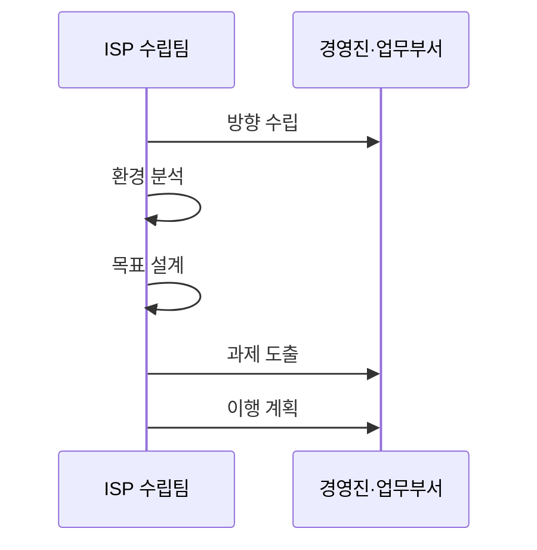

---
sidebar:
  order: 188
  label: "188. ISP 정보화 전략 계획 (ISP Information Strategy Planning)"
  badge:
    text: "기출 · 70%"
    variant: note
title: "ISP 정보화 전략 계획 (ISP Information Strategy Planning)"
date: "2026-07-25T00:30:00+09:00"
tags:
  - "notes-software"
weight: 188
extra:
  question_no: "188"
  source_status: "기출"
  source_history: "120회"
  priority: 70
  priority_note: "현황 분석과 목표 전략 수립이 반복 활용됨"
---

## 미리 알고가기

- **정보전략계획(Information Strategy Planning, ISP)**: ISP는 ‘아이에스피’로 읽고 영문 머리글자를 딴 약어이며, 경영 전략과 연계한 정보화 비전·투자 과제·중장기 로드맵을 수립함
- **정보시스템 마스터플랜(Information System Master Plan, ISMP)**: ISMP는 ‘아이에스엠피’로 읽고 영문 머리글자를 딴 약어이며, ISP가 선정한 개별 사업의 요구·규모·예산·발주 계획을 구체화함
- **전사 아키텍처(Enterprise Architecture, EA)**: EA는 ‘이에이’로 읽고 영문 머리글자를 딴 약어이며, 조직의 업무·데이터·응용·기술 구조와 전사 표준을 지속 관리함
- **비전**: 경영 전략이 요구하는 미래 정보화 방향과 목표 상태임
- **현황·격차 분석**: 현재 업무·시스템과 목표 상태의 차이와 원인을 찾는 활동임
- **목표 모델**: 미래 업무·데이터·응용·기술과 관리 체계를 표현한 구조임
- **포트폴리오·로드맵**: 포트폴리오는 투자 과제 묶음이고 로드맵은 단계별 실행 순서임
- **제안요청서(Request for Proposal, RFP)**: RFP는 ‘알에프피’로 읽고 영문 머리글자를 딴 약어이며, ISP 뒤 조달 단계에서 공급자에게 사업 범위·요구·제안 조건을 알림

## Ⅰ. 개요

- **정의/개념**: 비전 달성을 위한 중장기 투자 로드맵 수립
- **배경/필요성**: 개별 투자는 중복되기 쉬워 전사 우선순위가 필요함

### 쉽게 이해하기 (학습용)
- 비전 달성을 위한 중장기 정보화 투자 지도를 의미함

## Ⅱ. 특징

- 경영 전략과 정보화 목표를 연결한다.
- 현행과 목표 사이의 격차를 분석한다.
- 기술 도입을 통한 업무 개선 방향을 제시한다.
- 업무 효과·선행 관계로 투자 로드맵 구성한다.

### 쉽게 이해하기 (학습용)
- 투자 중복을 방지하고 추진 과제 우선순위를 설계함

## Ⅲ. 아키텍처 및 구성요소

| 설계 요소 | 설명 |
|:---|:---|
| 의사결정 | 범위와 이해관계자 결정 체계를 정함 |
| 전략 환경 | 경영 환경과 핵심 요인을 분석함 |
| 현행 분석 | 시스템 문제와 기술 격차를 분석함 |
| 목표 설계 | 미래 업무·기술 구조를 정의함 |
| 투자 계획 | 우선순위에 따라 로드맵을 수립함 |

> 요약: 전략과 격차를 투자 로드맵으로 연결함

### 쉽게 이해하기 (학습용)
- 목표와 현실의 차이를 파악해 실행 과제를 정리함

## Ⅳ. 원리 및 절차 흐름도

| 절차 | 설명 |
|:---|:---|
| 방향 수립 | 전략 연계 추진 목표 수립 |
| 환경 분석 | 외부 환경·현행 문제점 도출 |
| 목표 설계 | 미래 업무·정보 구조 정의 |
| 과제 도출 | 포트폴리오 과제 선정 |
| 이행 계획 | 우선순위 기반 예산 계획 |

> 요약: 현황과 목표 격차를 과제와 일정으로 구체화함

### 쉽게 이해하기 (학습용)
- 현장을 진단해 추진 과제별 실행 일정을 수립함

## Ⅴ. 종류 및 비교

| 판단 기준 | ISP | ISMP | EA |
|:---|:---|:---|:---|
| 핵심 특징 | 전사 투자 방향을 정함 | 개별 사업을 구체화함 | 전사 구조·표준을 관리함 |
| 적용 기준 | 투자 과제 선정 전 | 예산 요구·발주 전 | 구조·표준 상시 관리 |
| 주요 위험 | 실행 근거 부족 | 요구·비용 산정 오류 | 현업과 구조 불일치 |

> 요약: ISP는 로드맵, ISMP는 상세, EA는 표준 통제

### 쉽게 이해하기 (학습용)
- ISP는 투자 방향, ISMP는 발주, EA는 구조를 다룸

## Ⅵ. 실무 사례

1. 공공기관은 유사 정보화 과제의 중복을 제거함
2. 기업은 디지털 전환 과제의 실행 순서를 정함

### 쉽게 이해하기 (학습용)
- 공공기관은 같은 목적의 투자 과제를 하나로 합침
- 기업은 효과와 선행 관계로 과제 순서를 정함

## Ⅶ. 결론

- 경영 목표와 연결된 과제만 로드맵에 반영함

### 쉽게 이해하기 (학습용)
- 목표 기여도가 낮거나 중복된 과제는 투자에서 제외함
