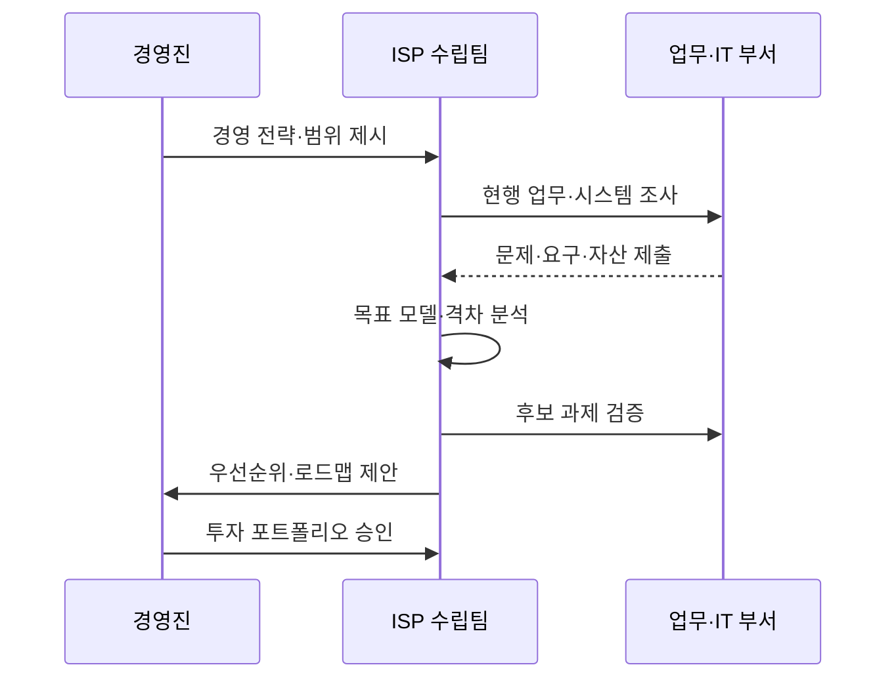

---
sidebar:
  order: 188
  label: "188. ISP 정보화 전략 계획 (ISP Information Strategy Planning)"
  badge: { text: "기출 · 70%", variant: note }
title: "ISP 정보화 전략 계획 (ISP Information Strategy Planning)"
date: "2026-07-27T23:59:59+09:00"
tags: ["notes-software"]
weight: 188
extra:
  question_no: "188"
  source_status: "기출"
  source_history: "120회"
  priority: 70
  priority_note: "현황 분석과 목표 전략 수립이 반복 활용됨"
---

## 미리 알고가기

- **정보전략계획(Information Strategy Planning, ISP)**: ‘아이에스피’로 읽고 영문 머리글자를 딴 약어이며, 경영 전략과 연계한 정보화 비전·투자 과제·중장기 로드맵을 수립함
- **정보시스템 마스터플랜(Information System Master Plan, ISMP)**: ‘아이에스엠피’로 읽고 영문 머리글자를 딴 약어이며, 선정된 개별 사업의 요구·규모·예산·발주 계획을 구체화함
- **전사 아키텍처(Enterprise Architecture, EA)**: ‘이에이’로 읽고 영문 머리글자를 딴 약어이며, 업무·데이터·응용·기술 구조와 표준을 지속 관리함
- **현행·목표 모델(Current·Target Model)**: 현재 업무·시스템 구조와 전략 달성에 필요한 미래 구조
- **격차 분석(Gap Analysis)**: 현행과 목표의 차이·원인·해소 과제를 식별하는 활동
- **과제 포트폴리오(Initiative Portfolio)**: 함께 평가·투자·관리하는 정보화 과제 집합
- **이행 로드맵(Implementation Roadmap)**: 효과·선후 관계·자원을 반영한 단계별 실행 순서

## Ⅰ. 개요

- **정의/개념**: 경영 전략 달성의 **정보화 비전·투자 로드맵 수립**
- **기존 한계**: 부서별 개별 투자의 **중복·전사 우선순위 부재**

### 쉽게 이해하기 (학습용)

- 조직의 목표를 이루기 위해 어떤 정보화 사업을 어떤 순서로 투자할지 그리는 중장기 지도다.

## Ⅱ. 특징

- 경영 전략과 **정보화 목표 정렬**
- 현행·목표의 **격차·개선 과제 도출**
- 가치·선후 관계 기반의 **투자 우선순위**

### 쉽게 이해하기 (학습용)

- 기술 목록부터 고르지 않고 경영 목표와 현재 문제를 연결해 필요한 투자 과제를 정한다.

## Ⅲ. 아키텍처 및 구성요소

| 구성요소 | 책임 |
|:---|:---|
| 경영 전략·환경 | 정보화의 **방향·핵심 동인** 제공 |
| 정보화 비전·목표 | 전략의 **목표 정보화 상태** 정의 |
| 현행·격차 분석 | 문제·중복·**개선 기회 식별** |
| 과제 포트폴리오 | 격차 해소의 **투자 후보 구성** |
| 이행 로드맵 | 효과·의존성 기반 **실행 순서 결정** |
| 성과 관리 | 과제의 **전략 기여도 측정** |

> 요약: 경영 전략과 현행 격차를 투자 과제·로드맵으로 연결

### 쉽게 이해하기 (학습용)

- 목표 지점과 현재 위치를 비교해 필요한 길을 찾고 효과와 선후 관계에 따라 공사 순서를 정한다.

## Ⅳ. 원리 및 절차 흐름

| 절차 | 설명 |
|:---|:---|
| 전략·범위 설정 | 경영 목표와 **계획 대상 확정** |
| 현행 분석 | 업무·데이터·**시스템 문제 파악** |
| 목표 모델 설계 | 전략 달성의 **미래 구조 정의** |
| 격차·과제 도출 | 차이의 원인과 **개선 후보 식별** |
| 우선순위 평가 | 가치·위험·**선행 관계 비교** |
| 로드맵 승인 | 단계별 **투자 순서 확정** |

> 요약: 전략과 현행의 격차를 우선순위 투자 로드맵으로 변환

### 쉽게 이해하기 (학습용)

- 조직 목표와 현재 시스템을 비교해 개선 과제를 만들고 효과가 크고 먼저 필요한 과제부터 배치한다.

## Ⅴ. 종류 및 비교

| 관리 체계 | ISP | ISMP | EA |
|:---|:---|:---|:---|
| 적용 기준 | 중장기 **투자 방향·과제 선정** | 특정 사업 **규모·발주 구체화** | 전사 구조·**표준 지속 관리** |
| 핵심 특징 | 비전·포트폴리오·**로드맵** | 상세 요구·예산·**발주 계획** | 업무·데이터·응용·**기술 정렬** |
| 한계 | 상세 구축 요구·**비용 부족** | 상위 전략 변화·**재산정** | 운영 거버넌스·**지속 투자 필요** |

> 요약: 전략 계획·사업 발주·구조 운영의 목적을 구분

### 쉽게 이해하기 (학습용)

- ISP는 투자 지도를 만들고 ISMP는 선택 사업의 설계·견적을 만들며 EA는 전사 구조와 표준을 계속 관리한다.

## Ⅵ. 실무 사례

1. 유통 기업은 **옴니채널 격차 분석**으로 통합 과제 도출
2. 공공기관은 **업무 효과·의존성 평가**로 3개년 로드맵 수립

### 쉽게 이해하기 (학습용)

- 온라인과 매장의 단절을 찾아 통합 과제를 만들고 먼저 필요한 기반 과제부터 연도별로 배치한다.

## Ⅶ. 결론

- 투자 방향은 **ISP**, 발주 상세는 **ISMP**, 구조 표준은 **EA**

### 쉽게 이해하기 (학습용)

- 정보화 계획의 목적이 전략·발주·구조 관리 중 무엇인지에 따라 적합한 체계를 선택한다.
