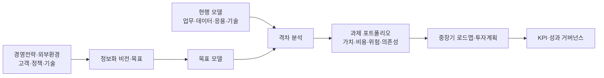
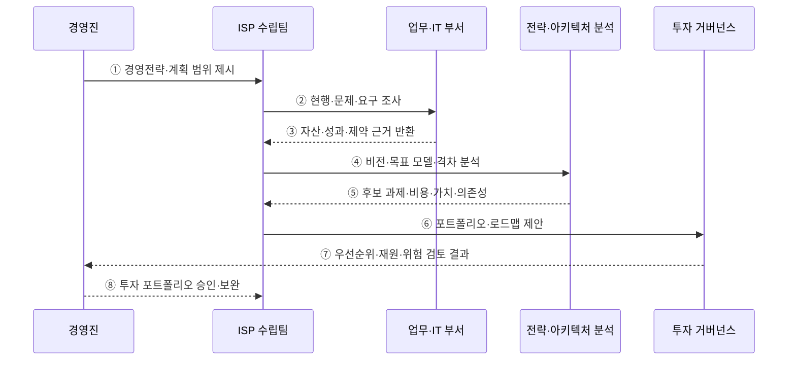

---
sidebar:
  order: 188
  label: "188. ISP 정보화 전략 계획 (ISP Information Strategy Planning)"
  badge: { text: "기출 · 70%", variant: note }
title: "ISP 정보화 전략 계획 (ISP Information Strategy Planning)"
date: "2026-07-27T23:59:59+09:00"
tags: ["notes-software"]
weight: 188
extra:
  question_no: "188"
  source_status: "기출"
  source_history: "120회"
  priority: 70
  priority_note: "현황 분석과 목표 전략 수립이 반복 활용됨"
---

## 미리 알고가기

- **정보전략계획(Information Strategy Planning, ISP·아이에스피)**: 경영전략과 연계한 정보화 비전·목표·투자 과제·중장기 로드맵을 수립하는 계획
- **정보시스템 마스터플랜(Information System Master Plan, ISMP·아이에스엠피)**: 선정된 개별 정보화사업의 목표 모델·상세 요구·규모·예산·발주 계획을 구체화하는 계획
- **전사 아키텍처(Enterprise Architecture, EA·이에이)**: 업무·데이터·응용·기술 구조와 원칙·표준을 지속 관리하는 체계
- **현행 모델(Current Model)**: 현재 업무·조직·데이터·응용·기술·운영 구조와 문제를 표현한 모델
- **목표 모델(Target Model)**: 경영전략 달성에 필요한 미래 업무·데이터·응용·기술 구조
- **격차 분석(Gap Analysis)**: 현행과 목표의 차이·원인·영향·해소 방안을 식별하는 활동
- **과제 포트폴리오(Initiative Portfolio)**: 가치·비용·위험·의존성으로 함께 평가하고 투자하는 정보화 과제 집합
- **이행 로드맵(Implementation Roadmap)**: 우선순위·선후 관계·자원·위험을 반영한 단계별 실행 순서
- **핵심성과지표(Key Performance Indicator, KPI·케이피아이)**: 정보화 과제의 전략 기여와 목표 달성을 측정하는 지표

## Ⅰ. 개요

- ISP는 경영전략을 **정보화 비전·목표·투자 과제·중장기 로드맵**으로 변환한다.
- 부서별 개별 투자로 생기는 중복 시스템·데이터 단절·전사 우선순위 부재를 줄인다.
- 특정 제품 도입 계획이 아니라 조직이 어떤 정보 역량에 왜 투자할지를 결정하는 전략 계획이다.

### 쉽게 이해하기 (학습용)
- 조직 목표를 이루기 위해 어떤 정보화사업을 어떤 순서로 투자할지 그린 지도임

## Ⅱ. 특징

- **전략 정렬**: 경영 목표·환경 변화·고객 가치와 정보화 목표를 연결한다.
- **전사 현황 분석**: 업무·조직·데이터·응용·기술·보안·운영의 문제와 중복을 진단한다.
- **목표 구조 제시**: 미래 업무 방식과 이를 지원할 정보·시스템·기술 방향을 정의한다.
- **격차 기반 과제**: 현행과 목표의 차이에서 개선 과제를 도출하고 중복·누락을 조정한다.
- **포트폴리오 판단**: 가치·시급성·비용·위험·의존성·실행 역량으로 투자 우선순위를 정한다.
- **성과 연결**: 로드맵의 과제를 전략 KPI와 연결해 투자 이후 효과를 추적한다.

### 쉽게 이해하기 (학습용)
- 현재 위치와 목표 지점의 차이를 보고 필요한 사업과 투자 순서를 정함

## Ⅲ. 아키텍처 및 구성요소

**도표안 A — 구조도**

**도표안 B — sequenceDiagram**

| 구성요소 | 역할 |
|:---|:---|
| 경영전략·환경 | 경영 목표·고객 요구·정책·기술 변화와 계획 범위 제공 |
| 정보화 비전·목표 | 정보화가 달성할 미래 가치·원칙·KPI 정의 |
| 현행 모델 | 업무·데이터·응용·기술·보안·운영 자산과 문제 진단 |
| 목표 모델 | 전략 달성에 필요한 미래 업무·정보·시스템 구조 설계 |
| 격차 분석 | 현행-목표 차이·원인·영향·해소 후보 도출 |
| 과제 포트폴리오 | 가치·비용·위험·의존성·역량으로 과제 평가 |
| 로드맵·성과관리 | 단계별 투자·자원·책임·KPI·재검토 시점 결정 |

**동작 원리**

- ① 경영진이 조직 전략·해결 과제·계획 기간·대상 범위·성과 기대를 제시한다.
- ② ISP 수립팀이 업무·IT 부서의 프로세스·데이터·시스템·비용·문제를 조사한다.
- ③ 부서가 자산 목록·업무량·성과·장애·규제·인력 등 판단 근거를 반환한다.
- ④ 수립팀이 경영전략에 맞는 정보화 비전과 목표 모델을 만들고 현행과의 격차를 분석한다.
- ⑤ 분석 계층이 격차 해소 과제의 가치·비용·위험·선행 관계·조직 변화를 평가한다.
- ⑥ 수립팀이 과제 조합과 연차별 이행 로드맵·투자 계획을 거버넌스에 제안한다.
- ⑦ 거버넌스가 중복·재원·실행 역량·포트폴리오 위험과 전략 기여를 검토한다.
- ⑧ 경영진이 우선순위와 재원을 승인하고 보완 과제를 다음 계획에 반영한다.

### 쉽게 이해하기 (학습용)
- 목표와 현재의 차이를 과제로 바꾸고 가치와 선후 관계로 투자 순서를 정함

## Ⅳ. 종류 및 비교

| 비교 항목 | ISP | ISMP | EA |
|:---|:---|:---|:---|
| 목적 | 정보화 방향·투자 과제 선정 | 특정 구축사업의 실행·발주 구체화 | 전사 구조·원칙·표준의 지속 관리 |
| 범위 | 전사·기관·중장기 | 개별 사업·구축 범위 | 전사 업무·데이터·응용·기술 |
| 핵심 질문 | 무엇에 왜 투자할 것인가 | 무엇을 어떤 규모·비용으로 구축할 것인가 | 구조와 표준을 어떻게 정렬·관리할 것인가 |
| 핵심 산출물 | 비전·목표 모델·과제·포트폴리오·로드맵 | 상세 요구·목표 설계·규모·총사업비·RFP 기준 | 현행·목표 아키텍처·원칙·표준·이행 통제 |
| 운영 주기 | 전략 변화에 따라 주기 재수립 | 사업 발주 전 수립·변경 시 보완 | 상시 갱신·준수 관리 |
| 한계 | 개별 사업의 상세 요구·비용 부족 | 상위 전략 변경 시 범위 재산정 | 지속 거버넌스와 관리 비용 필요 |

### 쉽게 이해하기 (학습용)
- ISP는 투자 지도, ISMP는 선택 사업의 설계·견적, EA는 전사 구조의 관리 기준임

## Ⅴ. 실무 고려사항 및 대책

| 고려사항 | 위험 | 대책 |
|:---|:---|:---|
| 전략 연결 | 최신 기술 목록이 목표를 대체 | 경영 목표-KPI-정보화 목표-과제 추적표 |
| 현황 근거 | 인터뷰 의견만으로 문제 왜곡 | 업무량·비용·장애·데이터 품질·사용률 분석 |
| 목표 모델 | 이상적 구조만 제시해 실행 불가 | 조직 역량·규제·기존 투자·전환 제약 반영 |
| 과제 중복 | 부서별 유사 플랫폼을 별도 추진 | 공통 역량·데이터·플랫폼 과제로 통합 |
| 우선순위 | 정치적 선호·단기 효과 편향 | 가치·위험·법정 의무·선행 관계의 다기준 평가 |
| 비용·효과 | 편익 과대·운영비 누락 | 생애주기 비용·정량·정성 편익과 민감도 분석 |
| 의존 관계 | 기반 과제 없이 서비스부터 착수 | 데이터·인프라·제도·조직 선행 관계 명시 |
| 실행 거버넌스 | 계획 발간 뒤 과제·KPI 방치 | 책임자·재원·마일스톤·분기 포트폴리오 검토 |
| 환경 변화 | 정책·시장·기술 변화로 로드맵 무효 | 가정·Trigger·Rolling Roadmap 갱신 |

### 쉽게 이해하기 (학습용)
- 사례: 유통 기업은 온라인·매장 데이터 단절을 찾아 공통 고객·재고 기반을 선행 과제로 배치함

## Ⅵ. 결론

- ISP의 핵심은 **경영전략과 현행 격차를 투자 가능한 정보화 과제와 로드맵으로 연결**하는 것이다.
- 기술 도입 목록이 아니라 가치·비용·위험·의존성·조직 역량을 반영한 포트폴리오여야 한다.
- KPI와 정기 재검토로 전략 변화에 맞춰 과제·재원·순서를 지속 조정해야 한다.

### 쉽게 이해하기 (학습용)
- 조직 목표에 기여하는 사업만 골라 기반부터 순서대로 투자함
