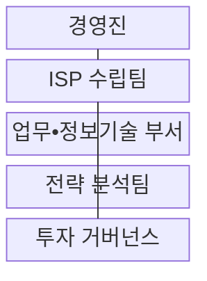
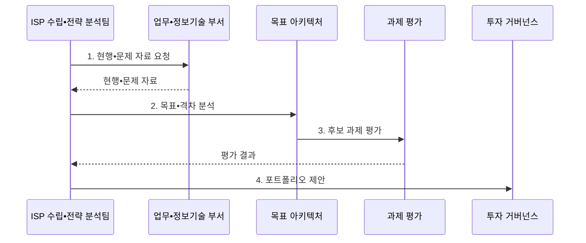

---
sidebar:
  order: 188
  label: "188. ISP 정보화 전략 계획 (ISP Information Strategy Planning)"
  badge: { text: "기출 • 70%", variant: note }
title: "ISP 정보화 전략 계획 (ISP Information Strategy Planning)"
date: "2026-08-04T14:42:06+09:00"
tags: ["notes-software"]
weight: 188
extra:
  question_no: "188"
  source_status: "기출"
  source_history: "120회"
  priority: 70
  priority_note: "현황 분석과 목표 전략 수립이 반복 활용됨"
---

## Ⅰ. 개요

핵심 용어

- **정보전략계획(Information Strategy Planning, ISP)**: 조직의 경영전략과 현황을 분석해 정보화 과제•투자 우선순위•중장기 로드맵으로 전환하는 전략 계획이다.

- 정의/개념: **ISP** 는 조직의 경영전략과 현황을 분석하여 정보화 과제와 중장기 투자 우선순위•로드맵으로 전환하는 전략 계획
- 배경/필요성: 부서별 개별 투자로 중복•단절되어 **전사 우선순위** 판단 불가

#### 한줄 요약
- 조직의 목적지를 정보화 목표로 바꾸고 현재 위치와의 차이를 사업 목록과 투자 순서로 그린 지도다.

## Ⅱ. 특징

핵심 용어

- **현행•목표 격차**: 현행•목표 격차는 현재 업무•시스템과 전략 달성에 필요한 미래 구조의 차이를 과제 후보로 바꾸는 근거다.
- **경영전략•정보화 목표 추적**: 조직 목표와 각 정보화 목표•과제의 기여 관계를 연결하는 정렬 기준이다.
- **가치•의존성**: 과제의 사업 효과와 선행 기반 과제 관계를 함께 평가하는 투자 우선순위 기준이다.
- **핵심 성과 지표(Key Performance Indicator, KPI)**: 정보화 투자가 조직 목표에 기여한 정도를 정량 측정하는 지표이다.

- **경영전략•정보화 목표** 의 추적 정렬
- **현행•목표 격차** 기반 과제 도출
- **가치•의존성** 기반 투자 순위
- **투자 거버넌스•KPI** 기반 성과 재검토

#### 한줄 요약
- 현재 업무와 시스템을 목표 모습에 겹쳐 보고 빈 공간을 과제로 바꾸면 무엇부터 투자할지 근거가 생긴다.

## Ⅲ. 구조 및 구성요소

핵심 용어

- **투자 거버넌스**: 투자 거버넌스는 과제의 가치, 위험, 의존성, KPI를 검토해 우선순위와 투자 지속 여부를 결정한다.
- **경영진**: 경영 목표와 정보전략계획의 범위•우선순위를 승인하는 구성요소이다.
- **ISP 수립팀**: 현행•목표•과제•로드맵을 하나의 계획으로 통합하는 구성요소이다.
- **업무•정보기술 부서**: 업무량•데이터•시스템•비용의 현행 근거를 제공하는 구성요소이다.
- **전략 분석팀**: 현행•목표 격차와 과제 가치•위험•선행 의존성을 평가하는 구성요소이다.

| 구성요소 | 책임 |
|:---|:---|
| 경영진 | 경영 목표•**계획 범위 승인** |
| ISP 수립팀 | 현행•목표•과제•**로드맵 통합** |
| 업무•정보기술 부서 | 업무•데이터•**자산 근거 제공** |
| 전략 분석팀 | 격차•가치•**의존성 평가** |
| 투자 거버넌스 | 우선순위•재원•**KPI 검토** |

#### 한줄 요약

- 경영진이 목적지를 정하면 업무 부서의 현행 근거와 분석팀의 격차 평가를 수립팀이 로드맵으로 묶고 거버넌스가 투자 순서를 검토한다.

## Ⅳ. 흐름도

핵심 용어

- **4. 포트폴리오 제안**: 후보 과제의 가치와 비용, 위험, 선행 관계를 비교해 연차별 투자와 KPI를 묶은 포트폴리오를 제안한다.
- **1. 현행•문제 자료 요청**: 업무•자산•비용•품질의 객관적 근거를 수집하는 단계이다.
- **2. 목표•격차 분석**: 경영전략 달성에 필요한 미래 구조와 현재 상태의 차이를 도출하는 단계이다.
- **3. 후보 과제 평가**: 과제별 가치•비용•위험•선행 관계를 비교하는 단계이다.
- **KPI 검토**: 연차별 투자 포트폴리오의 성과를 재검토하는 정량 기준이다.

**동작 원리**

1. **현행•문제 자료 요청**: 업무•자산•비용 근거 수집
2. **목표•격차 분석**: 미래 구조와 현행의 차이 도출
3. **후보 과제 평가**: 가치•비용•위험•선행성 비교
4. **포트폴리오 제안**: 연차별 투자•KPI 연결

#### 한줄 요약
- 목표와 현재의 차이를 사업 후보로 바꾼 뒤 가치와 선행 관계를 함께 보면 기반 사업보다 서비스 사업을 먼저 하는 오류를 막을 수 있다.

## Ⅴ. 종류 및 비교

핵심 용어

- **ISP 범위**: 전사 정보화 비전•투자 과제•우선순위와 중장기 로드맵 수립
- **정보시스템 마스터플랜(Information System Master Plan, ISMP)**: 개별 사업의 요구•규모•비용•제안요청서를 구체화하는 실행 계획이다.
- **전사 아키텍처(Enterprise Architecture, EA)**: 전사 업무•데이터•응용•기술 구조와 원칙•표준을 지속 관리하는 체계이다.

| 정보화 관리 | ISP | ISMP | EA |
|:---|:---|:---|:---|
| 적용 기준 | 전사의 **투자 방향 선정** | 개별 사업의 **발주 구체화** | 전사 구조의 **상시 통제** |
| 핵심 특징 | 비전•과제•**중장기 로드맵** | 요구•규모•**비용•RFP** | 구조•원칙•**표준 관리** |
| 한계 | 상세 요구•**비용 근거 부족** | 전략 변경의 **재산정 필요** | 지속 관리의 **운영 부담** |

#### 한줄 요약
- ISP는 투자 지도, ISMP는 선택 사업의 설계와 견적, EA는 모든 사업이 따라야 할 전사 건축 기준이다.

## Ⅵ. 실무 고려사항 및 대책

핵심 용어

- **과제 중복**: 과제 중복은 부서별로 비슷한 데이터와 플랫폼 기능을 별도 사업으로 추진해 투자와 운영 비용이 반복되는 문제다.
- **과제 추적표**: 전략 목표에서 과제와 KPI까지 기여 관계를 연결한 표이다.
- **분기 검토(Quarterly Review)**: 책임자•재원•성과 지표를 주기적으로 확인해 로드맵 지속•조정을 결정하는 활동이다.

| 문제 | 대책 | 효과 |
|:---|:---|:---|
| 기술 목록의 **전략 대체** | 목표•KPI•과제 **추적표 구성** | 투자 목적 **정렬 확보** |
| 인터뷰의 **현황 왜곡** | 업무량•비용•**품질 자료 분석** | 문제 진단 **객관성 확보** |
| 부서별 **과제 중복** | 공통 데이터•**플랫폼 과제 통합** | 중복 투자 **방지** |
| 단기 효과의 **순위 편향** | 가치•위험•**선행 관계 평가** | 실행 순서 **타당성 향상** |
| 계획 이후 **성과 방치** | 책임자•재원•**분기 검토 지정** | 로드맵 **실행력 확보** |

#### 한줄 요약
- 온라인과 매장 데이터가 끊긴 기업은 새 서비스보다 공통 고객과 재고 기반을 먼저 배치해야 뒤 과제가 같은 자료를 재사용한다.

## Ⅶ. 결론

핵심 용어

- **기반 과제**: 전략 기여가 높고 후속 사업의 선행 의존성을 해소하는 기반 과제부터 우선 투자해야 한다.

- 전략 기여가 높고 선행 의존성을 해소하는 **기반 과제** 부터 투자

#### 한줄 요약
- 최신 기술의 이름보다 조직 목표에 기여하는 정도와 기반 과제의 순서를 보고 투자하며 KPI로 계속 조정해야 한다.
