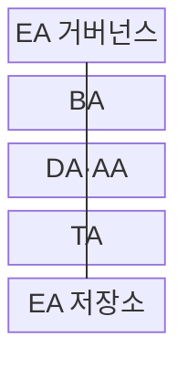
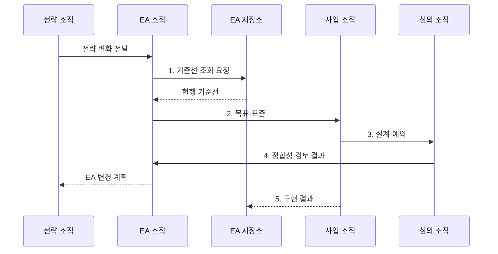

---
sidebar:
  order: 189
  label: "189. EA 전사적 아키텍처 (Enterprise Architecture)"
  badge: { text: "기출 · 85%", variant: note }
title: "EA 전사적 아키텍처 (Enterprise Architecture)"
date: "2026-07-31T00:21:20+09:00"
tags: ["notes-software"]
weight: 189
extra:
  question_no: "189"
  source_status: "기출"
  source_history: "125회, 128회, 132회, 134회, 135회"
  priority: 85
  priority_note: "현행·목표·참조모형 설계가 반복 출제됨"
---

## 미리 알고가기

- **전사 아키텍처(Enterprise Architecture, EA)**: 조직 전략과 업무·데이터·응용·기술 구조를 전사 관점에서 정렬하고 변화시키는 관리 체계
- **업무 아키텍처(Business Architecture, BA)**: 전략·조직·역량·가치 흐름·업무 프로세스 구조
- **데이터 아키텍처(Data Architecture, DA)**: 데이터 주제·모델·흐름·품질·소유권 구조
- **응용 아키텍처(Application Architecture, AA)**: 응용 기능·서비스·인터페이스·의존 관계 구조
- **기술 아키텍처(Technology Architecture, TA)**: 플랫폼·인프라·네트워크·보안 기술과 표준 구조
- **현행·목표 아키텍처(Baseline·Target Architecture)**: 현재 실제 구조와 전략 달성에 필요한 미래 구조
- **전환 아키텍처(Transition Architecture)**: 현행에서 목표로 이동하는 과정의 실행 가능한 중간 구조
- **참조모형(Reference Model)**: 반복 설계에 공통 용어·분류·관계·패턴을 제공하는 추상 모델
- **아키텍처 개발 방법(Architecture Development Method, ADM)**: 비전·현행·목표·격차·이행·변경을 반복 수행하는 TOGAF의 개발 방법
- **오픈 그룹 아키텍처 프레임워크(The Open Group Architecture Framework, TOGAF)**: 전사 아키텍처 개발 방법과 산출물 체계를 제공하는 프레임워크
- **아키텍처 거버넌스(Architecture Governance)**: 원칙·표준·설계 심사·예외·준수·변경을 관리하는 의사결정 체계
- **아키텍처 저장소(Architecture Repository)**: 모델·표준·결정·예외·사업 결과와 변경 이력을 보관하는 지식 기반

## Ⅰ. 개요

- 정의/개념: 조직 전략과 **업무·데이터·응용·기술 구조**를 정렬하고 변화를 통제하는 관리 체계
- 배경/필요성: 부서별 개별 구축은 중복·불일치로 **전사 영향 분석** 제약

### 쉽게 이해하기 (학습용)
- 부서별 건물을 전사 도시계획과 공통 설계 기준에 맞추고 완공 결과를 다시 지도에 반영하는 관리 체계다.

## Ⅱ. 특징

- 업무·데이터와 응용·기술의 **아키텍처 추적**
- **현행·목표·전환 구조** 기반 변화 관리
- **표준·예외**를 저장소로 순환 관리

### 쉽게 이해하기 (학습용)
- 현재 지도와 목표 지도 사이에 공사 중에도 업무를 유지할 전환 지도를 두고 각 사업이 그 경로를 따르는지 확인한다.

## Ⅲ. 구조 및 구성요소

| 구성요소 | 책임 |
|:---|:---|
| EA 거버넌스 | 원칙·심사·**예외 만료 통제** |
| BA | 역량·가치·**프로세스 구조 관리** |
| DA·AA | 데이터·응용·**서비스 관계 관리** |
| TA | 플랫폼·인프라·**보안 표준 관리** |
| EA 저장소 | 현행·목표·**전환 이력 보존** |

### 쉽게 이해하기 (학습용)

- 네 영역의 설계도가 저장소에서 같은 자산을 가리키고 거버넌스가 사업 설계와 예외를 심사해야 전사 지도가 갈라지지 않는다.

## Ⅳ. 흐름도

**동작 원리**

1. **기준선 조회 요청**: 현행 자산·표준·예외 확인
2. **목표·표준**: 원칙·참조모형·전환 제약 제시
3. **설계·예외**: 사유·위험·만료 조건 명시
4. **정합성 검토 결과**: 목표 기여·중복·영향 판정
5. **구현 결과**: 완공 자산·관계로 현행 기준선 갱신

### 쉽게 이해하기 (학습용)
- 사업 착수 때 전사 기준으로 설계를 심사하고 완공된 구조를 저장소에 돌려놓아야 다음 사업이 실제 지도를 사용한다.

## Ⅴ. 종류 및 비교

| EA 시점 모델 | 현행 아키텍처 | 목표 아키텍처 | 전환 아키텍처 |
|:---|:---|:---|:---|
| 적용 기준 | 현재의 **실제 구조 진단** | 전략 달성의 **미래 구조 정의** | 단계별 **공존·이동 설계** |
| 핵심 특징 | 자산·관계·**기술부채 기준선** | 원칙·표준·**공통 역량** | 중간 구조·**전환·폐기 순서** |
| 한계 | 미등록 자산·**최신성 저하** | 이상 구조의 **실행성 부족** | 임시 구조의 **영구화 위험** |

### 쉽게 이해하기 (학습용)
- 현재 건물을 운영하면서 목표 도시로 옮기려면 임시 도로와 공존 기간과 철거 순서를 담은 전환 지도가 필요하다.

## Ⅵ. 실무 고려사항 및 대책

| 고려사항 | 대책 | 효과 |
|:---|:---|:---|
| 저장소의 **최신성 저하** | 자동 수집·**사업 완료 갱신** | 투자 판단 **기준선 확보** |
| 과도한 **모델 상세도** | 의사결정 수준·**소유자 정의** | 유지 가능한 **범위 통제** |
| 영역 모델의 **관계 단절** | 공통 식별자·**메타모델 적용** | 영역 간 **추적성** |
| 임시 예외의 **기술부채화** | 책임자·만료·**상환 계획 지정** | 예외 누적 **억제** |
| 목표만 있는 **전환 계획** | 공존·롤백·**폐기 기준 설계** | 업무 중단 **위험 축소** |

### 쉽게 이해하기 (학습용)
- 중복 고객 자료는 DA의 공통 정의와 소유권뿐 아니라 AA의 단일 제공 서비스까지 연결해야 새 복제본 생성을 막을 수 있다.

## Ⅶ. 결론

- 전략 정합성과 전환 실행성이 검증된 **목표 아키텍처**만 승인하고 구현 결과로 기준선 갱신

### 쉽게 이해하기 (학습용)
- 전사 구조는 문서 작성으로 끝내지 않고 사업 심사와 예외 만료와 구현 결과를 저장소에 순환시켜 실제 기준선으로 유지해야 한다.
