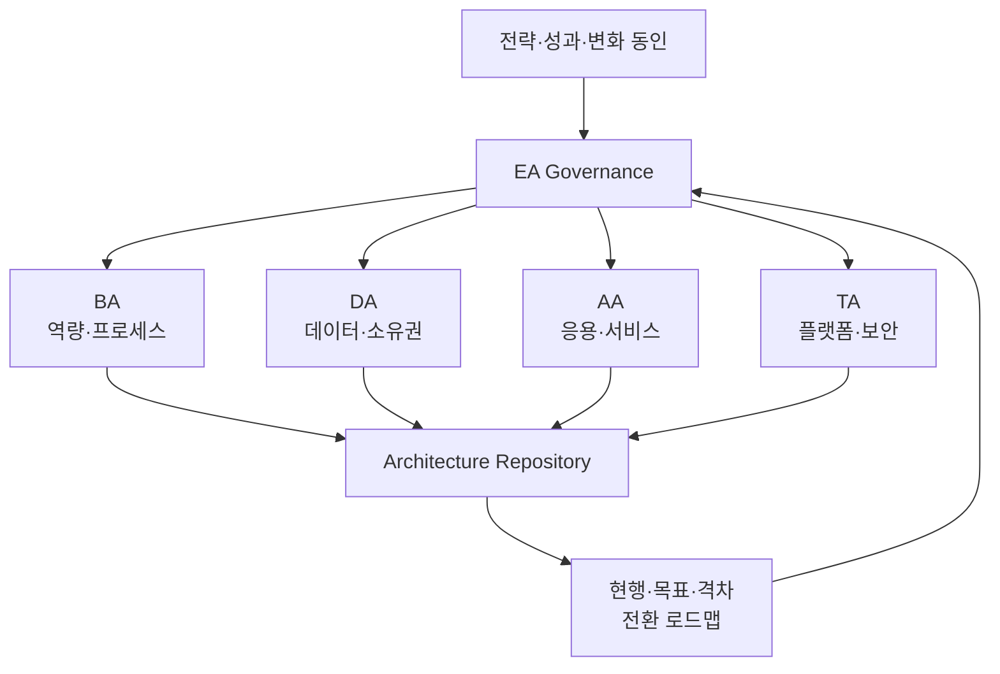
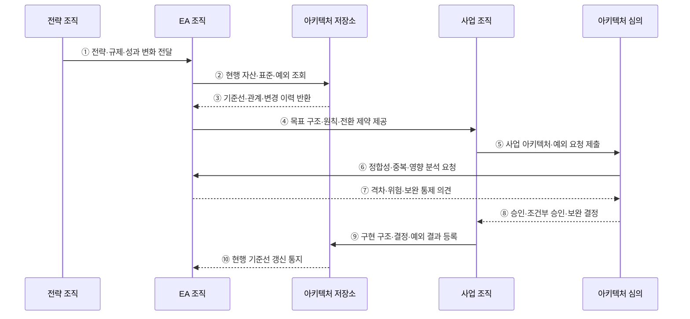

---
sidebar:
  order: 189
  label: "189. EA 전사적 아키텍처 (Enterprise Architecture)"
  badge: { text: "기출 · 85%", variant: note }
title: "EA 전사적 아키텍처 (Enterprise Architecture)"
date: "2026-07-27T23:59:59+09:00"
tags: ["notes-software"]
weight: 189
extra:
  question_no: "189"
  source_status: "기출"
  source_history: "125회, 128회, 132회, 134회, 135회"
  priority: 85
  priority_note: "현행·목표·참조모형 설계가 반복 출제됨"
---

## 미리 알고가기

- **전사 아키텍처(Enterprise Architecture, EA·이에이)**: 조직 전략과 업무·데이터·응용·기술 구조를 전사 관점에서 정렬하고 변화시키는 관리 체계
- **업무 아키텍처(Business Architecture, BA·비에이)**: 전략·조직·역량·가치 흐름·업무 프로세스 구조
- **데이터 아키텍처(Data Architecture, DA·디에이)**: 데이터 주제·모델·흐름·품질·소유권 구조
- **응용 아키텍처(Application Architecture, AA·에이에이)**: 응용 기능·서비스·인터페이스·의존 관계 구조
- **기술 아키텍처(Technology Architecture, TA·티에이)**: 플랫폼·인프라·네트워크·보안 기술과 표준 구조
- **현행·목표 아키텍처(Baseline·Target Architecture)**: 현재 실제 구조와 전략 달성에 필요한 미래 구조
- **전환 아키텍처(Transition Architecture)**: 현행에서 목표로 이동하는 과정의 실행 가능한 중간 구조
- **참조모형(Reference Model)**: 반복 설계에 공통 용어·분류·관계·패턴을 제공하는 추상 모델
- **아키텍처 개발 방법(Architecture Development Method, ADM·에이디엠)**: 비전·현행·목표·격차·이행·변경을 반복 수행하는 TOGAF의 개발 방법
- **아키텍처 거버넌스(Architecture Governance)**: 원칙·표준·설계 심사·예외·준수·변경을 관리하는 의사결정 체계
- **아키텍처 저장소(Architecture Repository)**: 모델·표준·결정·예외·사업 결과와 변경 이력을 보관하는 지식 기반

## Ⅰ. 개요

- EA는 전략을 **업무·데이터·응용·기술의 목표 구조와 변화 로드맵**으로 연결한다.
- 부서별 시스템 구축에서 발생하는 기능 중복·데이터 불일치·기술 난립·투자 충돌을 줄인다.
- 그림을 한 번 만드는 작업이 아니라 사업 심사와 구현 결과를 반영해 기준 구조를 지속 갱신하는 거버넌스다.

### 쉽게 이해하기 (학습용)
- 부서별 건물을 전사 도시계획·공통 설계 기준·공사 순서에 맞춰 관리함

## Ⅱ. 특징

- **전략 정렬**: 경영 목표와 필요한 업무 역량·정보·시스템·기술 변화를 연결한다.
- **영역 통합**: BA·DA·AA·TA의 모델과 관계를 하나의 관점에서 관리한다.
- **현행-목표 전환**: 실제 기준선·목표 구조·격차·중간 상태·사업 로드맵을 연결한다.
- **재사용 기준**: 원칙·표준·참조모형·공통 서비스를 사업 설계에 제공한다.
- **투자 통제**: 사업이 목표 구조에 기여하는지, 중복과 종속을 만드는지 심사한다.
- **예외 관리**: 표준을 지킬 수 없는 사유·위험·보완 통제·만료 시점을 기록한다.

### 쉽게 이해하기 (학습용)
- 현재 지도·목표 지도·중간 공사 지도를 만들고 각 사업이 기준을 따르는지 확인함

## Ⅲ. 아키텍처 및 구성요소

**도표안 A — 구조도**

**도표안 B — sequenceDiagram**

| 구성요소 | 역할 |
|:---|:---|
| BA | 전략·역량·조직·가치 흐름·프로세스 구조 관리 |
| DA | 데이터 정의·모델·흐름·품질·소유권·공유 원칙 관리 |
| AA | 응용 포트폴리오·기능·서비스·인터페이스·수명주기 관리 |
| TA | 플랫폼·인프라·네트워크·보안·기술 표준 관리 |
| 현행·목표 모델 | 실제 기준선과 전략 달성 구조 표현 |
| 전환 로드맵 | 격차 과제·중간 구조·의존성·사업 순서 연결 |
| 저장소 | 모델·원칙·표준·결정·예외·구현 이력 보관 |
| 거버넌스 | 설계 심사·예외 승인·준수 측정·변경 관리 |

**동작 원리**

- ① 전략 조직이 목표·규제·시장·성과 변화와 필요한 역량을 EA 조직에 전달한다.
- ② EA 조직이 저장소에서 실제 업무·데이터·응용·기술 자산과 표준·예외를 조회한다.
- ③ 저장소가 최신 기준선·영역 간 관계·과거 의사결정과 변경 이력을 반환한다.
- ④ EA 조직이 사업 조직에 목표 구조·원칙·표준·참조모형·전환 제약을 제공한다.
- ⑤ 사업 조직이 상세 아키텍처와 표준 예외가 필요하면 사유·기간·보완 통제를 제출한다.
- ⑥ 심의 조직이 EA 조직에 목표 정합성·중복 투자·데이터·기술·보안 영향을 분석하도록 요청한다.
- ⑦ EA 조직이 현행-목표 격차·위험·대안·보완 통제 의견을 반환한다.
- ⑧ 심의 조직이 승인·조건부 승인·보완·반려와 예외 만료 조건을 결정한다.
- ⑨ 사업 조직이 구현 완료 구조·아키텍처 결정·예외 결과를 저장소에 등록한다.
- ⑩ 저장소가 실제 구현을 현행 기준선에 반영하고 다음 사업의 분석 기준으로 제공한다.

### 쉽게 이해하기 (학습용)
- 전사 기준으로 사업 설계를 심사하고 실제 구축 결과를 다시 기준 지도에 반영함

## Ⅳ. 종류 및 비교

| 비교 항목 | 현행 아키텍처 | 목표 아키텍처 | 전환 아키텍처 |
|:---|:---|:---|:---|
| 목적 | 실제 기준선·문제·중복 파악 | 전략 달성의 미래 구조 정의 | 목표까지 실행 가능한 중간 상태 정의 |
| 시점 | 현재 | 계획 기간의 최종 | 단계별 이행 시점 |
| 내용 | 자산·관계·비용·기술부채 | 원칙·표준·공통 역량·목표 관계 | 공존 구조·데이터 전환·단계별 폐기 |
| 핵심 질문 | 지금 무엇이 어떻게 연결됐는가 | 최종적으로 어떤 구조여야 하는가 | 서비스 중단 없이 어떻게 이동하는가 |
| 위험 | 최신성 저하·미등록 자산 | 이상적이지만 실행 불가능 | 임시 구조의 영구화·전환 복잡성 |

| 영역 | 핵심 대상 | 대표 산출물 |
|:---|:---|:---|
| BA | 역량·가치 흐름·프로세스 | 역량 지도·업무 모델 |
| DA | 데이터·흐름·소유권 | 개념 데이터 모델·데이터 흐름 |
| AA | 응용·서비스·연계 | 응용 포트폴리오·인터페이스 모델 |
| TA | 플랫폼·인프라·보안 | 기술 참조모형·표준 프로파일 |

### 쉽게 이해하기 (학습용)
- 현재와 목표 사이에 실제 운영을 유지할 중간 구조를 넣어 변화 경로를 만듦

## Ⅴ. 실무 고려사항 및 대책

| 고려사항 | 위험 | 대책 |
|:---|:---|:---|
| 저장소 최신성 | 실제와 다른 모델로 잘못된 투자 판단 | 자동 자산 수집·사업 완료 갱신·정기 검증 |
| 모델 범위 | 모든 세부사항을 그리다 유지 불가 | 의사결정에 필요한 수준·관점·소유자 정의 |
| 전략 연결 | 기술 표준 관리로만 축소 | 목표-KPI-역량-과제-아키텍처 추적 |
| 영역 정합성 | 데이터·응용·기술 모델이 서로 단절 | 공통 ID·관계·메타모델·교차 검토 |
| 표준 경직성 | 혁신 차단·현장 우회 | 원칙 중심 표준·실험 경로·기한 있는 예외 |
| 예외 누적 | 임시 기술이 영구 기술부채로 남음 | 사유·위험·보완·책임자·만료·상환 계획 |
| 심사 시점 | 설계 완료 뒤 심사해 재작업 | 기획·개념 설계 단계의 조기 참여 |
| 효과 측정 | 문서만 늘고 중복·비용이 줄지 않음 | 재사용률·중복 폐기·표준 준수·Lead Time 측정 |
| 전환 관리 | 목표만 제시해 데이터·서비스 중단 | 전환 아키텍처·공존·Rollback·폐기 기준 |

### 쉽게 이해하기 (학습용)
- 사례: 중복 고객 데이터는 DA의 공통 정의·소유자·품질 기준과 AA의 단일 제공 서비스를 함께 설계함

## Ⅵ. 결론

- EA의 핵심은 **전략과 BA·DA·AA·TA의 현행·목표·전환 구조를 지속 연결**하는 것이다.
- 모델 작성보다 사업 의사결정·표준·예외·구현 결과를 순환시키는 거버넌스가 중요하다.
- 최신 저장소·실행 가능한 전환 로드맵·측정 가능한 투자 효과가 있어야 전사 중복과 불일치를 줄일 수 있다.

### 쉽게 이해하기 (학습용)
- 전사 기준 지도를 만들고 모든 사업의 결정과 실제 결과로 계속 갱신함
