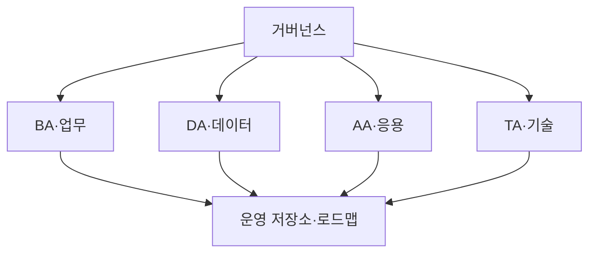
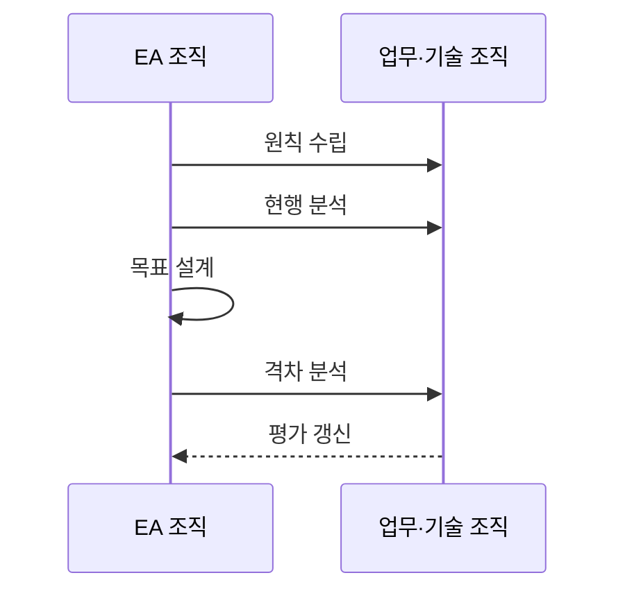

---
sidebar:
  order: 189
  label: "189. EA 전사적 아키텍처 (Enterprise Architecture)"
  badge:
    text: "기출 · 85%"
    variant: note
title: "EA 전사적 아키텍처 (Enterprise Architecture)"
date: "2026-07-25T00:30:00+09:00"
tags:
  - "notes-software"
weight: 189
extra:
  question_no: "189"
  source_status: "기출"
  source_history: "125회, 128회, 132회, 134회, 135회"
  priority: 85
  priority_note: "현행·목표·참조모형 설계가 반복 출제됨"
---

## 미리 알고가기

- **전사적 아키텍처(Enterprise Architecture, EA)**: EA는 ‘이에이’로 읽고 영문 머리글자를 딴 약어이며, 전략·업무·데이터·응용·기술을 전사 관점에서 정렬함
- **업무·데이터·응용·기술 아키텍처(Business Architecture, BA·Data Architecture, DA·Application Architecture, AA·Technology Architecture, TA)**: BA·DA·AA·TA는 ‘비에이·디에이·에이에이·티에이’로 읽고 각 영문 머리글자를 딴 약어이며, EA의 네 구조 영역을 구분함
- **오픈 그룹 아키텍처 프레임워크(The Open Group Architecture Framework, TOGAF)**: TOGAF는 ‘토가프’로 읽고 영문 머리글자를 딴 약어이며, EA 개발 방법·산출물·거버넌스를 제공함
- **아키텍처 개발 방법(Architecture Development Method, ADM)**: ADM은 ‘에이디엠’으로 읽고 영문 머리글자를 딴 약어이며, 현행·목표·격차·전환·변경을 반복 관리하는 TOGAF 절차임
- **정보기술(Information Technology, IT)**: IT는 ‘아이티’로 읽고 영문 머리글자를 딴 약어이며, EA가 전사 전략에 맞춰 정렬하는 처리·저장·전송 기술을 뜻함
- **현행·목표 아키텍처**: 현재 구조와 미래 지향 구조를 각각 표현한 모델임
- **격차·전환 아키텍처**: 격차는 현행과 목표의 차이이고 전환은 중간 단계 구조임
- **아키텍처 원칙·표준**: 의사결정 원칙·공통 기술·재사용 기준임
- **아키텍처 거버넌스**: 심사·예외·준수 측정으로 설계가 실제 사업에 적용되게 함
- **레거시**: 오래되어 유지 비용이 높거나 목표 표준과 맞지 않는 기존 시스템임

## Ⅰ. 개요

- **정의/개념**: 전사 전략·업무·정보기술 구조의 정렬 체계
- **배경/필요성**: 부서별 시스템·데이터 중복으로 전사 표준이 필요함

### 쉽게 이해하기 (학습용)
- 부서별 시스템을 전사 전략과 표준 구조에 맞춰 통합한다.

## Ⅱ. 특징

- 조직 역량과 정보화 요구를 연결한다.
- 영역 간 관계로 격차와 영향을 분석한다.
- 표준 모델로 공통 설계 기준을 제공한다.
- 심사·준수율로 사업의 표준 적용을 통제한다.

### 쉽게 이해하기 (학습용)
- 목표를 세우고 공통 표준으로 설계함

## Ⅲ. 아키텍처 및 구성요소

| 설계 요소 | 설명 |
|:---|:---|
| 거버넌스 | 심사와 의사결정 원칙을 관리함 |
| BA·업무 | 전략과 업무 프로세스를 표현함 |
| DA·데이터 | 데이터 구조와 흐름을 표현함 |
| AA·응용 | 응용 시스템과 연계를 표현함 |
| TA·기술 | 플랫폼과 보안 표준을 정의함 |
| 운영 저장소·로드맵 | 변경 이력과 전환 과제를 관리함 |

> 요약: 거버넌스로 네 영역 구조와 전환을 정렬함

### 쉽게 이해하기 (학습용)
- 네 영역의 설계가 같은 원칙을 따르는지 거버넌스가 확인한다.

## Ⅳ. 원리 및 절차 흐름도

| 절차 | 설명 |
|:---|:---|
| 원칙 수립 | 전사 전략 설계 원칙 정립 |
| 현행 분석 | 자산·기술 상태 분석 |
| 목표 설계 | 미래 표준·지향점 정의 |
| 격차 분석 | 현행·목표 차이로 로드맵 수립 |
| 평가 갱신 | 준수 성과 평가·구조 갱신 |

> 요약: 차이 분석 후 이행계획 수립함

### 쉽게 이해하기 (학습용)
- 차이 분석 후 이행 계획을 갱신함

## Ⅴ. 종류 및 비교

| 판단 기준 | 현행 | 목표 | 전환 |
|:---|:---|:---|:---|
| 핵심 특징 | 현재 자산을 표현함 | 미래 표준 구조를 정함 | 중간 단계 구조를 정함 |
| 적용 기준 | 기준선·문제 파악 | 지향점·격차 도출 | 단계별 이행 설계 |
| 주요 위험 | 자산 누락·현행화 지연 | 실행 가능성 부족 | 과제 의존성 누락 |

> 요약: 현행·목표 격차를 전환 단계로 연결

### 쉽게 이해하기 (학습용)
- 현행과 목표의 차이를 전환 과제로 나눔

## Ⅵ. 실무 사례

1. 공공기관은 중복 응용 시스템을 통합함
2. 금융기관은 표준 미달 레거시를 단계 폐기함

### 쉽게 이해하기 (학습용)
- 공공기관은 같은 기능의 중복 투자를 제거함
- 금융기관은 목표 표준과 맞지 않는 시스템을 순서대로 폐기함

## Ⅶ. 결론

- 표준 위반은 심사하고 승인 전환 과제만 실행함

### 쉽게 이해하기 (학습용)
- 설계 문서가 실제 투자·폐기 결정으로 이어져야 함
