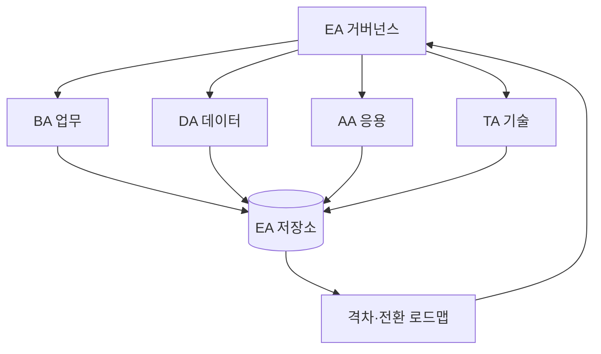
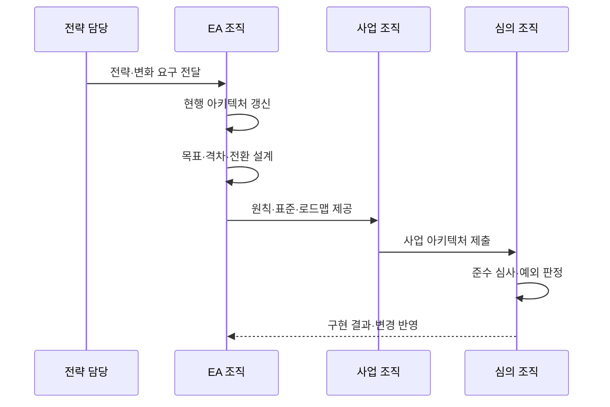

---
sidebar:
  order: 189
  label: "189. EA 전사적 아키텍처 (Enterprise Architecture)"
  badge: { text: "기출 · 85%", variant: note }
title: "EA 전사적 아키텍처 (Enterprise Architecture)"
date: "2026-07-27T23:59:59+09:00"
tags: ["notes-software"]
weight: 189
extra:
  question_no: "189"
  source_status: "기출"
  source_history: "125회, 128회, 132회, 134회, 135회"
  priority: 85
  priority_note: "현행·목표·참조모형 설계가 반복 출제됨"
---

## 미리 알고가기

- **전사 아키텍처(Enterprise Architecture, EA)**: ‘이에이’로 읽고 영문 머리글자를 딴 약어이며, 전략과 업무·데이터·응용·기술 구조를 전사 관점에서 정렬·관리함
- **업무 아키텍처(Business Architecture, BA)**: ‘비에이’로 읽고 영문 머리글자를 딴 약어이며, 전략·조직·업무 역량·프로세스를 구조화함
- **데이터 아키텍처(Data Architecture, DA)**: ‘디에이’로 읽고 영문 머리글자를 딴 약어이며, 데이터 주제·모델·흐름·관리 책임을 구조화함
- **응용 아키텍처(Application Architecture, AA)**: ‘에이에이’로 읽고 영문 머리글자를 딴 약어이며, 응용 기능·서비스·연계 관계를 구조화함
- **기술 아키텍처(Technology Architecture, TA)**: ‘티에이’로 읽고 영문 머리글자를 딴 약어이며, 플랫폼·네트워크·보안 기술과 표준을 구조화함
- **오픈 그룹 아키텍처 프레임워크(The Open Group Architecture Framework, TOGAF)**: ‘토가프’로 읽고 영문 핵심 글자를 딴 약어이며, EA 개발 방법·산출물·거버넌스를 제공함
- **아키텍처 개발 방법(Architecture Development Method, ADM)**: ‘에이디엠’으로 읽고 영문 머리글자를 딴 약어이며, 현행·목표·격차·전환·변경을 반복 관리하는 TOGAF 절차
- **전환 아키텍처(Transition Architecture)**: 현행에서 목표로 이동하는 중간 단계의 구조
- **아키텍처 거버넌스(Architecture Governance)**: 원칙·표준의 심사·예외 승인·준수 측정 체계

## Ⅰ. 개요

- 정의/개념: 전략과 **업무·데이터·응용·기술 구조를 정렬**
- 기존 한계: 부서별 시스템의 **기능·데이터 중복·표준 불일치**

### 쉽게 이해하기 (학습용)

- 부서마다 따로 지은 건물을 전사 도시 계획과 공통 설계 기준에 맞춰 연결하고 바꾸는 체계다.

## Ⅱ. 특징

- BA·DA·AA·TA의 **영역 간 관계 관리**
- 현행·목표·격차의 **전환 로드맵**
- 원칙·표준의 **심사·예외·준수 통제**

### 쉽게 이해하기 (학습용)

- 목표 구조만 그리지 않고 현재 구조와의 차이, 중간 이전 단계, 사업이 표준을 따르는지까지 계속 관리한다.

## Ⅲ. 아키텍처 및 구성요소

| 구성요소 | 책임 |
|:---|:---|
| BA | 전략·역량·**업무 프로세스 구조** |
| DA | 데이터 모델·**흐름·책임 구조** |
| AA | 응용 기능·**서비스·연계 구조** |
| TA | 플랫폼·보안의 **기술 표준 구조** |
| EA 저장소 | 모델·원칙·**변경 이력 보존** |
| 거버넌스 | 설계 심사·**예외·준수 관리** |

> 요약: 네 아키텍처 영역과 거버넌스가 전환 로드맵을 통제

### 쉽게 이해하기 (학습용)

- 업무·자료·프로그램·기술 지도를 한 저장소에 연결하고 모든 사업이 공통 원칙에 맞는지 심사한다.

## Ⅳ. 원리 및 절차 흐름

| 절차 | 설명 |
|:---|:---|
| 전략 요구 전달 | 변화 목표·**아키텍처 동인 확인** |
| 현행 갱신 | 실제 업무·자산의 **기준 상태 반영** |
| 목표·격차 설계 | 미래 구조와 **변경 과제 도출** |
| 전환 계획 | 중간 구조·**사업 로드맵 구성** |
| 준수 심사 | 사업 설계의 **원칙·표준 대조** |
| 변경 반영 | 구현 결과의 **저장소 최신화** |

> 요약: 전략 변화부터 사업 준수·저장소 갱신까지 반복 운영

### 쉽게 이해하기 (학습용)

- 전사 목표가 바뀌면 기준 지도를 고치고 사업 설계를 심사한 뒤 실제 구축 결과를 다시 지도에 반영한다.

## Ⅴ. 종류 및 비교

| EA 시점 | 현행 아키텍처 | 목표 아키텍처 | 전환 아키텍처 |
|:---|:---|:---|:---|
| 적용 기준 | 현재 자산·**문제 기준선 파악** | 전략 달성의 **미래 구조 정의** | 단계 이전의 **실행 가능성 확보** |
| 핵심 특징 | 실제 업무·**시스템 관계 표현** | 원칙·표준 기반 **목표 관계 표현** | 중간 상태·**사업 묶음 구성** |
| 한계 | 최신성 저하·**현실 왜곡** | 비용·제약의 **실행성 부족** | 과도 단계·**전환 복잡성** |

> 요약: 현재·미래·중간 구조를 연결해야 변화 실행 가능

### 쉽게 이해하기 (학습용)

- 현재 지도와 목표 지도만으로 부족하므로 실제 이동에 필요한 중간 도로와 공사 순서를 함께 설계한다.

## Ⅵ. 실무 사례

1. 고객 데이터 중복은 **DA 표준 모델·소유자**로 통합
2. 신규 사업은 **TA 표준·예외 심사** 후 기술 채택

### 쉽게 이해하기 (학습용)

- 같은 고객을 여러 부서가 다르게 관리하면 공통 정의와 책임자를 정하고 새 기술은 표준 적합성을 먼저 심사한다.

## Ⅶ. 결론

- 구조 정렬은 **BA·DA·AA·TA**, 실행 통제는 **거버넌스**

### 쉽게 이해하기 (학습용)

- 전사 구조를 연결해 그리는 일과 실제 사업이 그 구조를 따르게 하는 관리가 함께 필요하다.
