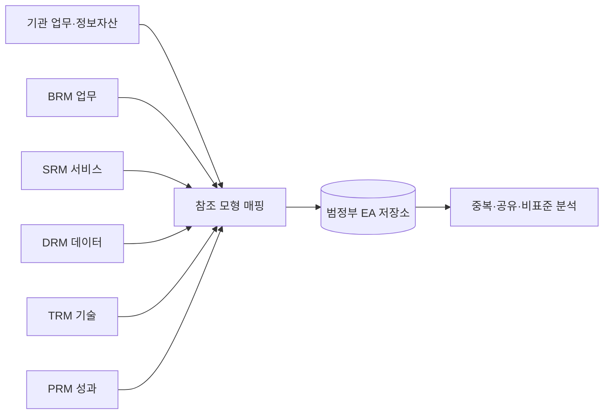
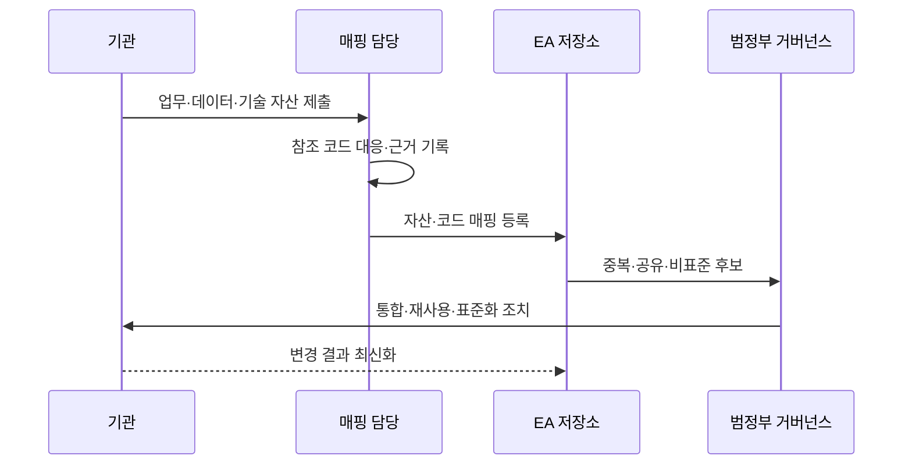

---
sidebar:
  order: 190
  label: "190. 범정부 EA 참조 모형 TRM·DRM (Government EA TRM DRM)"
  badge: { text: "기출 · 70%", variant: note }
title: "범정부 EA 참조 모형 TRM·DRM (Government EA TRM DRM)"
date: "2026-07-27T23:59:59+09:00"
tags: ["notes-software"]
weight: 190
extra:
  question_no: "190"
  source_status: "기출"
  source_history: "135회"
  priority: 70
  priority_note: "참조모형·성숙도 연계가 최근 출제됨"
---

## 미리 알고가기

- **범정부 전사 아키텍처(Government Enterprise Architecture, Government EA)**: ‘거버먼트 이에이’로 읽고 EA는 영문 머리글자를 딴 약어이며, 정부 기관의 업무·서비스·데이터·기술·성과를 공통 체계로 관리함
- **업무 참조 모형(Business Reference Model, BRM)**: ‘비알엠’으로 읽고 영문 머리글자를 딴 약어이며, 정부 기능·업무를 공통 영역으로 분류함
- **서비스 참조 모형(Service Reference Model, SRM)**: ‘에스알엠’으로 읽고 영문 머리글자를 딴 약어이며, 공통 응용 서비스 구성요소를 분류해 재사용 대상을 식별함
- **데이터 참조 모형(Data Reference Model, DRM)**: ‘디알엠’으로 읽고 영문 머리글자를 딴 약어이며, 데이터 주제·구조·교환 요소의 공유 기준을 제공함
- **기술 참조 모형(Technical Reference Model, TRM)**: ‘티알엠’으로 읽고 영문 머리글자를 딴 약어이며, 기술 서비스·플랫폼의 표준 분류와 호환 기준을 제공함
- **성과 참조 모형(Performance Reference Model, PRM)**: ‘피알엠’으로 읽고 영문 머리글자를 딴 약어이며, 정보화 투자와 공통 성과 지표를 연결함
- **참조 모형 매핑(Reference Model Mapping)**: 기관 자산을 공통 분류 코드에 연결해 비교 가능하게 만드는 활동
- **상호운용성(Interoperability)**: 서로 다른 기관·시스템이 표준 방식으로 데이터와 기능을 교환하는 능력
- **EA 저장소(EA Repository)**: 기관 자산·참조 코드·매핑 근거·변경 이력을 보관하는 관리 시스템

## Ⅰ. 개요

- 정의/개념: 정부 정보자산의 **공통 분류·비교 기준 제공**
- 기존 한계: 기관별 분류 차이의 **중복 투자·연계 판정 곤란**

### 쉽게 이해하기 (학습용)

- 기관마다 다른 이름으로 관리한 업무와 기술에 공통 분류 번호를 붙여 중복과 연결 대상을 찾는 체계다.

## Ⅱ. 특징

- 업무·서비스·데이터·기술·성과의 **공통 어휘**
- 기관 자산 매핑의 **중복·표준 준수 분석**
- EA 저장소의 **근거·변경 이력 관리**

### 쉽게 이해하기 (학습용)

- 같은 분류표에 기관 자산을 대응하면 비슷한 기능과 공유할 데이터, 표준에 맞지 않는 기술을 비교할 수 있다.

## Ⅲ. 아키텍처 및 구성요소

| 구성요소 | 책임 |
|:---|:---|
| BRM | 정부 **기능·업무 분류** |
| SRM | 공통 **응용 서비스 분류** |
| DRM | 데이터의 **주제·교환 기준** |
| TRM | 기술의 **서비스·표준 기준** |
| PRM | 투자와 **성과 지표 연결** |
| EA 저장소 | 자산·매핑·**변경 근거 보존** |

> 요약: 기관 자산을 다섯 참조모형에 매핑해 비교·재사용

### 쉽게 이해하기 (학습용)

- 업무, 서비스, 자료, 기술, 성과의 공통 분류표에 자산을 등록해 같은 것과 연결할 것을 찾는다.

## Ⅳ. 원리 및 절차 흐름

| 절차 | 설명 |
|:---|:---|
| 자산 제출 | 기관별 **업무·정보자산 식별** |
| 코드 매핑 | 공통 분류와 **대응 근거 작성** |
| 저장소 등록 | 자산·코드·**관계 이력 저장** |
| 후보 분석 | 중복 기능·**공유 데이터·비표준 식별** |
| 조정 | 통합·재사용·**표준 기술 전환** |
| 최신화 | 실제 변경의 **EA 저장소 반영** |

> 요약: 공통 코드 매핑 결과를 투자·공유·표준화에 활용

### 쉽게 이해하기 (학습용)

- 기관 자료에 표준 번호를 붙여 저장하고 같은 기능은 합치며 공유할 자료와 바꿀 기술을 정한다.

## Ⅴ. 종류 및 비교

| 참조 모형 | DRM | TRM |
|:---|:---|:---|
| 적용 기준 | 기관 간 **데이터 공유·교환** | 시스템 간 **기술 호환·표준화** |
| 핵심 특징 | 주제·구조·**교환 요소 분류** | 플랫폼·기술 서비스의 **표준 분류** |
| 한계 | 의미·품질 차이·**매핑 불일치** | 기술 변화·**표준 최신성 저하** |

> 요약: 데이터 의미·교환은 DRM, 기술 선택·호환은 TRM

### 쉽게 이해하기 (학습용)

- 어떤 자료를 같은 뜻으로 주고받을지는 DRM, 어떤 기술 규격으로 연결할지는 TRM이 정한다.

## Ⅵ. 실무 사례

1. 기관 주소 데이터는 **DRM 공통 항목**으로 교환 형식 정렬
2. 신규 플랫폼은 **TRM 표준 기술**과 대조해 예외 심사

### 쉽게 이해하기 (학습용)

- 기관별 주소 필드를 공통 의미에 맞추고 새 기술이 범정부 표준에서 벗어나면 예외 근거를 검토한다.

## Ⅶ. 결론

- 데이터 공유 기준은 **DRM**, 기술 상호운용 기준은 **TRM**

### 쉽게 이해하기 (학습용)

- 참조모형 이름보다 어떤 자산을 분류하고 어떤 의사결정에 쓰는지 구분해야 한다.
