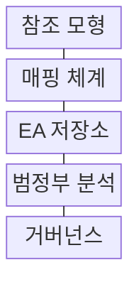
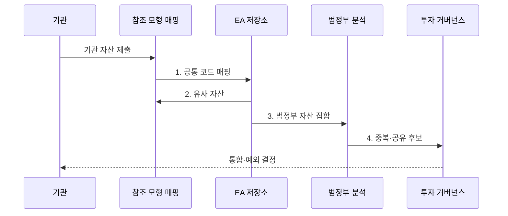

---
sidebar:
  order: 190
  label: "190. 범정부 EA 참조 모형 TRM·DRM (Government EA TRM DRM)"
  badge: { text: "기출 · 70%", variant: note }
title: "범정부 EA 참조 모형 TRM·DRM (Government EA TRM DRM)"
date: "2026-08-02T12:00:00+09:00"
tags: ["notes-software"]
weight: 190
extra:
  question_no: "190"
  source_status: "기출"
  source_history: "135회"
  priority: 70
  priority_note: "참조모형·성숙도 연계가 최근 출제됨"
---

## Ⅰ. 개요

핵심 용어

- **공통 분류**: 범정부 EA 참조모형은 기관별 업무, 서비스, 데이터, 기술, 성과 자산에 공통 분류를 적용해 비교와 연계를 지원한다.

- 정의/개념: **정부 EA 참조모형**은 기관의 업무·데이터·서비스·기술 자산을 공통 기준으로 분류하여 비교·재사용·연계를 지원하는 표준 분류 체계
- 배경/필요성: 기관별 분류는 명칭·기준 불일치로 **중복 투자 분석** 제약

#### 한줄 요약
- 기관마다 다른 이름으로 부르는 업무와 데이터와 기술에 같은 분류 번호를 붙이면 중복과 공유 후보를 함께 찾을 수 있다.

## Ⅱ. 특징

핵심 용어

- **DRM·TRM**: DRM은 데이터 의미와 교환 기준을, TRM은 기술 서비스와 호환·표준 기준을 제공한다.

- **BRM·SRM** 기반 업무·서비스 공통 분류
- **DRM·TRM** 기반 데이터·기술 표준화
- **PRM·성과 지표** 기반 투자 성과 추적
- **상호운용성·메타데이터** 기반 기관 간 교환
- **중복·공유 후보** 기반 투자 통제

#### 한줄 요약
- 기관 자산을 같은 분류표에 올리면 합칠 기능과 공유할 데이터와 표준으로 전환할 기술이 한눈에 드러난다.

## Ⅲ. 구조 및 구성요소

핵심 용어

- **EA 저장소**: EA 저장소는 기관 자산과 참조 코드, 관계, 표준, 예외와 변경 이력을 함께 보존한다.

| 구성요소 | 책임 |
|:---|:---|
| 참조 모형 | 업무·서비스·데이터·**기술·성과 분류** |
| 매핑 체계 | 기관 자산·**공통 코드 연결** |
| EA 저장소 | 자산·관계·**예외 이력 보존** |
| 범정부 분석 | 중복·공유·**비표준 후보 탐색** |
| 거버넌스 | 투자·통합·**예외·전환 결정** |

#### 한줄 요약

- 참조 모형이 공통 분류표를 제공하고 매핑과 저장소가 기관 자산을 모으면 분석과 거버넌스가 통합할 대상을 결정한다.

## Ⅳ. 흐름도

핵심 용어

- **4. 중복·공유 후보**: 범정부 분석은 공통 코드로 매핑된 자산에서 중복 기능, 공유 데이터, 비표준 기술 후보를 찾아 거버넌스에 제출한다.

**동작 원리**

1. **공통 코드 매핑**: 참조모형 코드와 관계 근거 연결
2. **유사 자산**: 기존 공통 서비스·표준 대조
3. **범정부 자산 집합**: 기관 간 중복·공유·상호운용 분석
4. **중복·공유 후보**: 통합·전환·예외 안건 제출

#### 한줄 요약
- 기관 자산에 같은 코드를 붙이고 기존 저장소와 대조하면 이름이 달라도 같은 기능과 데이터인 대상을 찾을 수 있다.

## Ⅴ. 종류 및 비교

핵심 용어

- **DRM**: DRM은 데이터 주제, 요소, 의미, 형식과 메타데이터를 분류해 기관 간 공유와 교환 기준을 맞춘다.

| 범정부 참조 모형 | DRM | TRM |
|:---|:---|:---|
| 적용 기준 | 데이터의 **의미·공유·교환** | 기술의 **호환·표준·전환** |
| 핵심 특징 | 주제·요소·**메타데이터 분류** | 서비스·플랫폼·**표준 분류** |
| 한계 | 동명이의·**이명동의 혼선** | 표준 노후·**제품명 오용** |

#### 한줄 요약
- DRM은 기관 사이에서 같은 데이터 뜻과 형식을 맞추고 TRM은 그 데이터를 주고받을 기술 규격을 맞춘다.

## Ⅵ. 실무 고려사항 및 대책

핵심 용어

- **표준 노후화**: 표준 노후화는 TRM에 등록된 기술 기준이 수명주기와 현실 변화를 반영하지 못해 전환 실행성을 잃는 문제다.

| 문제 | 대책 | 효과 |
|:---|:---|:---|
| 기관별 **매핑 불일치** | 정의·예시·**공통 검토 규칙** | 자산 비교 **일관성 확보** |
| 폐기 자산의 **현행 잔존** | 소유자·주기·**완료 자동 반영** | 저장소 **최신성 향상** |
| DRM의 **의미·단위 혼선** | 정의·단위·**소유권 메타데이터** | 데이터 공유 **정확성** |
| TRM의 **표준 노후화** | 수명주기·**대체 표준 개정** | 기술 전환 **실행성 확보** |
| 비표준 **예외 누적** | 책임자·만료·**전환 로드맵** | 기술부채 **영구화 방지** |

#### 한줄 요약
- 기관별 주소 항목은 DRM의 공통 의미와 형식에 매핑하고 교환 인터페이스는 TRM 표준에 대조해야 의미와 전송이 함께 맞는다.

## Ⅶ. 결론

핵심 용어

- **TRM**: 데이터 의미 차이는 DRM으로 정렬하고 기술의 호환성과 표준 전환은 TRM에 매핑해 투자 심사에 반영한다.

- 데이터 의미 차이는 **DRM**, 기술 호환·전환은 TRM으로 매핑하고 투자 심사에 반영

#### 한줄 요약
- 공통 분류표를 등록용으로 끝내지 않고 예산과 사업 심사에 연결해 통합·공유·표준 전환을 결정할 때 가치가 생긴다.
