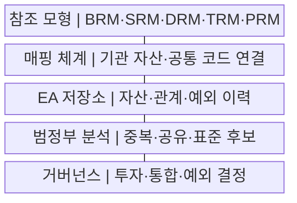
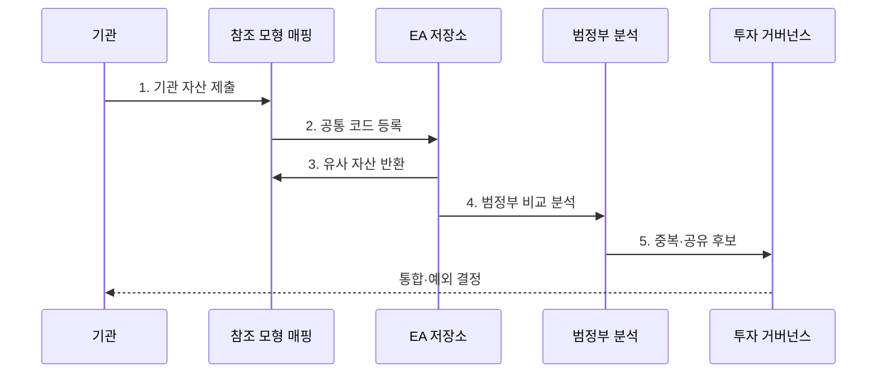

---
sidebar:
  order: 190
  label: "190. 범정부 EA 참조 모형 TRM·DRM (Government EA TRM DRM)"
  badge: { text: "기출 · 70%", variant: note }
title: "범정부 EA 참조 모형 TRM·DRM (Government EA TRM DRM)"
date: "2026-07-29T17:10:00+09:00"
tags: ["notes-software"]
weight: 190
extra:
  question_no: "190"
  source_status: "기출"
  source_history: "135회"
  priority: 70
  priority_note: "참조모형·성숙도 연계가 최근 출제됨"
---

## 미리 알고가기

- **범정부 전사 아키텍처(Government Enterprise Architecture, Government EA)**: 정부기관의 업무·서비스·데이터·기술·성과를 공통 기준으로 분류하고 투자·공유·표준화를 지원하는 체계
- **업무 참조 모형(Business Reference Model, BRM·비알엠)**: 기관 조직명이 아니라 정부 기능과 업무를 공통 영역으로 분류하는 모형
- **서비스 참조 모형(Service Reference Model, SRM·에스알엠)**: 응용 기능·공통 서비스 구성요소를 분류해 재사용 대상을 찾는 모형
- **데이터 참조 모형(Data Reference Model, DRM·디알엠)**: 데이터 주제·의미·구조·교환 요소의 공통 분류와 공유 기준을 제공하는 모형
- **기술 참조 모형(Technical Reference Model, TRM·티알엠)**: 플랫폼·인프라·보안·통신 등 기술 서비스의 공통 분류와 표준 기준을 제공하는 모형
- **성과 참조 모형(Performance Reference Model, PRM·피알엠)**: 정보화 투자·서비스와 공통 성과 영역·지표를 연결하는 모형
- **참조 모형 매핑(Reference Model Mapping)**: 기관 자산을 공통 분류 코드와 관계에 대응시키는 활동
- **상호운용성(Interoperability)**: 다른 기관·시스템이 공통 의미와 기술 규약으로 데이터·기능을 교환하는 능력
- **전사 아키텍처 저장소(EA Repository)**: 자산·참조 코드·관계·표준·예외·변경 이력을 보관하는 시스템
- **메타데이터(Metadata)**: 데이터의 의미·형식·소유자·품질·교환 조건을 설명하는 데이터

## Ⅰ. 개요

- 정의/개념: 기관 자산의 **공통 분류·비교·연계 기준**
- 배경/필요성: 범정부 **중복 투자·상호운용 불일치 해소**

### 쉽게 이해하기 (학습용)
- 기관마다 다른 이름으로 부르는 업무와 데이터와 기술에 같은 분류 번호를 붙이면 중복과 공유 후보를 함께 찾을 수 있다.

## Ⅱ. 특징

- **BRM·SRM·DRM·TRM·PRM** 공통 분류
- **업무·서비스·데이터·기술·성과** 교차 연결
- **중복·공유·표준·예외** 기반 투자 통제

### 쉽게 이해하기 (학습용)
- 기관 자산을 같은 분류표에 올리면 합칠 기능과 공유할 데이터와 표준으로 전환할 기술이 한눈에 드러난다.

## Ⅲ. 구조 및 구성요소

| 구성요소 | 책임 |
|:---|:---|
| 참조 모형 | 업무·서비스·데이터·**기술·성과 분류** |
| 매핑 체계 | 기관 자산·**공통 코드 연결** |
| EA 저장소 | 자산·관계·**예외 이력 보존** |
| 범정부 분석 | 중복·공유·**비표준 후보 탐색** |
| 거버넌스 | 투자·통합·**예외·전환 결정** |

### 쉽게 이해하기 (학습용)

- 참조 모형이 공통 분류표를 제공하고 매핑과 저장소가 기관 자산을 모으면 분석과 거버넌스가 통합할 대상을 결정한다.

## Ⅳ. 흐름도

**동작 원리**

1. **기관 자산 제출**: 업무·데이터·기술·성과 등록
2. **공통 코드 등록**: 참조 모형·관계·근거 매핑
3. **유사 자산 반환**: 기존 공통 서비스·표준 대조
4. **범정부 비교 분석**: 중복·공유·상호운용 탐색
5. **중복·공유 후보**: 통합·전환·예외 안건 제출

### 쉽게 이해하기 (학습용)
- 기관 자산에 같은 코드를 붙이고 기존 저장소와 대조하면 이름이 달라도 같은 기능과 데이터인 대상을 찾을 수 있다.

## Ⅴ. 종류 및 비교

| 범정부 참조 모형 | DRM | TRM |
|:---|:---|:---|
| 적용 기준 | 데이터의 **의미·공유·교환** | 기술의 **호환·표준·전환** |
| 핵심 특징 | 주제·요소·**메타데이터 분류** | 서비스·플랫폼·**표준 분류** |
| 한계 | 동명이의·**이명동의 혼선** | 표준 노후·**제품명 오용** |

### 쉽게 이해하기 (학습용)
- DRM은 기관 사이에서 같은 데이터 뜻과 형식을 맞추고 TRM은 그 데이터를 주고받을 기술 규격을 맞춘다.

## Ⅵ. 실무 고려사항 및 대책

| 고려사항 | 대책 | 효과 |
|:---|:---|:---|
| 기관별 **매핑 불일치** | 정의·예시·**공통 검토 규칙** | 자산 비교 **일관성 확보** |
| 폐기 자산의 **현행 잔존** | 소유자·주기·**완료 자동 반영** | 저장소 **최신성 향상** |
| DRM의 **의미·단위 혼선** | 정의·단위·**소유권 메타데이터** | 데이터 공유 **정확성** |
| TRM의 **표준 노후화** | 수명주기·**대체 표준 개정** | 기술 전환 **실행성 확보** |
| 비표준 **예외 누적** | 책임자·만료·**전환 로드맵** | 기술부채 **영구화 방지** |

### 쉽게 이해하기 (학습용)
- 기관별 주소 항목은 DRM의 공통 의미와 형식에 매핑하고 교환 인터페이스는 TRM 표준에 대조해야 의미와 전송이 함께 맞는다.

## Ⅶ. 결론

- **매핑 일관성·저장소 최신성·투자 연계**로 참조 모형 결정

### 쉽게 이해하기 (학습용)
- 공통 분류표를 등록용으로 끝내지 않고 예산과 사업 심사에 연결해 통합·공유·표준 전환을 결정할 때 가치가 생긴다.
