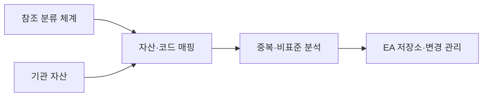
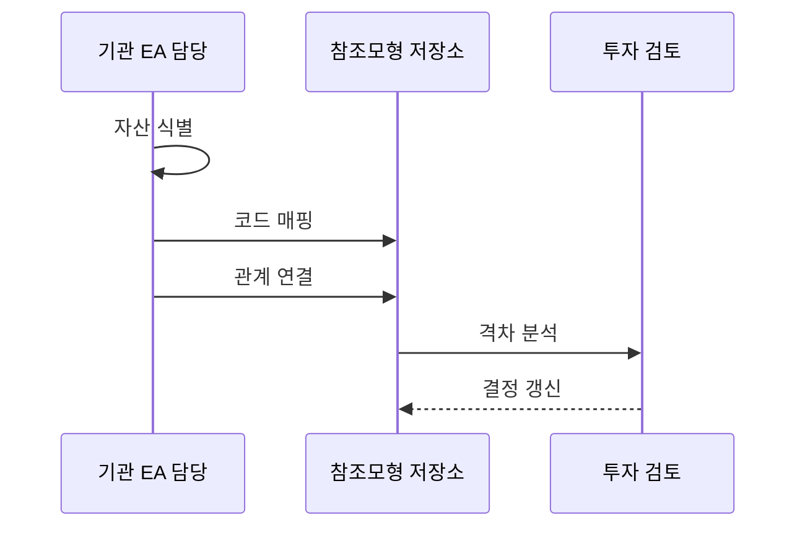

---
sidebar:
  order: 190
  label: "190. 범정부 EA 참조 모형 TRM·DRM (Government EA TRM DRM)"
  badge:
    text: "기출 · 70%"
    variant: note
title: "범정부 EA 참조 모형 TRM·DRM (Government EA TRM DRM)"
date: "2026-07-25T00:30:00+09:00"
tags:
  - "notes-software"
weight: 190
extra:
  question_no: "190"
  source_status: "기출"
  source_history: "135회"
  priority: 70
  priority_note: "참조모형·성숙도 연계가 최근 출제됨"
---

## 미리 알고가기

- **범정부 전사 아키텍처(Government Enterprise Architecture, Government EA)**: EA는 ‘이에이’로 읽고 영문 머리글자를 딴 약어이며, 정부 기관의 업무·데이터·서비스·기술·성과를 공통 분류로 관리함
- **업무 참조 모형(Business Reference Model, BRM)**: BRM은 ‘비알엠’으로 읽고 영문 머리글자를 딴 약어이며, 정부 기능·업무·대국민 서비스를 공통 업무 영역으로 분류함
- **서비스 참조 모형(Service Reference Model, SRM)**: SRM은 ‘에스알엠’으로 읽고 영문 머리글자를 딴 약어이며, 공통 응용 서비스 구성요소를 분류해 재사용 대상을 찾음
- **데이터 참조 모형(Data Reference Model, DRM)**: DRM은 ‘디알엠’으로 읽고 영문 머리글자를 딴 약어이며, 정부 데이터의 주제·구조·교환 요소를 분류해 공유 기준을 제공함
- **기술 참조 모형(Technical Reference Model, TRM)**: TRM은 ‘티알엠’으로 읽고 영문 머리글자를 딴 약어이며, 기술 서비스·플랫폼 표준을 분류해 선택·호환 기준을 제공함
- **성과 참조 모형(Performance Reference Model, PRM)**: PRM은 ‘피알엠’으로 읽고 영문 머리글자를 딴 약어이며, 정보화 투자와 성과 지표를 연결해 사업 결과를 비교함
- **참조 모형 매핑**: 기관 자산을 공통 분류 코드와 연결해 비교 가능하게 만드는 활동임
- **상호운용성**: 서로 다른 기관·시스템이 표준 방식으로 데이터와 기능을 교환하는 능력임
- **EA 저장소**: 기관 자산·참조 코드·매핑 근거·변경 이력을 보관해 범정부 EA를 최신 상태로 유지하는 관리 시스템임

## Ⅰ. 개요

- **정의/개념**: 범정부 아키텍처 공통 분류 체계임
- **배경/필요성**: 기관별 분류가 달라 중복·연계 판정 기준이 필요함

### 쉽게 이해하기 (학습용)
- 정부 자산을 공통 기준으로 체계화함

## Ⅱ. 특징

- 기관 자산 분류·비교용 공통 어휘 제공한다.
- 관계 추적으로 영향 범위 분석한다.
- 저장소에 코드와 매핑 근거 유지한다.
- 중복 기능과 비표준 기술 식별한다.

### 쉽게 이해하기 (학습용)
- 표준 번호로 중복 여부를 확인함

## Ⅲ. 아키텍처 및 구성요소

| 설계 요소 | 설명 |
|:---|:---|
| 참조 분류 체계 | 공통 업무·데이터·기술 코드를 제공함 |
| 기관 자산 | 기관별 업무·데이터·기술을 등록함 |
| 자산·코드 매핑 | 기관 자산을 공통 코드와 연결함 |
| 중복·비표준 분석 | 중복 기능과 비표준 기술을 식별함 |
| EA 저장소·변경 관리 | 근거와 승인 이력을 보관함 |

> 요약: 공통 분류로 기관 자산을 비교하고 조정함

### 쉽게 이해하기 (학습용)
- 표준 번호로 중복 관계를 분석함

## Ⅳ. 원리 및 절차 흐름도

| 절차 | 설명 |
|:---|:---|
| 자산 식별 | 업무·기술 자산 식별 |
| 코드 매핑 | 참조모형 코드 연결 |
| 관계 연결 | 아키텍처 관계 추적 |
| 격차 분석 | 중복·비표준 자산 분석 |
| 결정 갱신 | 분석 결과의 반영 승인 |

> 요약: 참조 매핑으로 중복·비표준 투자 조정

### 쉽게 이해하기 (학습용)
- 분류 번호로 중복과 투자 조율함

## Ⅴ. 종류 및 비교

| 판단 기준 | BRM | DRM | TRM |
|:---|:---|:---|:---|
| 핵심 특징 | 정부 기능·업무를 분류함 | 데이터 주제·구조를 분류함 | 기술 서비스·표준을 분류함 |
| 적용 기준 | 중복 업무·서비스 분석 | 데이터 공유·연계 설계 | 플랫폼 표준·호환 검토 |
| 주요 위험 | 기관별 해석 차이 | 데이터 코드 불일치 | 표준 노후화·예외 남용 |

> 요약: 업무·데이터·기술 분류 체계임

### 쉽게 이해하기 (학습용)
- 업무·데이터·기술 자산을 각 참조 모형의 공통 번호에 연결한다.

## Ⅵ. 실무 사례

1. 공공 플랫폼은 중복 데이터셋을 통합함
2. 시스템 전환은 TRM 표준 플랫폼을 우선 선택

### 쉽게 이해하기 (학습용)
- DRM 매핑으로 같은 주제의 중복 데이터를 찾음
- TRM 매핑으로 표준 플랫폼 재사용 대상을 찾음

## Ⅶ. 결론

- 중복·비표준 자산은 통합·전환 과제로 반영함

### 쉽게 이해하기 (학습용)
- 분류만 하지 말고 예산 조정과 자원 공유에 사용함
