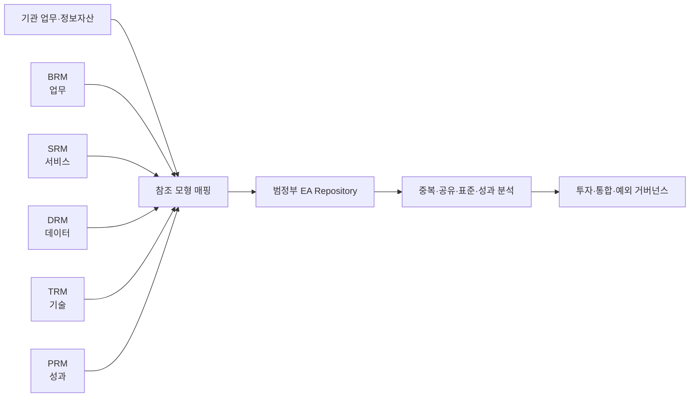
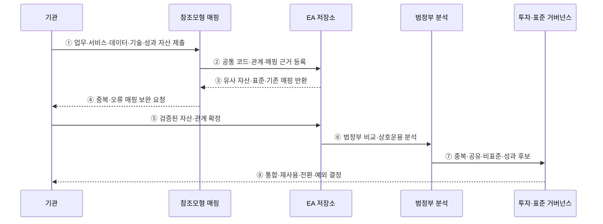

---
sidebar:
  order: 190
  label: "190. 범정부 EA 참조 모형 TRM·DRM (Government EA TRM DRM)"
  badge: { text: "기출 · 70%", variant: note }
title: "범정부 EA 참조 모형 TRM·DRM (Government EA TRM DRM)"
date: "2026-07-27T23:59:59+09:00"
tags: ["notes-software"]
weight: 190
extra:
  question_no: "190"
  source_status: "기출"
  source_history: "135회"
  priority: 70
  priority_note: "참조모형·성숙도 연계가 최근 출제됨"
---

## 미리 알고가기

- **범정부 전사 아키텍처(Government Enterprise Architecture, Government EA)**: 정부기관의 업무·서비스·데이터·기술·성과를 공통 기준으로 분류하고 투자·공유·표준화를 지원하는 체계
- **업무 참조 모형(Business Reference Model, BRM·비알엠)**: 기관 조직명이 아니라 정부 기능과 업무를 공통 영역으로 분류하는 모형
- **서비스 참조 모형(Service Reference Model, SRM·에스알엠)**: 응용 기능·공통 서비스 구성요소를 분류해 재사용 대상을 찾는 모형
- **데이터 참조 모형(Data Reference Model, DRM·디알엠)**: 데이터 주제·의미·구조·교환 요소의 공통 분류와 공유 기준을 제공하는 모형
- **기술 참조 모형(Technical Reference Model, TRM·티알엠)**: 플랫폼·인프라·보안·통신 등 기술 서비스의 공통 분류와 표준 기준을 제공하는 모형
- **성과 참조 모형(Performance Reference Model, PRM·피알엠)**: 정보화 투자·서비스와 공통 성과 영역·지표를 연결하는 모형
- **참조 모형 매핑(Reference Model Mapping)**: 기관 자산을 공통 분류 코드와 관계에 대응시키는 활동
- **상호운용성(Interoperability)**: 다른 기관·시스템이 공통 의미와 기술 규약으로 데이터·기능을 교환하는 능력
- **전사 아키텍처 저장소(EA Repository)**: 자산·참조 코드·관계·표준·예외·변경 이력을 보관하는 시스템
- **메타데이터(Metadata)**: 데이터의 의미·형식·소유자·품질·교환 조건을 설명하는 데이터

## Ⅰ. 개요

- 범정부 EA 참조 모형은 기관마다 다른 자산을 **공통 분류·비교·연계 가능한 언어**로 맞춘다.
- 중복 기능·공유 데이터·공통 서비스·비표준 기술·성과 연계를 범정부 관점에서 찾는다.
- 참조 모형은 제품 목록이 아니라 자산을 분류하고 투자·공유·표준화 결정을 지원하는 기준이다.

### 쉽게 이해하기 (학습용)
- 기관마다 다른 이름의 업무·데이터·기술에 같은 분류 번호를 붙여 비교함

## Ⅱ. 특징

- **공통 어휘**: 업무·서비스·데이터·기술·성과를 기관 간 같은 분류 체계로 표현한다.
- **교차 연결**: 업무가 사용하는 서비스·데이터·기술과 만들어 내는 성과를 추적한다.
- **중복 탐지**: 같은 기능·데이터·플랫폼을 별도로 구축하는 투자 후보를 찾는다.
- **재사용 촉진**: 공통 서비스·데이터·기술 표준을 새 사업의 우선 검토 대상으로 제공한다.
- **예외 통제**: 공통 기준과 다른 자산의 사유·위험·보완·전환 계획을 관리한다.
- **지속 최신화**: 조직·업무·데이터·기술 변화와 실제 구축 결과를 저장소에 반영한다.

### 쉽게 이해하기 (학습용)
- 같은 분류표로 보면 합칠 기능·공유할 데이터·바꿀 기술이 드러남

## Ⅲ. 아키텍처 및 구성요소

**도표안 A — 구조도**

**도표안 B — sequenceDiagram**

| 구성요소 | 역할 |
|:---|:---|
| BRM | 조직 경계와 무관한 정부 기능·업무 분류 |
| SRM | 응용 기능·서비스 구성요소·재사용 후보 분류 |
| DRM | 데이터 주제·의미·구조·교환·공유 기준 분류 |
| TRM | 기술 서비스·플랫폼·인터페이스·표준 분류 |
| PRM | 정보화 투자·서비스·성과 영역·지표 연결 |
| 매핑 체계 | 기관 자산과 참조 코드·관계·근거 연결 |
| EA 저장소 | 자산·매핑·표준·예외·변경 이력 보관 |
| 거버넌스 | 중복 투자·공동 활용·표준 준수·예외·전환 결정 |

**동작 원리**

- ① 기관이 실제 업무·서비스·데이터·기술·성과 자산과 소유자·상태를 제출한다.
- ② 매핑 담당이 각 자산을 참조 모형 코드에 연결하고 관계와 판단 근거를 저장한다.
- ③ 저장소가 기존의 유사 자산·공통 서비스·표준·과거 매핑을 반환한다.
- ④ 매핑 담당이 중복 분류·누락 관계·근거 부족을 기관에 보완 요청한다.
- ⑤ 기관이 검증된 자산·공통 코드·영역 간 관계를 기준선으로 확정한다.
- ⑥ 저장소의 표준화된 정보를 범정부 수준에서 중복·공유·상호운용성 관점으로 분석한다.
- ⑦ 분석 결과를 기능 통합·데이터 공유·비표준 기술·성과 미연계 후보로 거버넌스에 제출한다.
- ⑧ 거버넌스가 공동 활용·통합·표준 전환 또는 기한 있는 예외를 결정한다.

### 쉽게 이해하기 (학습용)
- 기관 자산에 공통 코드를 붙여 검증한 뒤 범정부 중복과 공유 후보를 찾음

## Ⅳ. 종류 및 비교

| 비교 항목 | DRM | TRM |
|:---|:---|:---|
| 대상 | 데이터 주제·요소·의미·교환 | 기술 서비스·플랫폼·인터페이스·표준 |
| 핵심 질문 | 어떤 데이터를 같은 뜻과 형식으로 공유할까 | 어떤 기술 기준으로 시스템을 구축·연결할까 |
| 주요 산출 | 공통 데이터 분류·메타데이터·교환 요소 | 기술 서비스 분류·표준 프로파일·적용 지침 |
| 활용 | 기관 간 데이터 발견·연계·재사용 | 기술 호환·표준화·제품·플랫폼 검토 |
| 판단 근거 | 의미·소유권·품질·보안 등급 | 기능·호환성·보안·수명주기·개방성 |
| 주요 위험 | 같은 이름의 다른 의미·다른 이름의 같은 의미 | 기술 변화로 표준 노후·제품명 중심 오용 |

| 참조 모형 | 분류 대상 | 의사결정 |
|:---|:---|:---|
| BRM | 정부 업무 | 중복 기능·책임·업무 연계 |
| SRM | 응용 서비스 | 공통 기능·서비스 재사용 |
| DRM | 데이터 | 의미 통일·공유·교환 |
| TRM | 기술 | 호환성·표준·전환 |
| PRM | 성과 | 투자 효과·지표 정렬 |

### 쉽게 이해하기 (학습용)
- DRM은 같은 데이터 뜻을 맞추고 TRM은 연결할 기술 규격을 맞춤

## Ⅴ. 실무 고려사항 및 대책

| 고려사항 | 위험 | 대책 |
|:---|:---|:---|
| 매핑 일관성 | 기관마다 같은 자산을 다른 코드로 분류 | 정의·예시·검토 규칙·공통 교육 |
| 자산 최신성 | 폐기·변경 자산이 현행으로 남음 | 소유자·갱신 주기·사업 완료 자동 반영 |
| DRM 의미 | 이름만 같고 업무 의미·단위가 다름 | 정의·코드·단위·품질·소유권 메타데이터 |
| 데이터 보안 | 공유 후보가 개인정보·기밀을 노출 | 등급·목적·최소 제공·접근·가명 처리 |
| TRM 최신성 | 노후 표준이 혁신과 보안을 방해 | 기술 수명주기·대체 표준·주기 개정 |
| 제품 종속 | 참조 모형이 특정 제품 목록으로 변질 | 기술 서비스·인터페이스·개방 표준 중심 |
| 예외 누적 | 비표준 기술이 영구화 | 사유·위험·책임자·만료·전환 로드맵 |
| 분석 활용 | 등록만 하고 투자 결정과 단절 | 예산·사전검토·사업 심사·성과 평가 연계 |

### 쉽게 이해하기 (학습용)
- 사례: 기관별 주소 항목을 DRM의 공통 의미·형식에 맞추고 연계 기술은 TRM 표준으로 검토함

## Ⅵ. 결론

- 범정부 EA 참조 모형의 핵심은 **기관 자산을 공통 언어로 분류해 비교·공유·표준화 결정에 활용**하는 것이다.
- DRM은 데이터 의미·교환, TRM은 기술 서비스·호환 기준을 제공하며 서로 함께 적용되어야 한다.
- 정확한 매핑·최신 저장소·기한 있는 예외·투자 심사 연계가 있어야 중복 투자와 상호운용 문제를 줄일 수 있다.

### 쉽게 이해하기 (학습용)
- 공통 분류표를 실제 투자·공유·표준 전환 결정에 써야 가치가 생김
