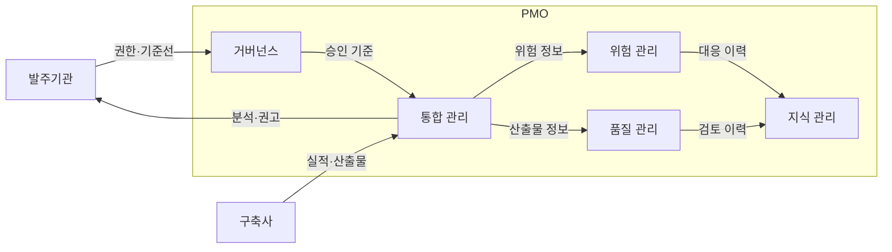
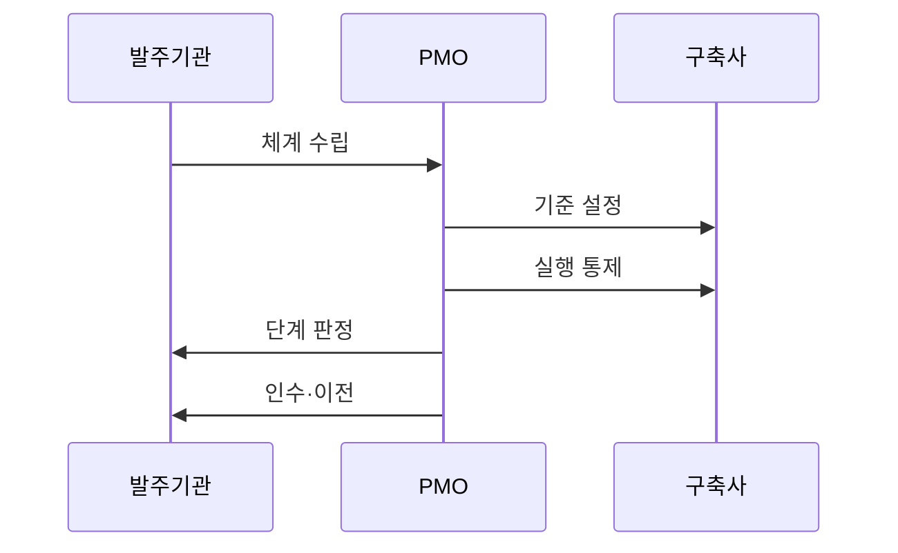

---
sidebar:
  order: 191
  label: "191. PMO 프로젝트 관리 위탁 (PMO)"
  badge:
    text: "기출 · 50%"
    variant: note
title: "PMO 프로젝트 관리 위탁 (PMO)"
date: "2026-07-25T00:30:00+09:00"
tags:
  - "notes-software"
weight: 191
extra:
  question_no: "191"
  source_status: "기출"
  source_history: "132회"
  priority: 50
  priority_note: "사업 통제와 발주자 지원 역할이 기존 출제됨"
---

## 미리 알고가기

- **프로젝트 관리 조직(Project Management Office, PMO)**: PMO는 ‘피엠오’로 읽고 영문 머리글자를 딴 약어이며, 발주기관의 통합 관리·의사결정을 지원하되 최종 승인 책임은 대신하지 않음
- **프로젝트 관리 위탁**: 전문 조직이 사업 관리를 지원하되 최종 책임은 발주기관이 보유함
- **독립성·이해상충**: 구축사와 별도 조직으로 운영해 자기 산출물을 스스로 평가하지 않게 함
- **관리 기준선**: 승인된 범위·일정·비용을 실제 실적과 비교하는 기준임
- **작업분류체계(Work Breakdown Structure, WBS)**: WBS는 ‘더블유비에스’로 읽고 영문 머리글자를 딴 약어이며, 전체 범위를 작업 단위로 계층 분해해 일정·비용·책임을 연결함
- **단계 게이트**: 다음 단계로 진행하기 전에 완료 기준과 증적을 확인하는 승인 지점임
- **감리**: 독립된 시점 점검으로 문제를 진단·권고하며 PMO는 사업을 상시 관리함
- **이슈·위험**: 이슈는 이미 발생한 문제이고 위험은 앞으로 발생할 수 있는 불확실성임
- **인수·지식 이전**: 인수는 결과물 승인이고 지식 이전은 운영 정보와 절차를 넘기는 활동임

## Ⅰ. 개요

- **정의/개념**: 발주기관을 지원해 사업 관리를 위탁 수행함
- **배경/필요성**: 발주기관의 관리 역량이 부족해 전문 지원이 필요함

### 쉽게 이해하기 (학습용)
- PMO가 일정·위험 근거를 정리하고 발주기관이 최종 결정한다.

## Ⅱ. 특징

- 범위·일정·비용 기준선을 통합 관리한다.
- 프로젝트 이슈와 위험을 지속 추적한다.
- 단계 게이트 통과 기준과 증적을 검토한다.
- 발주자와 구축자 간 이견을 조정한다.

### 쉽게 이해하기 (학습용)
- 승인 범위·일정·비용과 실제 실적의 차이를 계속 확인한다.

## Ⅲ. 아키텍처 및 구성요소

| 설계 요소 | 설명 |
|:---|:---|
| 거버넌스 | 권한과 승인 구조를 정의함 |
| 통합 관리 | WBS와 일정·예산을 연결함 |
| 위험 관리 | 발생 가능성과 영향을 추적함 |
| 품질 관리 | 산출물과 단계 완료를 평가함 |
| 지식 관리 | 지표·결정·운영 지식을 이전함 |

> 요약: 기준선과 위험·품질 증적을 연결해 판단함

### 쉽게 이해하기 (학습용)
- PMO가 구축사 산출물을 검토해 발주기관의 승인 근거를 만든다.

## Ⅳ. 원리 및 절차 흐름도

| 절차 | 설명 |
|:---|:---|
| 체계 수립 | 권한과 승인 체계 수립 |
| 기준 설정 | 범위·공정 기준선 설정 |
| 실행 통제 | 지연과 이슈 영향 분석 |
| 단계 판정 | 완료 기준과 품질 검증 |
| 인수·이전 | 인수 보고와 운영 지식 전수 |

> 요약: 기준선으로 실행을 통제하고 인수 판정

### 쉽게 이해하기 (학습용)
- 승인한 공정 기준과 실제 진척을 비교해 다음 단계 진입을 결정한다.

## Ⅴ. 종류 및 비교

| 판단 기준 | PMO | 발주처 | 구축사 |
|:---|:---|:---|:---|
| 핵심 특징 | 상태 분석·조정 지원 | 최종 승인·책임 보유 | 결과물 구현·시험 |
| 적용 기준 | 복잡 사업 관리 보강 | 예산·변경·인수 결정 | 계약 범위 개발 수행 |
| 주요 위험 | 권한 혼선·형식 보고 | 책임 위임·결정 지연 | 일정 지연·품질 미달 |

> 요약: 발주자 승인·PMO 분석 체계임

### 쉽게 이해하기 (학습용)
- PMO는 분석·조정을 맡고 발주기관은 승인 책임을 유지한다.

## Ⅵ. 실무 사례

1. 공공 사업은 미해결 고위험을 단계별 추적함
2. 시스템 전환은 복구 지연 시간을 검증함

### 쉽게 이해하기 (학습용)
- 공공 사업은 고위험이 남으면 다음 단계를 보류함
- 전환은 복구 지연이 기준을 넘으면 되돌림

## Ⅶ. 결론

- PMO는 근거를 제시하고 최종 결정은 발주자가 함

### 쉽게 이해하기 (학습용)
- PMO에 관리를 맡겨도 최종 승인 책임은 발주기관에 남음
