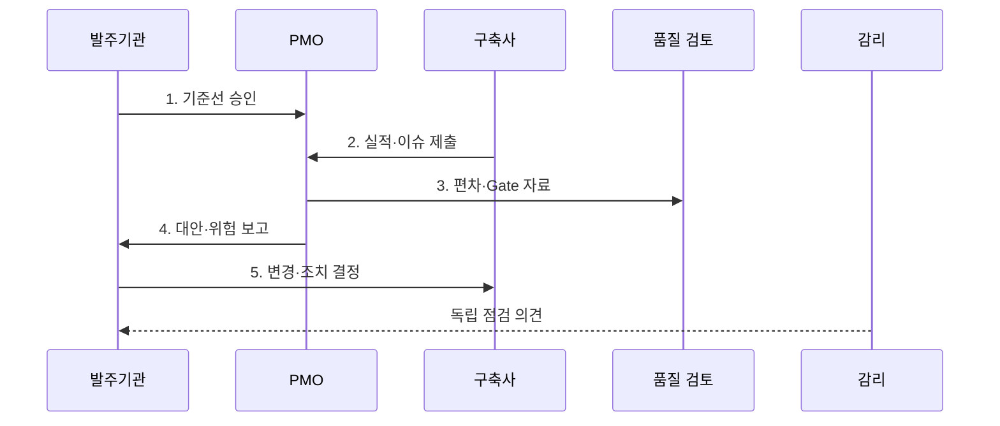

---
sidebar:
  order: 191
  label: "191. PMO 프로젝트 관리 위탁 (PMO)"
  badge: { text: "기출 · 50%", variant: note }
title: "PMO 프로젝트 관리 위탁 (PMO)"
date: "2026-07-31T11:02:35+09:00"
tags: ["notes-software"]
weight: 191
extra:
  question_no: "191"
  source_status: "기출"
  source_history: "132회"
  priority: 50
  priority_note: "사업 통제와 발주자 지원 역할이 기존 출제됨"
---

## 미리 알고가기

- **프로젝트 관리 조직(Project Management Office, PMO)**: 프로젝트의 범위·일정·비용·품질·위험·의사결정을 통합 관리하고 표준화하는 조직
- **프로젝트 관리 위탁(Project Management Consignment)**: 전문 조직이 발주기관의 사업관리 실무를 지원하지만 법적·계약상 최종 책임과 승인은 발주기관이 보유하는 방식
- **작업분류체계(Work Breakdown Structure, WBS)**: 전체 범위를 관리 가능한 작업 단위로 계층 분해해 일정·비용·책임·산출물을 연결한 구조
- **관리 기준선(Management Baseline)**: 승인된 범위·일정·비용을 실제 실적과 비교하는 기준
- **획득가치관리(Earned Value Management, EVM)**: 계획가치·획득가치·실제원가로 일정·비용 성과와 완료 전망을 분석하는 기법
- **임계경로(Critical Path)**: 지연되면 전체 완료일이 직접 늦어지는 여유시간이 없는 작업 경로
- **단계 게이트(Stage Gate)**: 다음 단계 진입 전에 완료 기준·산출물·품질·위험·승인을 확인하는 통제 지점
- **이슈·위험(Issue·Risk)**: 이슈는 이미 발생한 문제, 위험은 발생 가능성과 영향이 있는 불확실성
- **감리(Audit)**: 사업과 산출물의 적정성을 독립적으로 점검하고 개선을 권고하는 활동
- **이해상충(Conflict of Interest)**: 구축·관리·평가 주체의 이해관계가 겹쳐 독립 판단이 훼손되는 상태
- **책임 할당 행렬(Responsible·Accountable·Consulted·Informed, RACI)**: 수행·최종 책임·협의·통보 역할을 업무별로 구분하는 표

> **키워드:** PMO 프로젝트 관리 위탁 (PMO)

## Ⅰ. 개요

- 정의/개념: 전문 조직이 발주기관의 **통합 사업관리·의사결정**을 지원하는 위탁 방식
- 배경/필요성: 분야별 개별 관리로 범위·일정·비용의 **통합 영향 판단** 제약

### 쉽게 이해하기 (학습용)
- PMO가 공정표와 비용과 위험을 분석해 선택지를 내놓아도 건축주인 발주기관이 변경과 인수를 최종 결정한다.

## Ⅱ. 특징

- **WBS·RACI** 기반 범위·책임 배분
- **EVM·임계경로** 기반 편차·완료 전망
- **Gate·변경 이력** 기반 결정 지원

### 쉽게 이해하기 (학습용)
- 계획과 실제의 차이를 매주 같은 기준으로 계산하면 완료일이 밀리기 전에 대안별 영향과 필요한 결정을 제시할 수 있다.

## Ⅲ. 구조 및 구성요소

| 구성요소 | 책임 |
|:---|:---|
| 발주기관 | 기준선·변경·**인수 최종 승인** |
| PMO | 통합 계획·**편차·대안 분석** |
| 구축사 | 실행·산출물·**실적 원본 제출** |
| 품질·Gate | 결함·시험·**진입 기준 검토** |
| 감리 | 사업과 독립된 **적정성 점검** |

### 쉽게 이해하기 (학습용)

- 구축사가 실적을 내면 PMO가 편차를 분석하고 품질 검토와 감리가 다른 관점의 근거를 제공해 발주기관의 결정을 돕는다.

## Ⅳ. 흐름도

**동작 원리**

1. **기준선 승인**: 범위·일정·비용·역할 확정
2. **실적·이슈 제출**: 산출물·결함·위험 원본 수집
3. **편차·Gate 자료**: 완료 전망·진입 기준 판정
4. **대안·위험 보고**: 비용·일정·잔여 위험 비교
5. **변경·조치 결정**: 승인 조치 실행·완료 추적

### 쉽게 이해하기 (학습용)
- PMO는 지연을 보고하는 데서 끝내지 않고 원인과 대안별 비용을 비교해 발주기관 승인 뒤 완료 기준까지 추적한다.

## Ⅴ. 종류 및 비교

| 사업관리 역할 | PMO | 감리 |
|:---|:---|:---|
| 적용 기준 | 전 기간 **상시 통합 관리** | 정해진 시점의 **독립 점검** |
| 핵심 특징 | 계획·분석·**조정·조치 추적** | 진단·검증·**개선 권고** |
| 한계 | 역할 중복·**이해상충 위험** | 상시 조정·**실행 관리 한계** |

### 쉽게 이해하기 (학습용)
- PMO는 매일 공사 현장을 조정하는 관리실이고 감리는 정해진 시점에 독립 기준으로 공사를 점검하는 검사자다.

## Ⅵ. 실무 고려사항 및 대책

| 고려사항 | 대책 | 효과 |
|:---|:---|:---|
| 주체 간 **책임 중복** | RACI·승인 한도·**보고 경로 명시** | 의사결정 **지연 방지** |
| 과장된 **진척 보고** | 형상·시험·**비용 원본 연계** | 실적 자료 **신뢰성 확보** |
| 임계경로 **지연 누락** | 선후 관계·**완료 전망 분석** | 종료일 영향 **조기 식별** |
| 작은 변경의 **범위 누적** | 영향 분석·승인·**기준선 갱신** | 비용·일정 **팽창 통제** |
| 형식적인 **Gate 통과** | 측정 가능한 **단계 종료 기준 적용** | 단계 진입 **품질 확보** |

### 쉽게 이해하기 (학습용)
- 차세대 사업은 단순 진척률 대신 WBS 선후 관계로 완료일 영향을 계산하고 대안별 비용과 위험을 함께 승인받아야 한다.

## Ⅶ. 결론

- 원본 실적과 편차 영향이 검증되면 **PMO 대안**을 발주기관이 승인하고 구축사가 조치

### 쉽게 이해하기 (학습용)
- PMO는 원본 실적에서 판단 근거를 만들고 발주기관은 최종 결정하며 구축사는 승인된 조치를 완료 기준까지 실행해야 한다.
