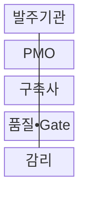

---
sidebar:
  order: 191
  label: "191. PMO 프로젝트 관리 위탁 (PMO)"
  badge: { text: "기출 • 50%", variant: note }
title: "PMO 프로젝트 관리 위탁 (PMO)"
date: "2026-08-03T08:48:47+09:00"
tags: ["notes-software"]
weight: 191
extra:
  question_no: "191"
  source_status: "기출"
  source_history: "132회"
  priority: 50
  priority_note: "사업 통제와 발주자 지원 역할이 기존 출제됨"
---

## Ⅰ. 개요

핵심 용어

- **프로젝트 관리 조직(Project Management Office, PMO)**: 범위•일정•비용•품질•위험을 통합 분석해 발주기관의 사업관리와 의사결정을 지원하는 전문 조직이다.

- 정의/개념: **PMO 프로젝트 관리 위탁** 은 전문 조직이 범위•일정•비용•품질•위험을 통합 분석해 발주기관의 사업관리와 의사결정을 지원하는 **관리 지원 방식**
- 배경/필요성: 분야별 개별 관리로 범위•일정•비용의 **통합 영향 판단** 제약

#### 한줄 요약
- PMO가 공정표와 비용과 위험을 분석해 선택지를 내놓아도 건축주인 발주기관이 변경과 인수를 최종 결정한다.

## Ⅱ. 특징

핵심 용어

- **EVM•임계경로**: EVM은 일정•비용 편차와 완료 전망을 정량화하고 임계경로는 전체 완료일에 직접 영향을 주는 작업을 식별한다.
- **작업 분류 체계(Work Breakdown Structure, WBS)**: 사업 범위를 관리 가능한 작업 단위로 계층 분해한 구조이다.
- **책임•승인•협의•통보(Responsible, Accountable, Consulted, Informed, RACI)**: 작업별 수행자•최종 책임자•협의자•통보 대상을 구분하는 책임 배정 기법이다.
- **획득가치관리(Earned Value Management, EVM)**: 계획가치•획득가치•실제비용으로 일정•비용 편차와 완료 전망을 계산하는 기법이다.
- **단계 관문(Stage Gate, Gate)**: 다음 사업 단계로 진입하기 전에 산출물•품질•위험 기준 충족 여부를 심사하는 통제 지점이다.

- **WBS•RACI** 기반 범위•책임 배분
- **EVM•임계경로** 기반 편차•완료 전망
- **Gate•변경 이력** 기반 결정 지원

#### 한줄 요약
- 계획과 실제의 차이를 매주 같은 기준으로 계산하면 완료일이 밀리기 전에 대안별 영향과 필요한 결정을 제시할 수 있다.

## Ⅲ. 구조 및 구성요소

핵심 용어

- **PMO**: PMO는 구축사의 실적 원본을 바탕으로 편차와 대안을 분석하고 품질•Gate 검토를 조정한다.
- **프로젝트 관리 조직(Project Management Office, PMO)**: 구축사의 실적 원본을 바탕으로 편차•대안을 분석하고 품질•단계 관문 검토를 조정하는 구성요소이다.
- **발주기관**: 기준선•변경•예산•인수의 최종 의사결정을 수행하는 구성요소이다.
- **구축사**: 승인된 계획을 실행하고 산출물•결함•실적 원본을 제출하는 구성요소이다.
- **감리(Audit)**: 사업 조직과 독립된 기준으로 사업관리와 산출물의 적정성을 점검하는 구성요소이다.

| 구성요소 | 책임 |
|:---|:---|
| 발주기관 | 기준선•변경•**인수 최종 승인** |
| PMO | 통합 계획•**편차•대안 분석** |
| 구축사 | 실행•산출물•**실적 원본 제출** |
| 품질•Gate | 결함•시험•**진입 기준 검토** |
| 감리 | 사업과 독립된 **적정성 점검** |

#### 한줄 요약

- 구축사가 실적을 내면 PMO가 편차를 분석하고 품질 검토와 감리가 다른 관점의 근거를 제공해 발주기관의 결정을 돕는다.

## Ⅳ. 흐름도

핵심 용어

- **4. 대안•위험 보고**: PMO는 편차 원인과 대안별 비용•일정•잔여 위험을 비교해 발주기관에 보고한다.
- **1. 기준선 승인**: 범위•일정•비용•품질 목표와 역할을 공식 확정하는 단계이다.
- **2. 실적•이슈 제출**: 구축사가 산출물•결함•위험•비용의 원본 자료를 제공하는 단계이다.
- **3. 편차•단계 관문(Stage Gate, Gate) 자료**: 완료 전망과 다음 단계 진입 기준 충족 여부를 판정하는 자료이다.
- **5. 변경•조치 결정**: 발주기관이 대안을 승인하고 구축사가 실행하도록 지시하는 단계이다.

**동작 원리**

1. **기준선 승인**: 범위•일정•비용•역할 확정
2. **실적•이슈 제출**: 산출물•결함•위험 원본 수집
3. **편차•Gate 자료**: 완료 전망•진입 기준 판정
4. **대안•위험 보고**: 비용•일정•잔여 위험 비교
5. **변경•조치 결정**: 승인 조치 실행•완료 추적

#### 한줄 요약
- PMO는 지연을 보고하는 데서 끝내지 않고 원인과 대안별 비용을 비교해 발주기관 승인 뒤 완료 기준까지 추적한다.

## Ⅴ. 종류 및 비교

핵심 용어

- **감리**: 감리는 정해진 시점에 사업과 산출물의 적정성을 독립적으로 진단하고 개선을 권고한다.
- **프로젝트 관리 조직(Project Management Office, PMO)**: 사업 전 기간에 계획•분석•조정•조치 추적을 수행하는 상시 관리 역할이다.
- **감리(Audit)**: 정해진 시점에 사업과 산출물의 적정성을 독립적으로 진단하고 개선을 권고하는 역할이다.

| 사업관리 역할 | PMO | 감리 |
|:---|:---|:---|
| 적용 기준 | 전 기간 **상시 통합 관리** | 정해진 시점의 **독립 점검** |
| 핵심 특징 | 계획•분석•**조정•조치 추적** | 진단•검증•**개선 권고** |
| 한계 | 역할 중복•**이해상충 위험** | 상시 조정•**실행 관리 한계** |

#### 한줄 요약
- PMO는 매일 공사 현장을 조정하는 관리실이고 감리는 정해진 시점에 독립 기준으로 공사를 점검하는 검사자다.

## Ⅵ. 실무 고려사항 및 대책

핵심 용어

- **진척 보고**: 진척 보고의 신뢰성을 확보하려면 형상, 시험, 비용 원본을 WBS 실적과 연결해 과장 여부를 검증해야 한다.

| 문제 | 대책 | 효과 |
|:---|:---|:---|
| 주체 간 **책임 중복** | RACI•승인 한도•**보고 경로 명시** | 의사결정 **지연 방지** |
| 과장된 **진척 보고** | 형상•시험•**비용 원본 연계** | 실적 자료 **신뢰성 확보** |
| 임계경로 **지연 누락** | 선후 관계•**완료 전망 분석** | 종료일 영향 **조기 식별** |
| 작은 변경의 **범위 누적** | 영향 분석•승인•**기준선 갱신** | 비용•일정 **팽창 통제** |
| 형식적인 **Gate 통과** | 측정 가능한 **단계 종료 기준 적용** | 단계 진입 **품질 확보** |

#### 한줄 요약
- 차세대 사업은 단순 진척률 대신 WBS 선후 관계로 완료일 영향을 계산하고 대안별 비용과 위험을 함께 승인받아야 한다.

## Ⅶ. 결론

핵심 용어

- **PMO 대안**: 원본 실적과 편차 영향이 검증되면 발주기관이 PMO 대안을 승인하고 구축사가 완료 기준까지 조치한다.

- 원본 실적과 편차 영향이 검증되면 **PMO 대안** 을 발주기관이 승인하고 구축사가 조치

#### 한줄 요약
- PMO는 원본 실적에서 판단 근거를 만들고 발주기관은 최종 결정하며 구축사는 승인된 조치를 완료 기준까지 실행해야 한다.
