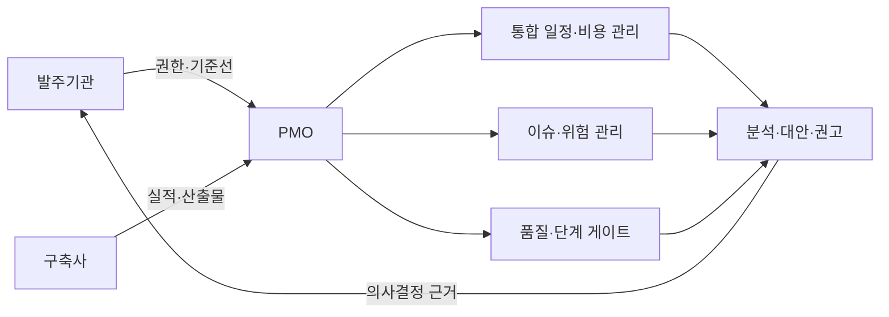
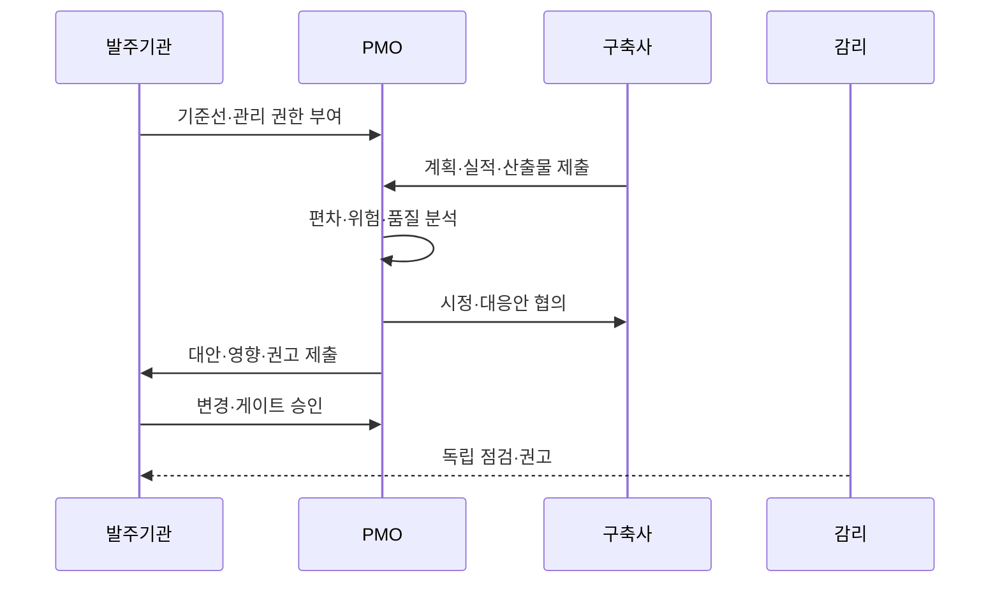

---
sidebar:
  order: 191
  label: "191. PMO 프로젝트 관리 위탁 (PMO)"
  badge: { text: "기출 · 50%", variant: note }
title: "PMO 프로젝트 관리 위탁 (PMO)"
date: "2026-07-27T23:59:59+09:00"
tags: ["notes-software"]
weight: 191
extra:
  question_no: "191"
  source_status: "기출"
  source_history: "132회"
  priority: 50
  priority_note: "사업 통제와 발주자 지원 역할이 기존 출제됨"
---

## 미리 알고가기

- **프로젝트 관리 조직(Project Management Office, PMO)**: ‘피엠오’로 읽고 영문 머리글자를 딴 약어이며, 발주기관의 통합 관리·의사결정을 지원하되 최종 승인 책임은 대신하지 않음
- **프로젝트 관리 위탁(Project Management Consignment)**: 전문 조직이 발주기관을 대신해 관리 실무를 지원하고 최종 책임은 발주기관이 보유하는 방식
- **작업분류체계(Work Breakdown Structure, WBS)**: ‘더블유비에스’로 읽고 영문 머리글자를 딴 약어이며, 전체 범위를 작업 단위로 계층 분해해 일정·비용·책임을 연결함
- **관리 기준선(Management Baseline)**: 승인된 범위·일정·비용을 실제 실적과 비교하는 기준
- **단계 게이트(Stage Gate)**: 다음 단계 진입 전에 완료 기준과 증적을 확인하는 승인 지점
- **이슈·위험(Issue·Risk)**: 이미 발생한 문제와 앞으로 발생할 수 있는 불확실성
- **감리(Audit)**: 독립된 시점 점검으로 사업 문제를 진단·권고하는 활동
- **이해상충(Conflict of Interest)**: 구축사와 관리·평가 주체의 이해관계가 겹쳐 독립 판단이 훼손되는 상태

## Ⅰ. 개요

- 정의/개념: 전문 조직이 발주기관의 **통합 사업관리·의사결정 지원**
- 기존 한계: 발주기관 관리 역량 부족의 **일정·품질·위험 통제 약화**

### 쉽게 이해하기 (학습용)

- PMO가 일정과 위험의 근거를 계속 정리해 권고하고 최종 사업 결정과 책임은 발주기관이 가진다.

## Ⅱ. 특징

- 범위·일정·비용의 **통합 기준선 관리**
- 이슈·위험·품질의 **상시 추적·조정**
- 발주기관 결정의 **근거·대안 제공**

### 쉽게 이해하기 (학습용)

- 계획과 실제 차이를 계속 확인하고 문제가 커지기 전에 선택 가능한 대응안을 발주기관에 제시한다.

## Ⅲ. 아키텍처 및 구성요소

| 구성요소 | 책임 |
|:---|:---|
| 발주기관 | 기준선·변경의 **최종 승인·책임** |
| PMO | 실적 분석과 **통합 관리·권고** |
| 구축사 | 계획 실행과 **산출물·실적 제출** |
| 통합 관리 | 범위·일정·비용의 **편차 분석** |
| 위험·품질 관리 | 위험 대응과 **게이트 증적 검토** |
| 의사결정 체계 | 변경·대응의 **승인·이력 보존** |

> 요약: PMO는 분석·권고하고 발주기관은 최종 승인

### 쉽게 이해하기 (학습용)

- 시공사는 공사하고 관리 전문가는 진척과 품질을 분석하며 건축주는 변경과 인수를 최종 결정한다.

## Ⅳ. 원리 및 절차 흐름

| 절차 | 설명 |
|:---|:---|
| 기준선 설정 | 범위·일정·**비용 목표 승인** |
| 실적 수집 | 진척·산출물·**이슈 현황 확보** |
| 편차 분석 | 계획 대비 **원인·영향 식별** |
| 대응안 협의 | 구축사의 **시정 조치 구체화** |
| 의사결정 지원 | 대안·비용·**위험 비교 제공** |
| 승인·추적 | 발주기관 결정과 **조치 이력 관리** |

> 요약: 실적 편차를 대응 대안으로 바꿔 발주기관 결정 지원

### 쉽게 이해하기 (학습용)

- 실제 진척이 계획과 다르면 원인과 선택지를 계산해 보고하고 승인된 조치가 끝날 때까지 추적한다.

## Ⅴ. 종류 및 비교

| 사업 통제 | PMO | 감리 |
|:---|:---|:---|
| 적용 기준 | 복잡 사업의 **상시 통합 관리** | 법정·독립 **시점별 점검** |
| 핵심 특징 | 계획·실적의 **지속 분석·조정 지원** | 산출물·절차의 **독립 진단·권고** |
| 한계 | 발주기관 승인 의존·**역할 중복** | 상시 조정·**실행 관리 한계** |

> 요약: PMO는 상시 관리 지원, 감리는 독립 시점 점검

### 쉽게 이해하기 (학습용)

- PMO는 공사 중 계속 관리하고 감리는 정해진 시점에 독립적으로 적정성을 점검한다.

## Ⅵ. 실무 사례

1. 차세대 사업 PMO는 **WBS 진척·임계경로**로 지연 분석

### 쉽게 이해하기 (학습용)

- 지연 작업이 전체 일정에 미치는 영향을 계산하고 다음 단계로 넘어갈 근거가 갖춰졌는지 확인한다.

## Ⅶ. 결론

- 대규모 사업의 일정·범위·품질 위험을 통합 통제하기 위해 **WBS 진척·임계경로·이슈·단계별 진입 기준**을 검토하고, PMO가 의사결정을 지원하되 최종 승인은 발주기관이 수행한다

### 쉽게 이해하기 (학습용)

- 지원·점검·승인의 주체를 분리해야 관리 위탁이 발주기관의 책임까지 대신한다는 오해를 막을 수 있다.
