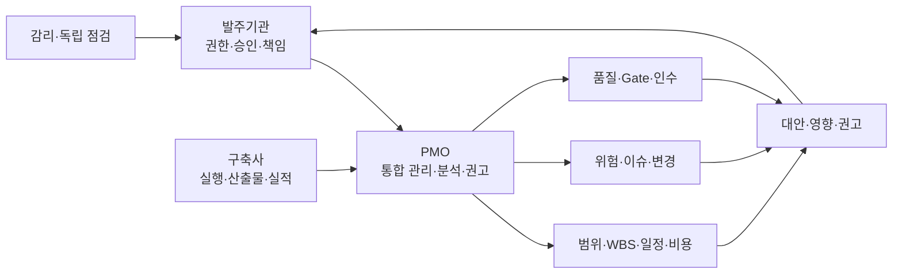
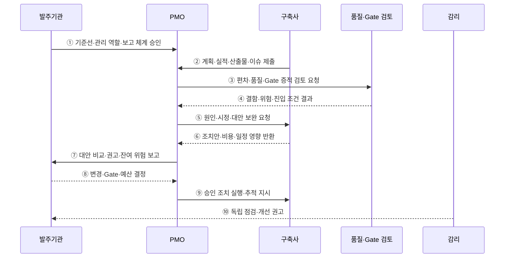

---
sidebar:
  order: 191
  label: "191. PMO 프로젝트 관리 위탁 (PMO)"
  badge: { text: "기출 · 50%", variant: note }
title: "PMO 프로젝트 관리 위탁 (PMO)"
date: "2026-07-27T23:59:59+09:00"
tags: ["notes-software"]
weight: 191
extra:
  question_no: "191"
  source_status: "기출"
  source_history: "132회"
  priority: 50
  priority_note: "사업 통제와 발주자 지원 역할이 기존 출제됨"
---

## 미리 알고가기

- **프로젝트 관리 조직(Project Management Office, PMO·피엠오)**: 프로젝트의 범위·일정·비용·품질·위험·의사결정을 통합 관리하고 표준화하는 조직
- **프로젝트 관리 위탁(Project Management Consignment)**: 전문 조직이 발주기관의 사업관리 실무를 지원하지만 법적·계약상 최종 책임과 승인은 발주기관이 보유하는 방식
- **작업분류체계(Work Breakdown Structure, WBS·더블유비에스)**: 전체 범위를 관리 가능한 작업 단위로 계층 분해해 일정·비용·책임·산출물을 연결한 구조
- **관리 기준선(Management Baseline)**: 승인된 범위·일정·비용을 실제 실적과 비교하는 기준
- **획득가치관리(Earned Value Management, EVM·이브이엠)**: 계획가치·획득가치·실제원가로 일정·비용 성과와 완료 전망을 분석하는 기법
- **임계경로(Critical Path)**: 지연되면 전체 완료일이 직접 늦어지는 여유시간이 없는 작업 경로
- **단계 게이트(Stage Gate)**: 다음 단계 진입 전에 완료 기준·산출물·품질·위험·승인을 확인하는 통제 지점
- **이슈·위험(Issue·Risk)**: 이슈는 이미 발생한 문제, 위험은 발생 가능성과 영향이 있는 불확실성
- **감리(Audit)**: 사업과 산출물의 적정성을 독립적으로 점검하고 개선을 권고하는 활동
- **이해상충(Conflict of Interest)**: 구축·관리·평가 주체의 이해관계가 겹쳐 독립 판단이 훼손되는 상태

## Ⅰ. 개요

- PMO는 발주기관의 대규모·복잡 사업을 **통합 계획·분석·조정·의사결정 지원**한다.
- 관리 역량과 정보가 분산되어 생기는 범위 증가·일정 지연·비용 초과·품질 저하를 조기에 통제한다.
- PMO가 실무를 위탁받아도 사업의 최종 승인·계약·인수 책임은 발주기관에 남는다.

### 쉽게 이해하기 (학습용)
- PMO가 공사 현황과 선택지를 정리하고 건축주인 발주기관이 최종 결정함

## Ⅱ. 특징

- **통합 기준선**: 범위·WBS·일정·비용·품질·자원 기준을 하나의 계획으로 연결한다.
- **상시 편차 분석**: 계획 대비 진척·비용·산출물·결함·위험의 차이와 완료 전망을 분석한다.
- **선제 위험 관리**: 발생 가능성·영향·노출 기간·대응 책임자를 지속 추적한다.
- **단계 통제**: 산출물과 Exit Criteria를 확인해 다음 단계 진입 여부를 권고한다.
- **의사결정 지원**: 대안별 비용·일정·품질·계약·위험 영향을 발주기관에 제공한다.
- **투명한 이력**: 변경·이슈·결정·승인·조치·예외 근거를 추적 가능하게 보존한다.

### 쉽게 이해하기 (학습용)
- 계획과 실제의 차이를 계속 계산해 문제가 커지기 전에 대응안을 제시함

## Ⅲ. 아키텍처 및 구성요소

**도표안 A — 구조도**

**도표안 B — sequenceDiagram**

| 구성요소 | 역할 |
|:---|:---|
| 발주기관 | 목표·기준선·계약·변경·Gate·인수의 최종 승인 |
| PMO | 통합 계획·실적 분석·조정·보고·대안·권고 |
| 구축사 | 계획 실행·산출물 작성·실적·결함·위험 보고 |
| 범위·일정·비용 관리 | WBS·임계경로·EVM·완료 전망·변경 영향 분석 |
| 위험·이슈·변경 관리 | 등록·평가·책임·기한·대응·에스컬레이션 추적 |
| 품질·Gate 관리 | 산출물·결함·시험·인수·단계 진입 기준 검토 |
| 감리 | PMO·발주·구축과 독립된 시점별 적정성 점검 |

**동작 원리**

- ① 발주기관이 승인 기준선·PMO 역할·의사결정 권한·보고 주기를 확정한다.
- ② 구축사가 WBS 실적·산출물·비용·결함·이슈·위험 원본을 PMO에 제출한다.
- ③ PMO가 계획 편차와 다음 Gate의 품질 증적을 검토 조직에 요청한다.
- ④ 검토 조직이 미충족 기준·결함·잔여 위험·진입 가능 여부를 반환한다.
- ⑤ PMO가 구축사에 편차 원인·시정 조치·실행 가능한 대안의 보완을 요청한다.
- ⑥ 구축사가 대안별 비용·일정·자원·품질·계약 영향을 반환한다.
- ⑦ PMO가 대안을 비교하고 권고안·가정·잔여 위험을 발주기관에 보고한다.
- ⑧ 발주기관이 변경·예산·Gate 진행·중단·인수 여부를 최종 결정한다.
- ⑨ PMO가 승인된 조치를 구축사에 전달하고 완료 기준까지 추적한다.
- ⑩ 감리는 정해진 시점에 독립적으로 사업 적정성을 점검해 발주기관에 권고한다.

### 쉽게 이해하기 (학습용)
- 실적을 분석해 대응안을 만들고 발주기관 승인 뒤 조치가 끝날 때까지 추적함

## Ⅳ. 종류 및 비교

| 비교 항목 | PMO | 감리 |
|:---|:---|:---|
| 목적 | 발주기관의 상시 통합 사업관리 지원 | 사업·산출물의 독립 적정성 점검 |
| 시점 | 계획부터 종료까지 지속 | 정해진 단계·시점 |
| 활동 | 계획·분석·조정·보고·조치 추적 | 점검·진단·개선 권고 |
| 관계 | 사업 운영에 참여해 관리 실무 지원 | 사업 수행과 독립성 유지 |
| 산출 | 통합 계획·현황·위험·변경·권고 | 점검 결과·문제·개선 권고 |
| 결정권 | 발주기관에 근거와 권고 제공 | 발주기관에 독립 의견 제공 |
| 한계 | 역할 중복·발주기관 의존·이해상충 | 상시 조정·실행 관리 한계 |

| PMO 유형 | 범위 | 적용 |
|:---|:---|:---|
| 지원형 | 표준·도구·교육·보고 지원 | 조직 역량이 높고 자율성이 중요한 사업 |
| 통제형 | 기준선·Gate·변경·품질 준수 통제 | 복잡·고위험·다수 공급자 사업 |
| 지시형 | 프로젝트 관리자와 실행 관리 직접 수행 | 발주기관 관리 역량이 부족한 대형 사업 |

### 쉽게 이해하기 (학습용)
- PMO는 계속 관리하고 감리는 정해진 시점에 독립적으로 점검함

## Ⅴ. 실무 고려사항 및 대책

| 고려사항 | 위험 | 대책 |
|:---|:---|:---|
| 역할·권한 | 발주기관·PMO·구축사 책임 중복 | RACI·승인 한도·에스컬레이션 명시 |
| 데이터 신뢰 | 진척률 과장·수동 보고 불일치 | 원시 증적·형상·시험·비용 시스템 연계 |
| WBS 품질 | 작업이 너무 크거나 산출물과 분리 | 결과물 중심 Work Package·완료 기준 |
| 일정 분석 | 진척률만 보고 임계경로 지연 누락 | 선후 관계·여유시간·완료 전망 분석 |
| 변경 통제 | 작은 변경 누적으로 범위·비용 증가 | 변경 요청·영향 분석·승인·기준선 갱신 |
| 위험 관리 | 목록만 만들고 대응 미실행 | Trigger·책임자·기한·잔여 위험 추적 |
| Gate 형식화 | 문서 존재만 보고 단계 진행 | 측정 가능한 Exit Criteria·결함 기준 |
| 이해상충 | 구축사와 PMO 관계로 독립 권고 훼손 | 조직·계약·평가 분리와 공개 이력 |
| 보고 과다 | 관리 문서가 실행 시간을 잠식 | 의사결정 중심 지표·예외 보고 자동화 |

### 쉽게 이해하기 (학습용)
- 사례: 차세대 사업은 WBS와 임계경로로 지연이 전체 완료일에 미치는 영향을 계산해 대응안을 승인받음

## Ⅵ. 결론

- PMO의 핵심은 **계획과 실제의 편차를 근거 있는 대안으로 바꿔 발주기관의 결정을 지원**하는 것이다.
- 관리 위탁은 발주기관의 최종 책임과 승인 권한을 이전하지 않는다.
- 정확한 실적 데이터·명확한 역할·단계 기준·독립 감리와 조치 추적이 함께 있어야 통제 효과가 생긴다.

### 쉽게 이해하기 (학습용)
- PMO는 판단 근거를 만들고 발주기관은 결정하며 구축사는 승인된 조치를 실행함
