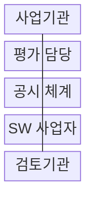
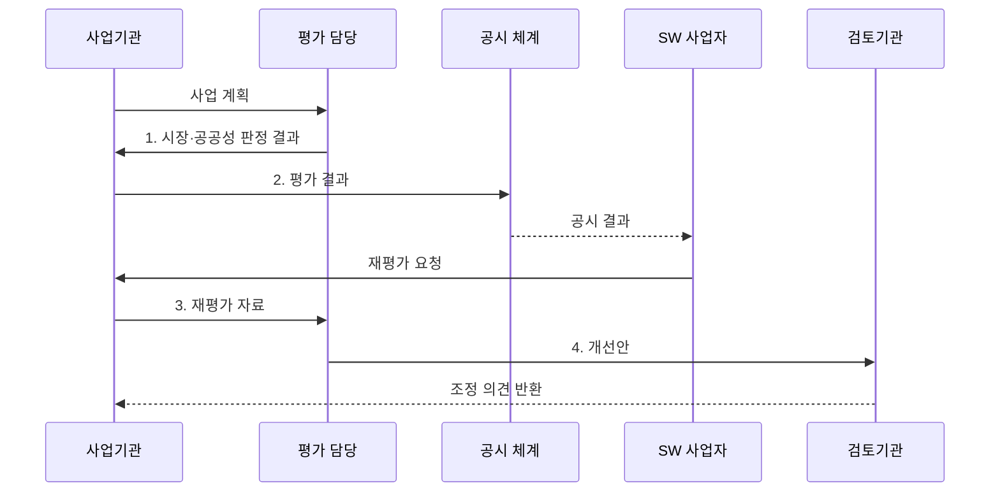

---
sidebar:
  order: 192
  label: "192. 소프트웨어 사업 영향 평가 (SW Business Impact Assessment)"
  badge: { text: "기출 · 70%", variant: note }
title: "소프트웨어 사업 영향 평가 (SW Business Impact Assessment)"
date: "2026-08-02T12:00:00+09:00"
tags: ["notes-software"]
weight: 192
extra:
  question_no: "192"
  source_status: "기출"
  source_history: "128회, 131회, 132회"
  priority: 70
  priority_note: "민간 시장 영향 판단 기준이 반복 출제됨"
---

## Ⅰ. 개요

핵심 용어

- **공공성·민간시장 영향**: 소프트웨어사업 영향평가는 공공 사업의 필요성과 공공성, 민간시장 대체 영향을 발주 전에 판단하는 법정 절차다.

- 정의/개념: **소프트웨어사업 영향평가**는 공공 SW사업의 필요성•공공성과 민간시장 대체 영향을 발주 전에 판단하는 **법정 사전 평가 절차**
- 배경/필요성: 시장 검토 없는 공공 직접 개발은 **민간 수요·사업 기회** 대체

#### 한줄 요약
- 공공기관이 제품을 만들기 전에 시장 진열대의 기존 상품으로 해결할 수 있는지와 민간 판매 기회를 없애는지 확인한다.

## Ⅱ. 특징

핵심 용어

- **공시·재평가**: 공시는 평가 근거와 결과를 공개하고 재평가는 민간 의견이나 변경된 사업계획을 반영해 다시 판단한다.

- **기획·발주 전 시장 영향** 사전 판정
- **기능·사용자·배포 범위** 단위 대체성 비교
- **소프트웨어 진흥법·영향평가 결과서** 기반 법정 절차
- **공시·재평가** 기반 사업 범위 조정

#### 한줄 요약
- 같은 기능을 민간 제품이 제공한다면 공공 고유 부분만 남기고 범용 부분은 구매로 돌려 시장 대체를 줄인다.

## Ⅲ. 구조 및 구성요소

핵심 용어

- **평가 담당**: 평가 담당은 민간 대안의 공급 가능성과 공공 사업의 필요성, 기능별 대체성을 분석한다.

| 구성요소 | 책임 |
|:---|:---|
| 사업기관 | 기능·사용자·**배포 범위 명시** |
| 평가 담당 | 시장 대안·공공성·**대체성 분석** |
| 공시 체계 | 평가 근거·**판정 결과 공개** |
| SW 사업자 | 유사 제품 근거·**재평가 요청** |
| 검토기관 | 개선안·**범위·조달 조정** |

#### 한줄 요약

- 사업기관의 계획과 민간 제품 근거를 평가 담당이 같은 기능 단위로 대조하고 검토기관이 조정안을 심사한다.

## Ⅳ. 흐름도

핵심 용어

- **4. 개선안**: 평가 결과와 민간 근거를 바탕으로 기능, 사용자, 배포 범위, 조달 방식을 조정한 개선안을 검토기관에 제출한다.

**동작 원리**

1. **시장·공공성 판정 결과**: 민간 대안과 대체 불가 근거 비교
2. **평가 결과**: 사업 범위·근거·시장 영향 공개
3. **재평가 자료**: 사업자 근거와 새로운 민간 대안 반영
4. **개선안**: 기능·배포 범위·조달 방식 조정

#### 한줄 요약
- 시장 조사 결과를 공개하고 사업자가 유사 제품 근거를 내면 입찰 전에 다시 평가해야 조정 내용이 실제 발주 범위에 반영된다.

## Ⅴ. 종류 및 비교

핵심 용어

- **민간 SW 구매·이용**: 민간 SW 구매·이용은 유사 기능을 공급하는 상용 제품이나 서비스를 경쟁 조달해 빠르게 도입하는 방식이다.

| SW 확보 방식 | 공공 직접 개발 | 민간 SW 구매·이용 |
|:---|:---|:---|
| 적용 기준 | 대체 불가 **법정·공공 업무** | 유사 기능·**민간 공급 존재** |
| 핵심 특징 | 고유 요구·**정책 직접 반영** | 경쟁 조달·**빠른 도입** |
| 한계 | 시장 침해·**운영비 증가** | 공급자 종속·**서비스 종료** |

#### 한줄 요약
- 시장에서 살 수 있는 범용 기능은 구매하고 법정 업무처럼 공공만 수행할 기능만 좁혀서 개발한다.

## Ⅵ. 실무 고려사항 및 대책

핵심 용어

- **형식 평가**: 형식 평가는 발주 직전에 근거 확인 없이 서식만 채워 사업 범위를 실질적으로 조정할 시간을 잃는 문제다.

| 문제 | 대책 | 효과 |
|:---|:---|:---|
| 발주 직전 **형식 평가** | 기획 초기·**공고 전 재확인** | 사업 조정 **시간 확보** |
| 사업명 중심 **대안 누락** | 기능·여정·**서비스 단위 비교** | 유사 제품 **탐색 정확성** |
| 검색만의 **공급 오판** | 가격·납품·**연계 인터페이스 확인** | 조달 가능성 **검증** |
| 무상 배포의 **수요 대체** | 대상·기간·**재배포 조건 제한** | 민간시장 **침해 축소** |
| 사업 변경 뒤 **평가 고정** | 중요 범위 변경 시 **재평가** | 판정 근거 **최신성 확보** |

#### 한줄 요약
- 범용 문서 기능은 민간 서비스로 조달하고 법령에 따른 고유 심사 기능만 개발하면 공공 목적과 민간 기회를 함께 지킬 수 있다.

## Ⅶ. 결론

핵심 용어

- **구매·이용**: 민간 공급이 존재하는 기능은 구매·이용하고 대체 불가능한 공공 고유 기능만 직접 개발해야 한다.

- 민간 공급이 있으면 **구매·이용**, 대체 불가 공공 기능만 직접 개발하고 배포 범위 제한

#### 한줄 요약
- 직접 개발을 정당화하는 데 그치지 말고 시장 공급 기능은 구매로 돌리고 공공 고유 기능과 배포 범위만 남겨야 한다.
