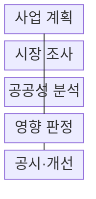
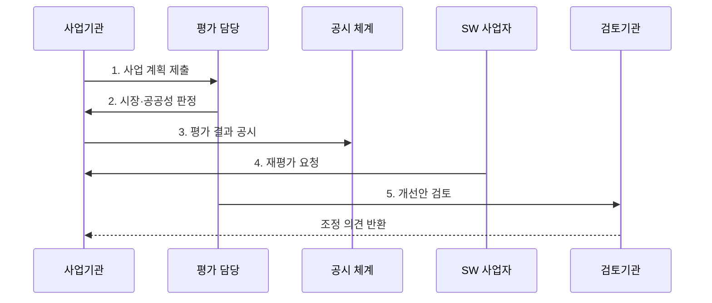

---
sidebar:
  order: 192
  label: "192. 소프트웨어 사업 영향 평가 (SW Business Impact Assessment)"
  badge: { text: "기출 · 70%", variant: note }
title: "소프트웨어 사업 영향 평가 (SW Business Impact Assessment)"
date: "2026-07-30T18:00:00+09:00"
tags: ["notes-software"]
weight: 192
extra:
  question_no: "192"
  source_status: "기출"
  source_history: "128회, 131회, 132회"
  priority: 70
  priority_note: "민간 시장 영향 판단 기준이 반복 출제됨"
---

## 미리 알고가기

- **소프트웨어사업 영향평가(SW Business Impact Assessment)**: 국가기관 등의 소프트웨어사업이 민간 소프트웨어 시장에 미치는 영향을 사업 전에 분석하는 법정 평가
- **소프트웨어 진흥법**: 소프트웨어산업 진흥과 공공 소프트웨어사업 절차를 규정하고 영향평가·공시·재평가의 근거를 둔 법률
- **민간시장 침해 가능성**: 공공 개발·배포가 기존 민간 제품·서비스의 수요·매출·사업 기회를 대체할 가능성
- **사업 필요성·공공성**: 법정 업무·국가안보·공익·보편적 서비스 등 공공이 사업을 추진해야 하는 근거
- **민간 대안(Private-sector Alternative)**: 상용 소프트웨어 구매·임차·서비스형 소프트웨어 이용·민간 위탁으로 직접 개발을 대신하는 방안
- **영향평가 결과서**: 사업 기본정보·운영계획·유사 민간 소프트웨어·시장침해 가능성·필요성·공공성·조정 내용을 기록하는 서식
- **공시(Public Disclosure)**: 평가 근거와 결과를 공개해 소프트웨어사업자가 확인하고 재평가를 요청할 수 있게 하는 절차
- **재평가(Reassessment)**: 공시 결과에 이의가 있거나 사업계획이 달라졌을 때 민간 의견과 새로운 근거를 반영해 다시 판단하는 절차
- **개선 조치(Corrective Measure)**: 시장 침해를 줄이도록 기능·사용자·배포·사업 기간·조달 방식을 조정하는 조치

## Ⅰ. 개요

- 정의/개념: 공공 SW사업의 **공공성·민간시장 영향 사전 평가**
- 배경/필요성: 직접 개발의 **민간 수요·사업 기회 대체 방지**

### 쉽게 이해하기 (학습용)
- 공공기관이 제품을 만들기 전에 시장 진열대의 기존 상품으로 해결할 수 있는지와 민간 판매 기회를 없애는지 확인한다.

## Ⅱ. 특징

- **기획·발주 전 시장 영향** 사전 판정
- **기능·사용자·배포 범위** 단위 대체성 비교
- **공시·재평가·범위 조정** 기반 절차 투명성

### 쉽게 이해하기 (학습용)
- 같은 기능을 민간 제품이 제공한다면 공공 고유 부분만 남기고 범용 부분은 구매로 돌려 시장 대체를 줄인다.

## Ⅲ. 구조 및 구성요소

| 구성요소 | 책임 |
|:---|:---|
| 사업 계획 | 기능·사용자·**배포 범위 명시** |
| 시장 조사 | 유사 제품·가격·**공급 역량 확인** |
| 공공성 분석 | 법정·공익·**대체 불가 입증** |
| 영향 판정 | 대체성·**시장 기회 감소 분석** |
| 공시·개선 | 재평가·**범위·조달 조정** |

### 쉽게 이해하기 (학습용)

- 사업 계획과 시장 상품을 같은 기능 단위로 나란히 놓고 공공만 해야 할 이유를 더해야 직접 개발 범위를 판단할 수 있다.

## Ⅳ. 흐름도

**동작 원리**

1. **사업 계획 제출**: 기능·사용자·배포·예산 명시
2. **시장·공공성 판정**: 민간 대안·대체 불가 비교
3. **평가 결과 공시**: 범위·근거·판정 공개
4. **재평가 요청**: 사업자 근거·새 대안 반영
5. **개선안 검토**: 기능·배포·조달 방식 조정

### 쉽게 이해하기 (학습용)
- 시장 조사 결과를 공개하고 사업자가 유사 제품 근거를 내면 입찰 전에 다시 평가해야 조정 내용이 실제 발주 범위에 반영된다.

## Ⅴ. 종류 및 비교

| SW 확보 방식 | 공공 직접 개발 | 민간 SW 구매·이용 |
|:---|:---|:---|
| 적용 기준 | 대체 불가 **법정·공공 업무** | 유사 기능·**민간 공급 존재** |
| 핵심 특징 | 고유 요구·**정책 직접 반영** | 경쟁 조달·**빠른 도입** |
| 한계 | 시장 침해·**운영비 증가** | 공급자 종속·**서비스 종료** |

### 쉽게 이해하기 (학습용)
- 시장에서 살 수 있는 범용 기능은 구매하고 법정 업무처럼 공공만 수행할 기능만 좁혀서 개발한다.

## Ⅵ. 실무 고려사항 및 대책

| 고려사항 | 대책 | 효과 |
|:---|:---|:---|
| 발주 직전 **형식 평가** | 기획 초기·**공고 전 재확인** | 사업 조정 **시간 확보** |
| 사업명 중심 **대안 누락** | 기능·여정·**서비스 단위 비교** | 유사 제품 **탐색 정확성** |
| 검색만의 **공급 오판** | 가격·납품·**API·확장성 확인** | 조달 가능성 **검증** |
| 무상 배포의 **수요 대체** | 대상·기간·**재배포 조건 제한** | 민간시장 **침해 축소** |
| 사업 변경 뒤 **평가 고정** | 중요 범위 변경 시 **재평가** | 판정 근거 **최신성 확보** |

### 쉽게 이해하기 (학습용)
- 범용 문서 기능은 민간 서비스로 조달하고 법령에 따른 고유 심사 기능만 개발하면 공공 목적과 민간 기회를 함께 지킬 수 있다.

## Ⅶ. 결론

- **공공 고유성·민간 대체성·배포 영향**으로 사업 방식 결정

### 쉽게 이해하기 (학습용)
- 직접 개발을 정당화하는 데 그치지 말고 시장 공급 기능은 구매로 돌리고 공공 고유 기능과 배포 범위만 남겨야 한다.
