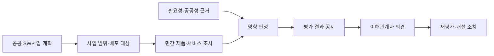
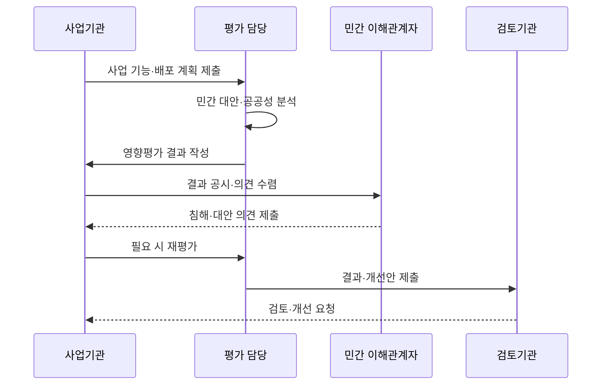

---
sidebar:
  order: 192
  label: "192. 소프트웨어 사업 영향 평가 (SW Business Impact Assessment)"
  badge: { text: "기출 · 70%", variant: note }
title: "소프트웨어 사업 영향 평가 (SW Business Impact Assessment)"
date: "2026-07-27T23:59:59+09:00"
tags: ["notes-software"]
weight: 192
extra:
  question_no: "192"
  source_status: "기출"
  source_history: "128회, 131회, 132회"
  priority: 70
  priority_note: "민간 시장 영향 판단 기준이 반복 출제됨"
---

## 미리 알고가기

- **소프트웨어(Software, SW)사업 영향평가**: ‘에스더블유 사업 영향평가’로 읽고 SW는 Software를 줄인 표기이며, 국가기관 등의 소프트웨어사업이 민간 시장에 미치는 영향을 사전에 분석함
- **소프트웨어 진흥법**: 소프트웨어산업 기반과 공공 소프트웨어사업 절차를 규정하고 사업 영향평가의 근거를 둔 법률
- **민간시장 침해 가능성**: 공공 개발·배포가 기존 민간 제품의 수요·판매·사업 기회를 대체할 가능성
- **사업 필요성·공공성**: 법정 업무·공익·보안 등 공공이 사업을 추진해야 하는 근거
- **민간 대안(Private-sector Alternative)**: 구매·임차·민간 서비스 이용으로 공공 직접 개발을 대신할 수 있는 방안
- **재평가(Reassessment)**: 사업 계획 변경이나 이해관계자 의견을 반영해 시장 영향을 다시 판단하는 절차
- **개선 조치(Corrective Measure)**: 침해 가능성을 줄이도록 기능·사용자·배포·조달 방식을 조정하는 조치
- **결과 공시(Public Disclosure)**: 평가 근거와 결과를 공개해 이해관계자의 검토·의견 제출을 가능하게 하는 절차

## Ⅰ. 개요

- 정의/개념: 공공 SW사업의 **민간시장 침해 가능성을 사전 평가**
- 기존 한계: 공공 직접 개발의 **민간 제품 수요·사업 기회 대체**

### 쉽게 이해하기 (학습용)

- 정부가 새 소프트웨어를 만들기 전에 이미 시장에서 살 수 있는 제품과 민간 사업 기회를 해치지 않는지 확인한다.

## Ⅱ. 특징

- 유사 민간 SW의 **존재·대체 가능성 조사**
- 사업 필요성·공공성과 **시장 영향의 비교**
- 공시·재평가·개선의 **계획 조정 절차**

### 쉽게 이해하기 (학습용)

- 공공 개발 이유만 보는 것이 아니라 살 수 있는 민간 대안과 배포 범위가 시장을 대체하는지도 함께 본다.

## Ⅲ. 아키텍처 및 구성요소

| 구성요소 | 책임 |
|:---|:---|
| 사업 계획 | 기능·사용자·**배포 범위 명시** |
| 시장 조사 | 유사 제품·서비스의 **조달 가능성 확인** |
| 공공성 근거 | 직접 추진의 **법정·공익 필요 입증** |
| 영향 판정 | 대체 가능성과 **시장 침해 비교** |
| 결과 공시 | 평가 근거의 **공개·의견 수렴** |
| 개선 조치 | 범위·배포·**조달 방식 조정** |

> 요약: 민간 대안과 공공성을 비교해 사업 범위·방식 조정

### 쉽게 이해하기 (학습용)

- 만들 기능과 이용 대상을 밝히고 시장 제품과 공공 필요를 비교한 뒤 의견을 받아 계획을 고친다.

## Ⅳ. 원리 및 절차 흐름

| 절차 | 설명 |
|:---|:---|
| 대상 확정 | 기능·이용자·**배포 범위 특정** |
| 시장 조사 | 유사 SW·가격·**조달 가능성 확인** |
| 영향 판정 | 대체성·공공성의 **종합 비교** |
| 결과 공시 | 평가 근거와 **판정 공개** |
| 의견·재평가 | 민간 의견·변경의 **재검토** |
| 개선 반영 | 기능·배포·**구매 방식 조정** |

> 요약: 사전 평가를 공시하고 의견·변경을 재평가해 개선

### 쉽게 이해하기 (학습용)

- 먼저 시장 영향을 평가해 공개하고 새로운 대안이나 사업 변경이 나오면 다시 판단해 범위를 줄이거나 구매로 바꾼다.

## Ⅴ. 종류 및 비교

| 사업 방식 | 공공 직접 개발 | 민간 SW 구매·이용 |
|:---|:---|:---|
| 적용 기준 | 법정 업무·**대체 불가 공공성** | 유사 제품·**민간 공급 가능** |
| 핵심 특징 | 공공 요구의 **맞춤 기능 구현** | 시장 제품의 **조달·서비스 활용** |
| 한계 | 시장 침해·**중복 개발 위험** | 요구 차이·**공급자 종속성** |

> 요약: 대체 불가 공공성은 개발, 민간 대안은 구매·이용

### 쉽게 이해하기 (학습용)

- 공공만 수행할 수 있는 기능은 직접 만들고 시장에서 충족할 수 있으면 제품과 서비스를 우선 검토한다.

## Ⅵ. 실무 사례

1. 범용 문서 기능은 **민간 SaaS 조달**로 직접 개발 축소
2. 법정 행정 기능은 **공공성 근거·제한 배포**로 영향 완화

### 쉽게 이해하기 (학습용)

- 시장에 있는 일반 기능은 구매하고 고유 법정 업무는 필요한 이용자에게만 제공해 민간 대체 범위를 줄인다.

## Ⅶ. 결론

- 민간 대안이 있으면 **구매·이용**, 대체 불가 공공성은 **제한 개발**

### 쉽게 이해하기 (학습용)

- 공공 개발 여부뿐 아니라 기능과 배포 범위를 어디까지 줄일 수 있는지 함께 판단한다.
