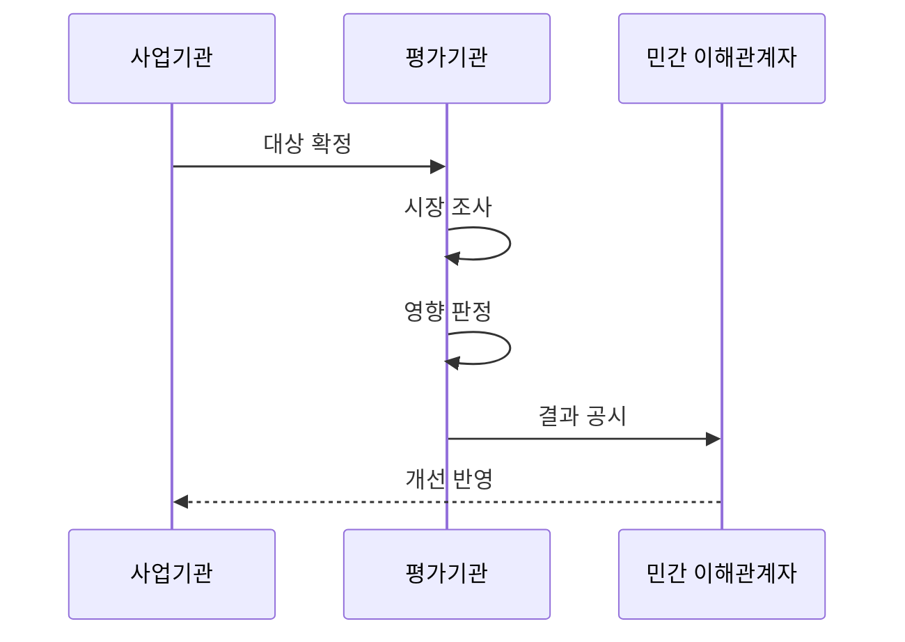

---
sidebar:
  order: 192
  label: "192. 소프트웨어 사업 영향 평가 (SW Business Impact Assessment)"
  badge:
    text: "기출 · 70%"
    variant: note
title: "소프트웨어 사업 영향 평가 (SW Business Impact Assessment)"
date: "2026-07-25T00:30:00+09:00"
tags:
  - "notes-software"
weight: 192
extra:
  question_no: "192"
  source_status: "기출"
  source_history: "128회, 131회, 132회"
  priority: 70
  priority_note: "민간 시장 영향 판단 기준이 반복 출제됨"
---

## 미리 알고가기

- **소프트웨어(Software, SW)사업 영향평가**: SW는 ‘에스더블유’로 읽고 Software를 줄인 표기이며, 공공 소프트웨어 사업의 민간 시장 영향을 분석해 직접 개발·배포 범위를 조정함
- **소프트웨어 진흥법**: 소프트웨어 산업 진흥과 공공 소프트웨어 사업의 기본 절차를 규정하고 사업 영향평가의 법적 근거를 두는 법률임
- **민간시장 침해**: 공공 개발·배포가 기존 민간 제품의 수요와 사업 기회를 대체하는 영향임
- **공공성**: 법정 업무·공익·보안 때문에 공공이 직접 제공해야 하는 필요성임
- **민간 대안**: 구매·임차·민간 서비스 이용으로 공공 개발을 대신할 수 있는 방안임
- **상호운용성**: 서로 다른 시스템이 표준 방식으로 데이터와 기능을 교환하는 능력임
- **재평가·개선조치**: 계획 변경이나 의견을 다시 검토해 범위·방식·배포 대상을 조정함
- **이해관계자 의견 수렴**: 민간 기업·협회·사용자에게 평가 결과와 사업 계획의 의견을 받는 절차임

## Ⅰ. 개요

- **정의/개념**: 민간 SW 시장 침해 여부를 사전 평가함
- **배경/필요성**: 공공 개발이 민간 수요를 대체해 사전 영향 판정이 필요함

### 쉽게 이해하기 (학습용)
- 민간 제품을 대신할 공공 개발인지 미리 점검함

## Ⅱ. 특징

- 사업 기능·사용자·배포 대상·예산을 특정한다.
- 유사 소프트웨어·가격·조달 가능성 조사한다.
- 법정 업무 필요성과 민간 대안을 비교한다.
- 의견 수렴 후 범위·조달·배포 방식 조정한다.

### 쉽게 이해하기 (학습용)
- 공공 직접 개발의 필요성과 민간 제품 대체 가능성을 함께 공개한다.

## Ⅲ. 아키텍처 및 구성요소

| 설계 요소 | 설명 |
|:---|:---|
| 사업 범위 | 기능·사용자·배포 대상을 특정함 |
| 시장 조사 | 유사 제품·서비스·가격을 조사함 |
| 영향 판정 | 대체 가능성과 공공성을 평가함 |
| 결과 공시 | 결과를 공개하고 의견을 수렴함 |
| 개선 반영 | 범위·조달·배포 방식을 조정함 |

> 요약: 시장 대안과 공공성을 비교해 사업을 조정함

### 쉽게 이해하기 (학습용)
- 시장 대안을 통해 사업 계획을 조정함

## Ⅳ. 원리 및 절차 흐름도

| 절차 | 설명 |
|:---|:---|
| 대상 확정 | 기능·사용자·배포 범위 특정 |
| 시장 조사 | 유사 제품과 조달 상황 조사 |
| 영향 판정 | 시장 대체성과 공공성 평가 |
| 결과 공시 | 결과 공시와 의견 수렴 |
| 개선 반영 | 재평가 후 사업 계획 보완 |

> 요약: 시장 대체성과 공공성 판정으로 계획 보완

### 쉽게 이해하기 (학습용)
- 민간 대안과 공공 필요성을 비교해 사업 범위를 고침

## Ⅴ. 종류 및 비교

| 판단 기준 | 최초 평가 | 재평가 | 개선 조치 |
|:---|:---|:---|:---|
| 핵심 특징 | 최초 계획 영향을 분석함 | 변경·의견을 다시 판단함 | 침해 요소를 사업에서 줄임 |
| 적용 기준 | 사업 기획·예산 요구 전 | 계획 변경·이견 발생 시 | 시장 대체 우려가 클 때 |
| 주요 위험 | 시장 조사 누락 | 형식 재검토·근거 부족 | 범위만 축소·효과 미흡 |

> 요약: 계획 변경·이견은 재평가 후 범위 조정

### 쉽게 이해하기 (학습용)
- 처음 평가한 뒤 계획이 바뀌면 다시 보고 침해 기능을 줄임

## Ⅵ. 실무 사례

1. 공공 플랫폼은 민간 기능의 직접 개발을 줄임
2. 무료 소프트웨어는 민간 대체 범위의 배포를 제한함

### 쉽게 이해하기 (학습용)
- 공공 플랫폼은 구매 가능한 기능을 민간에서 조달함
- 무료 소프트웨어는 법정 업무에 필요한 대상만 배포함

## Ⅶ. 결론

- 민간 대안이 있으면 직접 개발·무상 배포를 줄임

### 쉽게 이해하기 (학습용)
- 공공성이 입증되지 않은 기능은 민간에서 조달함
