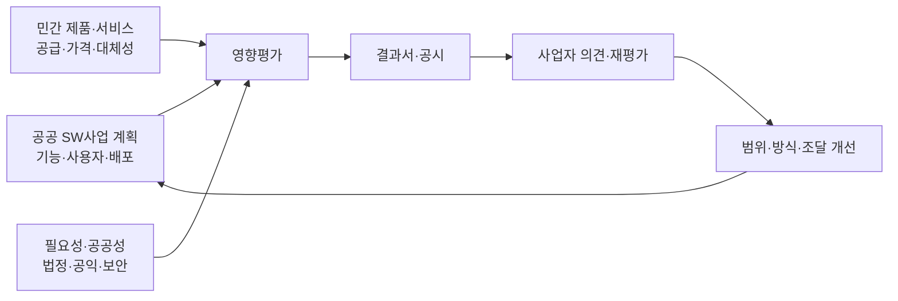
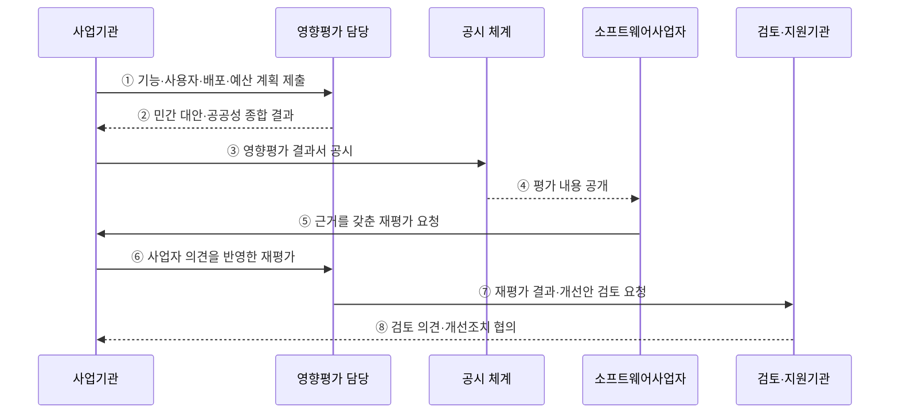

---
sidebar:
  order: 192
  label: "192. 소프트웨어 사업 영향 평가 (SW Business Impact Assessment)"
  badge: { text: "기출 · 70%", variant: note }
title: "소프트웨어 사업 영향 평가 (SW Business Impact Assessment)"
date: "2026-07-27T23:59:59+09:00"
tags: ["notes-software"]
weight: 192
extra:
  question_no: "192"
  source_status: "기출"
  source_history: "128회, 131회, 132회"
  priority: 70
  priority_note: "민간 시장 영향 판단 기준이 반복 출제됨"
---

## 미리 알고가기

- **소프트웨어사업 영향평가(SW Business Impact Assessment)**: 국가기관 등의 소프트웨어사업이 민간 소프트웨어 시장에 미치는 영향을 사업 전에 분석하는 법정 평가
- **소프트웨어 진흥법**: 소프트웨어산업 진흥과 공공 소프트웨어사업 절차를 규정하고 영향평가·공시·재평가의 근거를 둔 법률
- **민간시장 침해 가능성**: 공공 개발·배포가 기존 민간 제품·서비스의 수요·매출·사업 기회를 대체할 가능성
- **사업 필요성·공공성**: 법정 업무·국가안보·공익·보편적 서비스 등 공공이 사업을 추진해야 하는 근거
- **민간 대안(Private-sector Alternative)**: 상용 소프트웨어 구매·임차·서비스형 소프트웨어 이용·민간 위탁으로 직접 개발을 대신하는 방안
- **영향평가 결과서**: 사업 기본정보·운영계획·유사 민간 소프트웨어·시장침해 가능성·필요성·공공성·조정 내용을 기록하는 서식
- **공시(Public Disclosure)**: 평가 근거와 결과를 공개해 소프트웨어사업자가 확인하고 재평가를 요청할 수 있게 하는 절차
- **재평가(Reassessment)**: 공시 결과에 이의가 있거나 사업계획이 달라졌을 때 민간 의견과 새로운 근거를 반영해 다시 판단하는 절차
- **개선 조치(Corrective Measure)**: 시장 침해를 줄이도록 기능·사용자·배포·사업 기간·조달 방식을 조정하는 조치

## Ⅰ. 개요

- 소프트웨어사업 영향평가는 공공 사업의 **민간시장 침해 가능성과 사업 필요성·공공성**을 사전에 비교한다.
- 공공 직접 개발이 이미 공급되는 민간 제품·서비스의 수요와 사업 기회를 불필요하게 대체하는 것을 줄인다.
- 평가·공시·재평가·개선으로 사업 자체뿐 아니라 기능·사용자·배포 범위와 조달 방식을 조정한다.

### 쉽게 이해하기 (학습용)
- 정부가 만들기 전에 시장에서 살 수 있는 제품과 민간 사업을 불필요하게 밀어내는지 확인함

## Ⅱ. 특징

- **사전성**: 실행계획 수립 또는 발주 전에 민간시장 영향을 평가한다.
- **시장 조사**: 주요 기능과 동일·유사한 민간 소프트웨어의 공급·사용자·가격·조달 가능성을 확인한다.
- **공공성 비교**: 직접 개발의 필요성과 민간 대체 가능성·시장 영향을 함께 판단한다.
- **범위 조정**: 침해 가능성이 있으면 공공 고유 기능만 남기거나 사용자·배포 범위를 제한한다.
- **투명성**: 결과서를 공시하고 이해관계자인 소프트웨어사업자의 재평가 요청을 받는다.
- **재검토 의무**: 부적합 판단 시 사업내용 조정 등 사업을 다시 검토한다.

### 쉽게 이해하기 (학습용)
- 공공이 꼭 해야 할 범위와 민간 제품으로 충족할 범위를 나눔

## Ⅲ. 아키텍처 및 구성요소

**도표안 A — 구조도**

**도표안 B — sequenceDiagram**

| 구성요소 | 역할 |
|:---|:---|
| 사업계획 | 기능·사용자·운영기관·배포 범위·기간·예산 명시 |
| 시장 조사 | 동일·유사 민간 제품·서비스·가격·조달·공급 역량 확인 |
| 공공성 분석 | 법정 업무·공익·보안·민간 부적합 사유 입증 |
| 영향 판정 | 대체성·무료 배포·사용자 범위·시장 기회 감소 분석 |
| 결과서·공시 | 평가 단계·근거·판정·조정 내용을 표준 서식으로 공개 |
| 재평가 | 사업자 의견·사업 변경·새 민간 대안을 반영해 재판정 |
| 개선 조치 | 기능 축소·대상 제한·구매 전환·민간 참여 방식 적용 |

**동작 원리**

- ① 사업기관이 개발 기능·이용자·운영·배포·예산 범위를 영향평가 담당에 제출한다.
- ② 평가 담당이 유사 민간 소프트웨어와 공공 필요성을 조사해 시장침해 가능성과 조정안을 반환한다.
- ③ 사업기관이 정해진 서식의 영향평가 결과서를 공시한다.
- ④ 공시 체계가 사업 범위·평가 근거·판정 내용을 소프트웨어사업자에게 공개한다.
- ⑤ 이해관계 사업자가 유사 제품·시장 영향 등 근거를 들어 재평가를 요청한다.
- ⑥ 사업기관은 해당 사업자의 의견을 듣고 입찰공고 전까지 재평가한다.
- ⑦ 재평가 결과와 기능·배포·조달 개선안을 검토·지원기관에 제출한다.
- ⑧ 검토 의견에 따라 부적합 사업은 내용을 조정하고 결과를 사업계획과 발주 문서에 반영한다.

### 쉽게 이해하기 (학습용)
- 시장 제품을 조사해 결과를 공개하고 이의가 있으면 다시 평가해 사업 범위를 고침

## Ⅳ. 종류 및 비교

| 비교 항목 | 공공 직접 개발 | 민간 SW 구매·이용 |
|:---|:---|:---|
| 적용 | 대체하기 어려운 법정·공익·보안·고유 업무 | 동일·유사 민간 기능과 공급 역량 존재 |
| 범위 | 공공 고유 요구로 최소화 | 설정·확장·연계로 요구 충족 |
| 장점 | 특수 업무·통제·정책 변화 직접 반영 | 개발 중복 감소·시장 경쟁·빠른 도입 |
| 위험 | 민간시장 침해·무료 확산·운영비 증가 | 공급자 종속·기능 차이·서비스 종료 |
| 대책 | 사용자·배포 제한·민간 참여·개방 기준 | 경쟁 조달·SLA·데이터 이전·출구 전략 |

| 평가 결과 | 후속 조치 |
|:---|:---|
| 민간 대안 없음·공공성 충분 | 근거를 기록하고 계획 범위로 추진 |
| 일부 기능 대체 가능 | 범용 기능 구매, 고유 기능만 개발 |
| 시장 침해 가능성 높음 | 기능·사용자·배포 축소 또는 사업 방식 재검토 |
| 근거 불충분·의견 상충 | 조사 보완·재평가·전문 검토 |

### 쉽게 이해하기 (학습용)
- 시장에 있으면 구매하고 공공만 해야 하는 기능만 제한적으로 개발함

## Ⅴ. 실무 고려사항 및 대책

| 고려사항 | 위험 | 대책 |
|:---|:---|:---|
| 평가 시점 | 발주 직전 형식 평가로 조정 불가 | 기획 초기 평가·입찰공고 전 재확인 |
| 기능 단위 조사 | 사업명만 비교해 유사 제품 누락 | 핵심 기능·사용자 여정·서비스 단위 비교 |
| 시장 자료 | 검색 결과만으로 공급 가능성 오판 | 가격·납품 사례·API·규제·확장성 확인 |
| 무료 배포 | 공공 SW의 무상 확산이 민간 수요 대체 | 대상 기관·사용자·기간·재배포 조건 제한 |
| 공공성 근거 | “공익”만 제시해 직접 개발 정당화 | 법적 근거·대체 불가 사유·위험을 구체화 |
| 재평가 | 사업자 의견을 형식적으로 처리 | 근거별 수용·반박·조정 이력 공개 |
| 계획 변경 | 기능·배포 확대 후 이전 평가 유지 | 중요 범위 변경 시 영향 재검토 |
| 법정 기한 | 공시·재평가 지연으로 발주 절차 위험 | 현행 시행령 기한을 일정 기준선에 반영 |

### 쉽게 이해하기 (학습용)
- 사례: 범용 문서 기능은 민간 SaaS로 조달하고 고유 법정 업무만 제한 개발함

## Ⅵ. 결론

- 소프트웨어사업 영향평가의 핵심은 **공공 필요성과 민간 대체·시장 침해를 기능·사용자·배포 범위별로 비교**하는 것이다.
- 평가는 직접 개발의 정당화 문서가 아니라 구매·범위 축소·민간 참여를 포함한 사업 개선 절차다.
- 최신 법령의 평가·공시·재평가 기한과 서식을 확인하고 사업 변경 시 영향 판단도 갱신해야 한다.

### 쉽게 이해하기 (학습용)
- 공공만 해야 할 기능만 남기고 시장에서 공급되는 기능은 민간 방식으로 돌림
