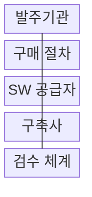

---
sidebar:
  order: 193
  label: "193. SW 조달: 상용SW 직접구매 (SW Direct Purchase)"
  badge: { text: "기출 · 70%", variant: note }
title: "SW 조달: 상용SW 직접구매 (SW Direct Purchase)"
date: "2026-08-02T12:00:00+09:00"
tags: ["notes-software"]
weight: 193
extra:
  question_no: "193"
  source_status: "기출"
  source_history: "126회, 129회"
  priority: 70
  priority_note: "대상·예외·통합 책임이 반복 출제됨"
---

## Ⅰ. 개요

핵심 용어

- **공급자에게 직접 구매**: 상용 SW 직접구매는 발주기관이 제품을 구축 계약과 분리해 공급자에게 직접 구매하는 조달 방식이다.

- 정의/개념: 상용 SW를 구축 계약과 분리해 **공급자에게 직접 구매**하는 조달 방식
- 배경/필요성: 통합 발주는 제품별 가격·사용권·**공급 책임** 확인 제약

### 쉽게 이해하기 (학습용)

- 건축주가 시공사에 모든 자재를 맡기지 않고 완제품 설비의 규격과 가격을 직접 확인해 사는 장면이 상용 SW 직접구매에 해당한다.

## Ⅱ. 특징

핵심 용어

- **중립 규격·BMT**: 중립 규격은 제품명이 아닌 기능·성능·호환 조건을 정의하고 BMT는 같은 조건에서 후보 제품을 비교한다.

- **가격·라이선스** 조달 투명성
- **공급자·구축사 책임** 분리·연결
- **중립 규격·BMT** 기반 경쟁 구매

### 쉽게 이해하기 (학습용)

- 발주기관이 제품 계약서를 들고 공급자와 구축사를 한 탁자에 앉혀, 제품 공급과 시스템 연결의 책임선을 각각 긋는다.

## Ⅲ. 구조 및 구성요소

핵심 용어

- **검수 체계**: 검수 체계는 납품 버전, 사용 권리, 성능, 기술지원과 구축사의 설치·연계 결과가 계약에 맞는지 확인한다.

| 구성요소 | 책임 |
|:---|:---|
| 발주기관 | 규격·수량·**계약·검수 책임** |
| 구매 절차 | 시장 조사·**경쟁·제품 선정** |
| SW 공급자 | 제품·라이선스·**기술지원 제공** |
| 구축사 | 제품의 **설치·연계·통합 수행** |
| 검수 체계 | 납품·권리·**성능·지원 확인** |

### 쉽게 이해하기 (학습용)

- 공급자는 제품 상자를, 구축사는 연결 결과를 내놓고 발주기관은 두 결과를 같은 검수 기준에서 맞춰 본다.

## Ⅳ. 흐름도

핵심 용어

- **4. 권리·지원 증빙**: SW 공급자는 본 운영과 재해복구 환경의 라이선스 수량, 사용 범위, 지원 조건을 검수에 증빙한다.

**동작 원리**

1. **제품 계약서**: 시장 조사·BMT로 선정한 제품과 권리 범위 확정
2. **제품·설치 정보**: 공급자·구축사 접점 연결
3. **설치·연계 결과**: 통합 결과·성능 증명
4. **권리·지원 증빙**: 라이선스·지원 조건 대조

### 쉽게 이해하기 (학습용)

- 후보 제품을 같은 조건으로 고르고 설치 결과와 본 서버·재해복구 서버의 사용권 수량표까지 계약서에 대조한다.

## Ⅴ. 종류 및 비교

핵심 용어

- **직접구매**: 직접구매는 독립 제품을 분리 조달할 수 있을 때 발주기관이 제품 공급자와 직접 계약하는 방식이다.

| 상용 SW 조달 | 직접구매 | 구축 계약 포함 |
|:---|:---|:---|
| 적용 기준 | 독립 제품·**분리 구매 가능** | 분리 곤란·**통합 책임 우선** |
| 핵심 특징 | 발주기관의 **제품 직접 계약** | 구축사의 **제품·통합 일괄 계약** |
| 한계 | 공급자·구축사 **책임 조정** | 가격·권리·**선정 불투명** |

### 쉽게 이해하기 (학습용)

- 독립 포장된 제품은 발주기관이 따로 사고, 구축 작업과 떼면 작동하지 않는 제품은 예외 근거를 붙여 한 계약 상자에 담는다.

## Ⅵ. 실무 고려사항 및 대책

핵심 용어

- **책임 공백**: 책임 공백은 제품 공급과 설치·연계의 경계에서 공급자와 구축사 어느 쪽도 장애 해결 책임을 지지 않는 문제다.

| 문제 | 대책 | 효과 |
|:---|:---|:---|
| 특정 제품의 **종속 규격** | 중립 기능·성능 규격과 **BMT** | 공정 경쟁·**객관적 선정** |
| 권리 수량의 **과소·과다** | 운영·DR별 **메트릭 검증** | 위반·비용 낭비 **방지** |
| 공급·구축의 **책임 공백** | 설치·장애의 **RACI 명시** | 분쟁·지연 **축소** |
| 직접구매 **예외 남용** | 분리 곤란·영향 **근거 기록** | 감사 대응 **근거 확보** |
| 장기 **유지관리 비용** | TCO·종료·**이전 조건 비교** | 전환 위험 **통제** |

### 쉽게 이해하기 (학습용)

- 같은 짐을 실은 후보 제품을 나란히 시험하고, 본 서버와 재해복구 서버의 사용권 수량표까지 계약서에 대조 표시한다.

## Ⅶ. 결론

핵심 용어

- **통합 필수**: 독립 분리와 책임 계약이 가능하면 직접구매하고 구축과 분리할 수 없는 통합 필수 상황은 근거를 남겨 예외 발주한다.

- 독립 분리와 책임 계약이 가능하면 **직접구매**, 통합 필수면 예외 발주

### 쉽게 이해하기 (학습용)

- 중립 규격으로 독립 구매할 수 있고 공급자와 구축사의 연계 책임을 계약에서 연결할 수 있을 때 직접구매해야 한다.
