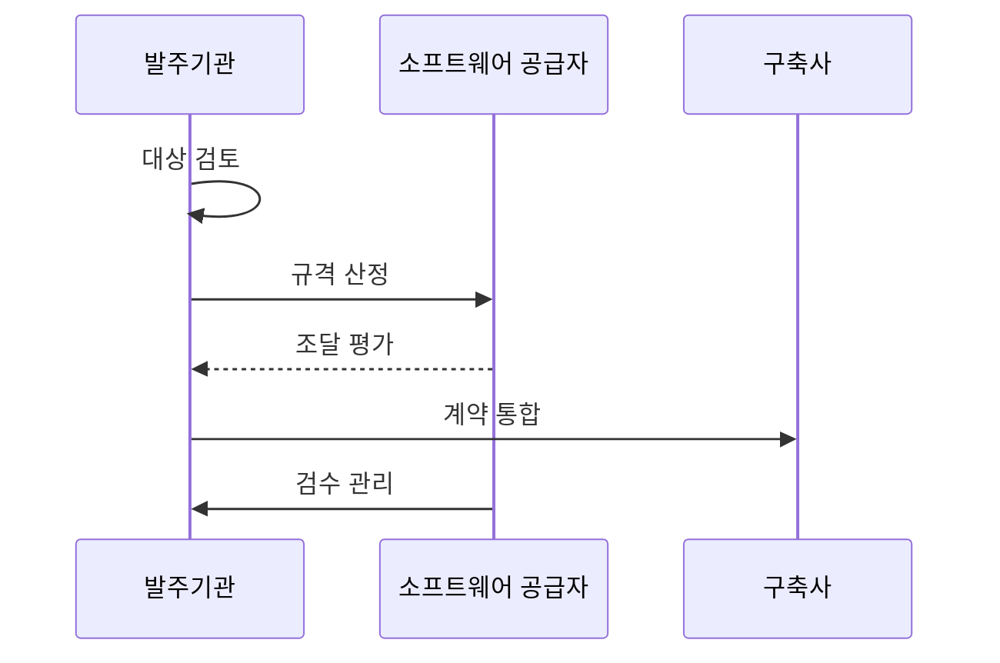

---
sidebar:
  order: 193
  label: "193. SW 조달 — 상용SW 직접구매 (SW Direct Purchase)"
  badge:
    text: "기출 · 70%"
    variant: note
title: "SW 조달 — 상용SW 직접구매 (SW Direct Purchase)"
date: "2026-07-25T00:30:00+09:00"
tags:
  - "notes-software"
weight: 193
extra:
  question_no: "193"
  source_status: "기출"
  source_history: "126회, 129회"
  priority: 70
  priority_note: "대상·예외·통합 책임이 반복 출제됨"
---

## 미리 알고가기

- **상용 소프트웨어(Software, SW) 직접구매**: SW는 ‘에스더블유’로 읽고 Software를 줄인 표기이며, 상용 소프트웨어를 구축 계약과 분리해 발주기관이 공급자에게 직접 구매함
- **조달 방식**: 종합쇼핑몰·경쟁·협상·BMT 중 요구와 시장에 맞는 구매 절차를 선택함
- **벤치마크 테스트(Benchmark Test, BMT)**: BMT는 ‘비엠티’로 읽고 영문 머리글자를 딴 약어이며, 동일 환경·데이터·부하에서 후보 제품의 기능·성능을 비교함
- **라이선스 메트릭**: 사용자·코어·서버처럼 사용 권리와 수량을 계산하는 단위임
- **가상화·재해복구(Disaster Recovery, DR) 라이선스**: DR은 ‘디알’로 읽고 영문 머리글자를 딴 약어이며, 가상 인스턴스와 재해복구 예비 환경의 추가 사용 권리를 수량에 포함함
- **총소유비용(Total Cost of Ownership, TCO)**: TCO는 ‘티시오’로 읽고 영문 머리글자를 딴 약어이며, 구매·유지관리·교육·전환·종료 비용을 합쳐 제품 가격을 비교함
- **중립 규격**: 특정 브랜드 대신 필요한 기능·성능·호환 조건으로 작성한 규격임
- **직접구매 예외**: 분리 구매가 불가능하거나 사업 목적을 훼손하는 근거를 검토해 통합 발주를 허용하는 경우임
- **카탈로그·경쟁 협상**: 카탈로그는 등록 제품 선택이고 경쟁 협상은 제안 평가 후 계약하는 방식임
- **웹 애플리케이션 서버(Web Application Server, WAS)**: WAS는 ‘와스’로 읽고 영문 머리글자를 딴 약어이며, 웹 요청의 업무 로직을 실행하고 본문의 BMT 구매 대상이 됨
- **검수**: 납품 버전·사용 권리·보안·기술지원이 계약과 일치하는지 확인함

## Ⅰ. 개요

- **정의/개념**: 상용 소프트웨어를 분리해 발주함
- **배경/필요성**: 통합 발주는 제품 가격·책임을 가려 분리 구매가 필요함

### 쉽게 이해하기 (학습용)
- 상용 소프트웨어를 구축 계약과 나눠 공급자에게 직접 구매함

## Ⅱ. 특징

- 계획 단계에서 분리 발주 대상·예외를 검토한다.
- 브랜드를 제외한 기능·성능 중립 규격 작성한다.
- 라이선스 수량·유지관리·기술 지원 계약한다.
- 구축사 연계 일정과 책임 경계를 조정한다.

### 쉽게 이해하기 (학습용)
- 브랜드가 아닌 기능·성능과 필요한 사용 권리 수량을 계약한다.

## Ⅲ. 아키텍처 및 구성요소

| 설계 요소 | 설명 |
|:---|:---|
| 요구 정의 | 중립적인 기능·성능 규격을 정의함 |
| 시장 조사 | 가격과 조달 경로를 조사함 |
| 라이선스 | 산정 단위·수량·비용을 정함 |
| 계약 통합 | 구축사와 공급자의 연계 책임을 정함 |
| 검수 관리 | 납품 버전과 사용 권리를 관리함 |

> 요약: 규격부터 라이선스·연계·검수까지 관리함

### 쉽게 이해하기 (학습용)
- 제품 규격과 라이선스 수량을 정하고 납품 때 같은지 확인한다.

## Ⅳ. 원리 및 절차 흐름도

| 절차 | 설명 |
|:---|:---|
| 대상 검토 | 직접구매 대상과 예외 여부 판단 |
| 규격 산정 | 기능 규격과 예산 산정 |
| 조달 평가 | 기술성·가격·BMT 결과 평가 |
| 계약 통합 | 연계 규격과 책임 조율 |
| 검수 관리 | 버전·권리·보증 검수 |

> 요약: 중립 규격으로 구매하고 권리·버전 검수

### 쉽게 이해하기 (학습용)
- 직접구매 대상과 규격을 정한 뒤 구축 연계까지 검수함

## Ⅴ. 종류 및 비교

| 판단 기준 | 카탈로그 | 경쟁·협상 | BMT 연계 |
|:---|:---|:---|:---|
| 핵심 특징 | 등록 제품을 직접 선택함 | 제안서로 공급자를 선정함 | 실측 결과를 평가에 반영함 |
| 적용 기준 | 표준 사양·단가 확인 | 복합 기술·가격 평가 | 성능 차이 검증 필요 |
| 주요 위험 | 연동 조건 누락 | 평가 편향·협상 지연 | 시험 환경 왜곡 |

> 요약: 요구와 실측 기준 구매함

### 쉽게 이해하기 (학습용)
- 표준 제품은 카탈로그, 복합 요구는 협상, 성능 차이는 BMT로 판정한다.

## Ⅵ. 실무 사례

1. WAS 구매는 BMT로 처리량을 비교함
2. 보안SW 구매는 사용자·서버 수량을 검증함

### 쉽게 이해하기 (학습용)
- WAS는 같은 부하에서 처리 성능을 비교함
- 보안SW는 실제 배치 수량과 권리를 맞춤

## Ⅶ. 결론

- 발주자는 SW·구축사 연계 책임을 계약에 명시함

### 쉽게 이해하기 (학습용)
- 따로 구매해도 공급자와 구축사의 연계 책임을 계약에 나눠 적음
