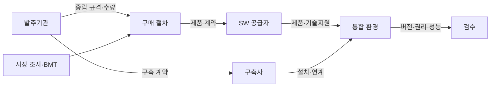
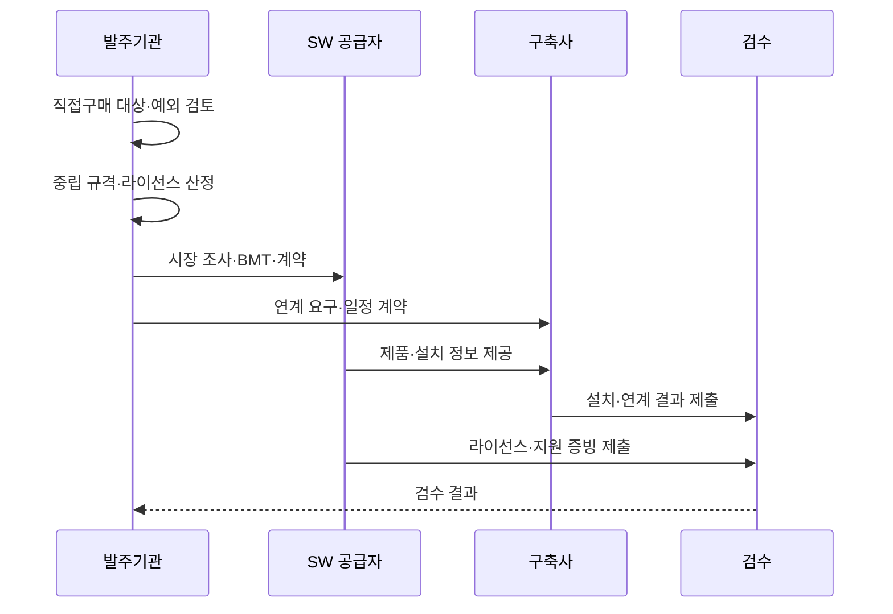

---
sidebar:
  order: 193
  label: "193. SW 조달 — 상용SW 직접구매 (SW Direct Purchase)"
  badge: { text: "기출 · 70%", variant: note }
title: "SW 조달 — 상용SW 직접구매 (SW Direct Purchase)"
date: "2026-07-27T23:59:59+09:00"
tags: ["notes-software"]
weight: 193
extra:
  question_no: "193"
  source_status: "기출"
  source_history: "126회, 129회"
  priority: 70
  priority_note: "대상·예외·통합 책임이 반복 출제됨"
---

## 미리 알고가기

- **상용 소프트웨어(Software, SW) 직접구매**: ‘에스더블유 직접구매’로 읽고 SW는 Software를 줄인 표기이며, 상용 SW를 구축 계약과 분리해 발주기관이 공급자에게 직접 구매함
- **벤치마크 테스트(Benchmark Test, BMT)**: ‘비엠티’로 읽고 영문 머리글자를 딴 약어이며, 동일 환경·데이터·부하에서 후보 제품의 기능·성능을 비교함
- **라이선스 메트릭(License Metric)**: 사용자·코어·서버 등 소프트웨어 사용 권리의 수량을 계산하는 단위
- **재해복구(Disaster Recovery, DR)**: ‘디알’로 읽고 영문 머리글자를 딴 약어이며, 장애 시 서비스를 복구할 예비 환경·절차
- **총소유비용(Total Cost of Ownership, TCO)**: ‘티시오’로 읽고 영문 머리글자를 딴 약어이며, 구매·유지관리·교육·전환·종료 비용을 합친 전체 비용
- **중립 규격(Neutral Specification)**: 특정 제품명이 아니라 필요한 기능·성능·호환 조건으로 작성한 구매 규격
- **직접구매 예외(Direct-purchase Exception)**: 분리 구매가 불가능하거나 사업 목적을 훼손하는 근거가 인정되어 통합 발주하는 경우
- **웹 애플리케이션 서버(Web Application Server, WAS)**: ‘와스’로 읽고 영문 머리글자를 딴 약어이며, 웹 요청의 업무 로직을 실행하는 상용 미들웨어
- **검수(Acceptance Inspection)**: 납품 버전·사용 권리·보안·기술지원이 계약과 일치하는지 확인하는 절차

## Ⅰ. 개요

- 정의/개념: 상용 SW를 구축 계약과 **분리해 공급자에게 직접 구매**
- 기존 한계: 통합 발주의 **제품 가격·라이선스·공급 책임 불투명**

### 쉽게 이해하기 (학습용)

- 시공사에 모든 자재 구매를 맡기지 않고 완제품 소프트웨어는 발주기관이 규격과 가격을 확인해 직접 산다.

## Ⅱ. 특징

- 중립 규격 기반의 **제품 경쟁·선정**
- 라이선스·유지관리의 **가격·권리 투명성**
- 공급자·구축사의 **연계·통합 책임 조정**

### 쉽게 이해하기 (학습용)

- 제품 계약은 직접 관리하되 구축 시스템과 제대로 연결할 책임과 일정을 별도로 정해야 한다.

## Ⅲ. 아키텍처 및 구성요소

| 구성요소 | 책임 |
|:---|:---|
| 발주기관 | 규격·수량·**계약·검수 책임** |
| 구매 절차 | 시장 조사·**경쟁·제품 선정** |
| SW 공급자 | 제품·라이선스·**기술지원 제공** |
| 구축사 | 제품의 **설치·연계·통합 수행** |
| 통합 책임표 | 장애·일정의 **주체·접점 명시** |
| 검수 | 납품·권리·**성능·지원 확인** |

> 요약: 제품 구매와 시스템 통합 계약의 책임을 연결

### 쉽게 이해하기 (학습용)

- 발주기관이 제품을 사고 공급자는 제품을 지원하며 구축사는 설치·연계하고 검수에서 계약 내용을 확인한다.

## Ⅳ. 원리 및 절차 흐름

| 절차 | 설명 |
|:---|:---|
| 대상·예외 검토 | 분리 구매 가능성과 **예외 근거 확인** |
| 규격·수량 산정 | 기능·성능·**라이선스 범위 정의** |
| 제품 선정 | 시장 조사·BMT·**계약 방식 적용** |
| 연계 책임 계약 | 공급자·구축사의 **역할·일정 명시** |
| 설치·통합 | 제품 구성과 **업무 시스템 연계** |
| 검수 | 버전·권리·성능·**지원 조건 확인** |

> 요약: 직접 구매와 구축 연계를 별도 계약하고 통합 검수

### 쉽게 이해하기 (학습용)

- 살 제품과 사용 권리를 정해 계약하고 설치·연계 담당을 나눈 뒤 제품과 전체 시스템을 함께 확인한다.

## Ⅴ. 종류 및 비교

| 조달 방식 | 상용 SW 직접구매 | 구축 계약 포함 구매 |
|:---|:---|:---|
| 적용 기준 | 독립 제품·**분리 구매 가능** | 분리 곤란·**통합 책임 필수** |
| 핵심 특징 | 발주기관의 **제품·가격 직접 계약** | 구축사의 **제품·통합 일괄 계약** |
| 한계 | 공급자·구축사 **책임 조정 부담** | 가격·라이선스·**제품 선정 불투명** |

> 요약: 분리 가능성과 통합 책임 위험으로 구매 방식 결정

### 쉽게 이해하기 (학습용)

- 제품을 따로 살 수 있으면 가격과 권리를 직접 관리하고 분리가 사업을 해치면 근거를 남겨 통합 발주한다.

## Ⅵ. 실무 사례

1. WAS는 **중립 성능 규격·BMT**로 공급 제품 선정
2. DR 환경은 **예비 인스턴스 라이선스**까지 수량 계약

### 쉽게 이해하기 (학습용)

- 웹 서버 제품은 같은 부하로 비교하고 재해복구용 예비 서버도 사용할 권리가 있는지 계약에 포함한다.

## Ⅶ. 결론

- 분리 가능하면 **직접구매**, 불가피한 통합은 **예외 근거·책임 명시**

### 쉽게 이해하기 (학습용)

- 제품 가격만 분리할 것이 아니라 라이선스와 시스템 연계의 최종 책임까지 계약에서 연결해야 한다.
